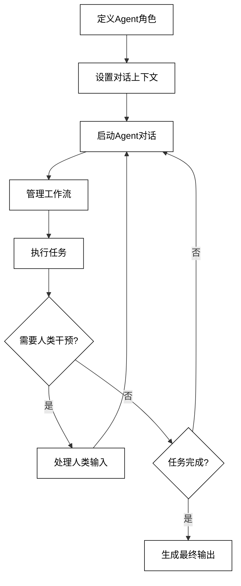
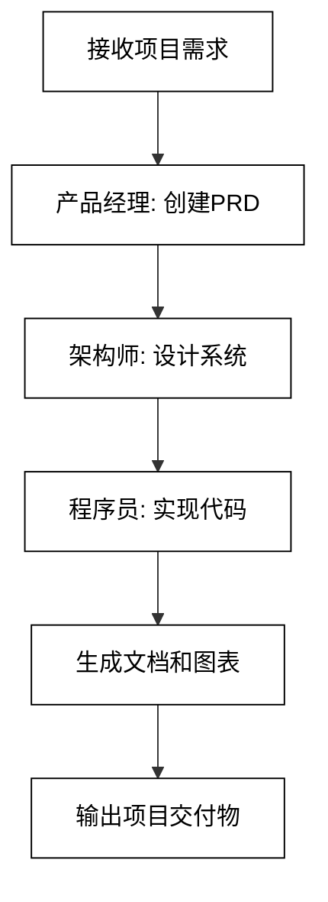

## 第10章 Agent 7：多Agent框架——AutoGen和MetaGPT

在本章中，我们将探讨两个强大的多Agent框架：AutoGen和MetaGPT。这些框架提供了创建和管理多个协作AI Agent的高级工具和抽象，使得开发复杂的多Agent系统变得更加简单和高效。

### 10.1 AutoGen

AutoGen是一个灵活的框架，用于构建多Agent对话和工作流系统。它提供了一套工具，使开发者能够轻松创建、定制和管理多个AI Agent，这些Agent可以相互交流并协作完成复杂任务。

#### 10.1.1 AutoGen简介

AutoGen的核心特性包括：

1. 多Agent对话：支持多个Agent之间的复杂对话和交互。
2. 灵活的Agent定义：可以轻松定义具有不同角色和能力的Agent。
3. 工作流管理：提供工具来管理Agent之间的工作流和任务分配。
4. 人机交互：支持人类用户在Agent对话中的参与和干预。
5. 可扩展性：易于集成新的模型、工具和功能。

AutoGen的工作流程可以概括为以下步骤：

1. 定义Agent角色和能力
2. 设置初始对话上下文
3. 启动Agent间对话
4. 管理工作流和任务执行
5. 处理人类干预（如果需要）
6. 生成最终输出或决策

下面是AutoGen的简化工作流程图：



#### 10.1.2 AutoGen实战

让我们通过一个实际例子来展示如何使用AutoGen创建一个多Agent系统。在这个例子中，我们将创建一个简单的软件开发团队，包括一个项目经理、一个开发者和一个测试员。

首先，安装AutoGen：

```bash
pip install pyautogen
```

然后，创建一个Python文件，例如`autogen_example.py`，并添加以下代码：

```python
import autogen

# 配置 AI 模型
config_list = [
    {
        'model': 'gpt-4',
        'api_key': 'your-api-key-here'
    }
]

# 创建 Agent
project_manager = autogen.AssistantAgent(
    name="ProjectManager",
    system_message="You are a project manager. You create project plans and assign tasks to the team.",
    llm_config={"config_list": config_list}
)

developer = autogen.AssistantAgent(
    name="Developer",
    system_message="You are a software developer. You implement features and fix bugs.",
    llm_config={"config_list": config_list}
)

tester = autogen.AssistantAgent(
    name="Tester",
    system_message="You are a software tester. You create and execute test plans.",
    llm_config={"config_list": config_list}
)

human = autogen.UserProxyAgent(
    name="Human",
    system_message="You are a human user interacting with the AI team.",
    human_input_mode="TERMINATE"
)

# 启动对话
task = "Create a simple calculator app with addition and subtraction functions."
chat_result = human.initiate_chat(
    project_manager,
    message=f"We need to {task} Please create a project plan and assign tasks."
)

# 处理项目经理的回应
pm_response = chat_result.last_message()
print(f"Project Manager's Plan:\n{pm_response}")

# 开发者执行任务
dev_result = human.initiate_chat(
    developer,
    message=f"Based on the project manager's plan, please implement the calculator app."
)

# 测试员执行测试
test_result = human.initiate_chat(
    tester,
    message=f"The developer has completed the implementation. Please create and execute a test plan for the calculator app."
)

# 输出最终结果
print(f"\nDeveloper's Implementation:\n{dev_result.last_message()}")
print(f"\nTester's Report:\n{test_result.last_message()}")
```

这个例子展示了AutoGen的以下特性：

1. Agent定义：我们定义了三个AI Agent（项目经理、开发者、测试员）和一个人类代理。
2. 多Agent对话：Agents之间进行了多轮对话，完成了从计划到实现再到测试的完整流程。
3. 任务分配：项目经理创建计划并分配任务给其他Agent。
4. 工作流管理：通过`initiate_chat`方法管理Agent之间的工作流。
5. 人机交互：通过`UserProxyAgent`模拟人类参与。

运行这个脚本，你将看到一个完整的软件开发流程，从项目规划到实现再到测试，全部由AI Agents完成。

### 10.2 MetaGPT

MetaGPT是另一个强大的多Agent框架，专注于软件开发流程的自动化。它模拟了一个完整的软件公司，包括不同角色的AI Agents协作完成从需求分析到代码实现的整个过程。

#### 10.2.1 MetaGPT简介

MetaGPT的核心特性包括：

1. 软件开发流程模拟：模拟了从需求分析到代码实现的完整软件开发流程。
2. 多角色协作：包括产品经理、架构师、程序员等多个角色的AI Agent。
3. 文档生成：自动生成各种软件开发文档，如需求文档、设计文档等。
4. 代码生成：能够生成可执行的代码。
5. 可视化：提供软件架构和流程的可视化表示。

MetaGPT的工作流程可以概括为以下步骤：

1. 接收项目需求
2. 产品经理分析需求并创建PRD（产品需求文档）
3. 架构师设计系统架构
4. 程序员实现代码
5. 生成相关文档和图表
6. 输出最终项目交付物

下面是MetaGPT的简化工作流程图：



#### 10.2.2 MetaGPT实战

让我们通过一个实际例子来展示如何使用MetaGPT创建一个简单的软件项目。在这个例子中，我们将使用MetaGPT来开发一个基本的待办事项应用。

首先，安装MetaGPT：

```bash
pip install metagpt
```

然后，创建一个Python文件，例如`metagpt_example.py`，并添加以下代码：

```python
import asyncio
from metagpt.software_company import SoftwareCompany
from metagpt.roles import ProjectManager, Architect, Engineer
from metagpt.const import WORKSPACE_ROOT

async def main():
    # 设置 OpenAI API 密钥
    import os
    os.environ["OPENAI_API_KEY"] = "your-api-key-here"

    # 创建一个软件公司实例
    company = SoftwareCompany()

    # 添加角色到公司
    company.hire([ProjectManager(), Architect(), Engineer()])

    # 启动项目
    idea = "Create a simple todo list application with features to add, remove, and mark tasks as complete."
    await company.start_project(idea)

    # 等待项目完成
    await company.run()

    # 输出项目结果
    print(f"Project output can be found in: {WORKSPACE_ROOT}")

if __name__ == "__main__":
    asyncio.run(main())
```

这个例子展示了MetaGPT的以下特性：

1. 软件公司模拟：通过`SoftwareCompany`类模拟了一个完整的软件开发团队。
2. 多角色协作：包括项目经理、架构师和工程师等不同角色。
3. 自动化流程：从接收idea到生成最终代码，整个过程都是自动化的。
4. 项目管理：通过`start_project`和`run`方法管理整个开发流程。
5. 输出管理：自动将项目输出保存到指定的工作空间。

运行这个脚本，MetaGPT将模拟一个完整的软件开发过程，包括：

1. 项目经理分析需求并创建产品需求文档（PRD）
2. 架构师设计系统架构
3. 工程师实现代码
4. 生成各种文档和图表

完成后，你可以在指定的工作空间目录中找到生成的所有文件，包括PRD、架构设计文档、UML图表和实现的代码。

### 10.3 小结

本章我们探讨了两个强大的多Agent框架：AutoGen和MetaGPT。这些框架展示了AI Agent技术在复杂系统模拟和自动化方面的潜力，特别是在软件开发领域。

主要内容包括：

1. AutoGen：
    - 灵活的多Agent对话和工作流管理
    - 支持自定义Agent角色和能力
    - 易于集成人机交互

2. MetaGPT：
    - 专注于软件开发流程的自动化
    - 模拟完整的软件公司团队
    - 自动生成各种软件开发文档和代码

关键技术点：

1. 多Agent协作：实现不同专业领域Agent之间的有效沟通和任务分配
2. 工作流管理：自动化复杂的多步骤流程
3. 角色定义：为Agent设定明确的角色和职责
4. 文档生成：自动生成高质量的项目文档
5. 代码实现：AI驱动的代码生成和优化

实践建议：

1. 从简单项目开始，逐步增加复杂性
2. 仔细定义每个Agent的角色和能力，确保它们能够有效配合
3. 实现robust的错误处理和异常情况管理
4. 定期review AI生成的文档和代码，确保质量和一致性
5. 考虑如何将这些框架集成到现有的开发流程中

未来展望：

1. 更深度的领域知识：开发能够理解和应用特定领域专业知识的Agent
2. 持续学习：实现能够从过去项目中学习和改进的Agent系统
3. 跨项目知识迁移：探索如何让Agent将一个项目的经验应用到新项目
4. 人机协作增强：改进AI和人类开发者之间的协作模式
5. 代码质量和安全性：强化AI生成代码的质量检查和安全性评估

AutoGen和MetaGPT代表了AI Agent技术在软件开发和项目管理领域的前沿应用。这些框架不仅提高了开发效率，还为如何构建复杂的多Agent系统提供了宝贵的见解。随着这些技术的不断发展，我们可以期待看到更多创新的应用，如：

1. 智能项目管理系统：能够自动分配任务、预测风险并提出解决方案
2. 自适应软件开发流程：根据项目特性和团队能力动态调整开发策略
3. 全自动代码审查和优化系统：持续监控和改进代码质量
4. 智能需求分析工具：深入理解客户需求并自动转化为技术规格
5. 跨语言和跨平台开发助手：轻松实现多语言、多平台的项目开发

这些进展将进一步推动软件开发领域的革新，使得开发过程更加高效、灵活和智能化。同时，它也为我们思考AI在其他复杂协作领域的应用提供了新的视角和可能性。
