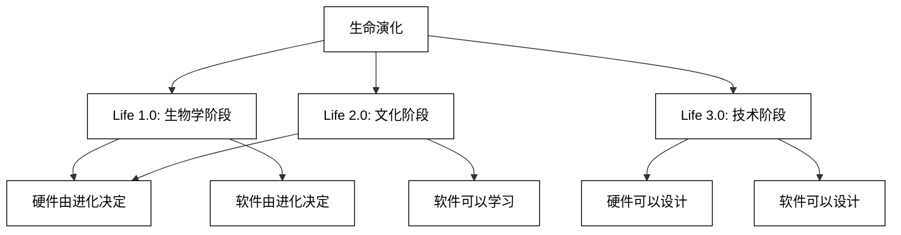
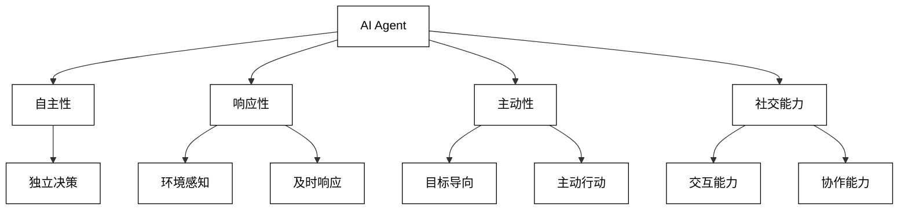
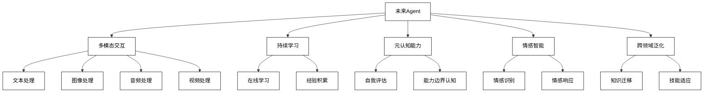
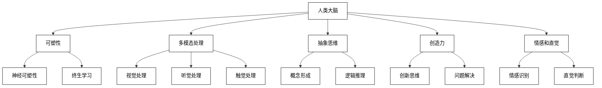
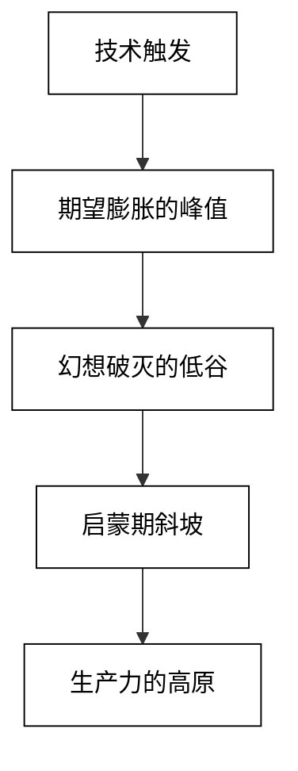

# 大模型应用开发：动手做AI Agent 

关键词：AI Agent、GPT、大语言模型、智能代理、LangChain、OpenAI API、LlamaIndex、MetaGPT、GPT大语言模型应用、智能代理、LangChain开发实战

文章摘要：
本文深入探讨了AI Agent在大模型应用开发中的关键角色，涵盖了从基础概念到实践应用的全面内容。文章首先阐述了Agent的定义、核心组成要素以及其在人工智能领域的重要性。随后，详细介绍了基于大模型的Agent技术框架，包括ReAct、函数调用等多种认知框架。在技术工具方面，重点讲解了OpenAI API、LangChain和LlamaIndex等主流开发工具的使用方法和实践案例。

文章通过七个实际的Agent开发项目，涵盖了自动化办公、智能调度、知识整合等多个应用场景，展示了Agent在各个领域的实际应用和潜力。每个项目都包含了详细的代码实现、原理解析和效果分析，为读者提供了全面的学习和实践指导。此外，文章还探讨了多Agent系统的开发框架，如AutoGen和MetaGPT，以及Agent技术的未来发展趋势。

通过本文，读者将全面了解AI Agent的开发流程、核心技术和实际应用，为进一步探索和创新AI应用提供坚实的基础。

## 第1章 何谓Agent，为何Agent

### 1.1 大开脑洞的演讲：Life 3.0

在人工智能的发展历程中，麻省理工学院物理学教授Max Tegmark的"Life 3.0"概念无疑是一个具有里程碑意义的思想实验。这个概念不仅开启了我们对生命和智能本质的深度思考，更为AI Agent的定义和发展提供了宏观的理论框架。

Tegmark将生命的演化分为三个阶段：

1. Life 1.0：生物学阶段，硬件和软件都由进化决定。
2. Life 2.0：文化阶段，硬件由进化决定，软件可以学习。
3. Life 3.0：技术阶段，硬件和软件都可以设计。



在这个框架下，AI Agent可以被视为向Life 3.0迈进的重要一步。它们代表了一种能够自主学习、决策和行动的智能实体，具有改变自身"软件"（即知识和行为模式）的能力，某些高级Agent甚至可能具备改变自身"硬件"（即物理结构或计算基础）的潜力。

Tegmark的演讲引发了一系列深刻的问题：

1. 智能的本质是什么？
2. 意识是否可以被人工创造？
3. AI的发展会如何影响人类社会和个体？
4. 我们应如何确保AI的发展方向与人类价值观一致？

这些问题直接关系到AI Agent的设计理念和伦理考量。例如，在设计一个自主学习的Agent时，我们需要考虑：

- 如何确保Agent的学习目标与人类利益一致？
- 如何在Agent的决策过程中嵌入道德和伦理考量？
- 如何平衡Agent的自主性与可控性？

Life 3.0的概念也为Agent的长期发展提供了一个远景。我们可以设想，未来的Agent可能不仅仅是软件实体，还可能以各种物理形态存在，如智能机器人、纳米机器人，甚至是生物电子混合体。这种多样化的Agent生态系统将为人类社会带来前所未有的机遇和挑战。

在实际应用中，Life 3.0的思想已经开始影响Agent的设计和开发。例如：

1. 元学习（Meta-learning）：使Agent能够"学会如何学习"，类似于Life 2.0向3.0过渡的能力。

2. 自适应架构：设计能够根据任务和环境动态调整自身结构的Agent，模拟Life 3.0中"硬件可设计"的特性。

3. 伦理AI：在Agent的决策框架中嵌入道德推理能力，以应对复杂的社会和道德问题。

4. 多Agent系统：构建能够协作和竞争的Agent生态系统，模拟复杂的社会动态。

```python
# 元学习Agent的伪代码示例
class MetaLearningAgent:
    def __init__(self):
        self.meta_model = initialize_meta_model()
        self.task_specific_model = None

    def adapt_to_new_task(self, task_data):
        # 使用元模型快速适应新任务
        self.task_specific_model = self.meta_model.adapt(task_data)

    def learn_and_improve(self, experience):
        # 从经验中学习，更新元模型
        self.meta_model.update(experience)

    def perform_task(self, input_data):
        if self.task_specific_model is None:
            raise Exception("Agent not adapted to any task yet")
        return self.task_specific_model.predict(input_data)

# 使用示例
agent = MetaLearningAgent()
new_task_data = load_new_task_data()
agent.adapt_to_new_task(new_task_data)

for episode in range(num_episodes):
    input_data = get_input_data()
    result = agent.perform_task(input_data)
    experience = get_feedback(result)
    agent.learn_and_improve(experience)
```

这个伪代码展示了一个具有元学习能力的Agent，它能够快速适应新任务并从经验中持续学习改进，体现了向Life 3.0迈进的特征。

总的来说，Tegmark的Life 3.0概念为我们理解和开发AI Agent提供了一个宏大的视角。它不仅激发了我们对Agent未来发展的想象，也提醒我们在追求技术进步的同时，需要深思熟虑地考虑伦理和社会影响。在未来的Agent开发中，我们应该始终牢记这一远景，努力创造既能推动技术进步，又能造福人类社会的智能系统。

### 1.2 那么，究竟何谓Agent

在探讨了Life 3.0的宏大概念后，我们需要更具体地定义何谓Agent。Agent，作为人工智能领域的一个核心概念，其定义和理解随着技术的发展不断演进。在当前的AI语境中，Agent可以被广泛定义为一个能够感知环境、做出决策并采取行动以实现特定目标的智能实体。

Agent的核心特征包括：

1. 自主性（Autonomy）：能够在没有直接人类干预的情况下独立运作。
2. 响应性（Reactivity）：能够感知环境并及时做出响应。
3. 主动性（Proactivity）：能够主动采取行动以实现目标。
4. 社交能力（Social ability）：能够与其他Agent或人类进行交互和协作。



在技术实现上，一个典型的Agent通常包含以下组件：

1. 感知模块（Perception Module）：用于接收和处理环境信息。
2. 决策模块（Decision-making Module）：基于感知信息和内部状态做出决策。
3. 执行模块（Execution Module）：将决策转化为具体行动。
4. 学习模块（Learning Module）：从经验中学习和改进。
5. 知识库（Knowledge Base）：存储Agent的知识和经验。

```python
# Agent的基本结构伪代码
class Agent:
    def __init__(self):
        self.perception_module = PerceptionModule()
        self.decision_module = DecisionModule()
        self.execution_module = ExecutionModule()
        self.learning_module = LearningModule()
        self.knowledge_base = KnowledgeBase()

    def perceive(self, environment):
        return self.perception_module.process(environment)

    def decide(self, perception):
        return self.decision_module.make_decision(perception, self.knowledge_base)

    def act(self, decision):
        return self.execution_module.execute(decision)

    def learn(self, experience):
        self.learning_module.update(experience, self.knowledge_base)

    def run(self, environment):
        while True:
            perception = self.perceive(environment)
            decision = self.decide(perception)
            action = self.act(decision)
            experience = environment.get_feedback(action)
            self.learn(experience)
            if environment.is_terminal():
                break

# 使用示例
agent = Agent()
environment = Environment()
agent.run(environment)
```

这个伪代码展示了一个基本Agent的结构和运行流程，包括感知、决策、行动和学习的循环过程。

在现代AI领域，特别是在大语言模型（LLM）的背景下，Agent的概念得到了进一步的扩展和深化。基于LLM的Agent不仅具备了强大的自然语言理解和生成能力，还能够执行复杂的认知任务，如推理、规划和问题解决。这些Agent通常具有以下特点：

1. 语言智能：能够理解和生成人类语言，进行复杂的对话和交互。
2. 任务适应性：能够快速适应各种不同的任务和领域。
3. 知识整合：能够整合和利用大规模的知识。
4. 上下文理解：能够理解和维持长期上下文。
5. 推理能力：能够进行逻辑推理和创造性思考。

例如，OpenAI的GPT系列模型就可以被视为一种高级的语言Agent。它们能够执行各种语言任务，从简单的问答到复杂的文本生成和分析。通过fine-tuning或prompt engineering，这些模型可以被定制为专门的Agent，用于特定的应用场景，如客户服务、内容创作或代码生成。

```python
# 基于LLM的Agent伪代码示例
class LLMAgent:
    def __init__(self, model):
        self.model = model
        self.conversation_history = []

    def process_input(self, user_input):
        self.conversation_history.append(f"User: {user_input}")
        context = "\n".join(self.conversation_history)
        response = self.model.generate(context)
        self.conversation_history.append(f"Agent: {response}")
        return response

    def perform_task(self, task_description):
        prompt = f"Task: {task_description}\nPlease provide a step-by-step solution."
        solution = self.model.generate(prompt)
        return solution

# 使用示例
llm_agent = LLMAgent(LargeLanguageModel())
user_query = "How can I improve my programming skills?"
response = llm_agent.process_input(user_query)
print(response)

task = "Develop a marketing strategy for a new smartphone."
solution = llm_agent.perform_task(task)
print(solution)
```

这个伪代码展示了一个基于LLM的Agent如何处理对话和执行任务。它能够维护对话历史，生成上下文相关的回复，并针对特定任务提供解决方案。

然而，值得注意的是，尽管当前的LLM-based Agent表现出色，但它们仍然存在一些局限性：

1. 幻觉问题：可能生成虚假或不准确的信息。
2. 伦理考量：可能产生有偏见或不适当的内容。
3. 解释性不足：难以解释模型的决策过程。
4. 泛化能力有限：在未见过的场景中表现可能不稳定。

为了克服这些挑战，研究人员正在探索各种方法，如：

- 结合外部知识库和检索系统以提高准确性。
- 开发更强大的推理和规划能力。
- 实现多模态感知和交互。
- 增强Agent的自我监督和学习能力。

```python
# 增强型Agent伪代码示例
class EnhancedAgent(LLMAgent):
    def __init__(self, model, knowledge_base, reasoning_engine):
        super().__init__(model)
        self.knowledge_base = knowledge_base
        self.reasoning_engine = reasoning_engine

    def process_input(self, user_input):
        # 检索相关知识
        relevant_info = self.knowledge_base.retrieve(user_input)
        
        # 使用推理引擎
        reasoning_result = self.reasoning_engine.reason(user_input, relevant_info)
        
        # 生成回复
        response = super().process_inputuser_input)
        
        # 结合推理结果和LLM输出
        final_response = self.combine_outputs(response, reasoning_result)
        
        return final_response

    def combine_outputs(self, llm_output, reasoning_output):
        # 实现输出结合的逻辑
        combined = f"LLM: {llm_output}\nReasoning: {reasoning_output}"
        return self.model.generate(f"Combine the following outputs:\n{combined}")

# 使用示例
enhanced_agent = EnhancedAgent(LargeLanguageModel(), KnowledgeBase(), ReasoningEngine())
query = "What are the potential impacts of quantum computing on cryptography?"
response = enhanced_agent.process_input(query)
print(response)
```

这个增强型Agent示例展示了如何结合知识库和推理引擎来改进Agent的表现。通过整合外部知识和专门的推理能力，Agent可以生成更准确、更可靠的响应。

随着技术的不断进步，我们可以预见未来的Agent将更加智能和多功能。它们可能具备以下特征：

1. 多模态交互：能够处理和生成文本、图像、音频和视频等多种形式的数据。
2. 持续学习：能够从与环境和用户的交互中不断学习和改进。
3. 元认知能力：具备自我评估和反思的能力，能够理解自身的局限性。
4. 情感智能：能够理解和适当回应人类的情感状态。
5. 跨领域泛化：能够将一个领域的知识和技能迁移到其他领域。



总结来说，Agent作为AI研究和应用的核心概念，正在经历快速的演变和发展。从最初的简单反应式系统，到现在基于大语言模型的复杂智能体，Agent的定义和能力不断扩展。未来的Agent将更加接近于通用人工智能（AGI）的理想，能够在各种复杂环境中自主学习、推理和行动。

然而，随着Agent变得越来越先进，我们也面临着更多的伦理和社会挑战。如何确保Agent的行为符合人类价值观？如何平衡Agent的自主性和可控性？如何处理Agent可能带来的就业影响？这些问题需要技术开发者、伦理学家、政策制定者和整个社会共同努力来解决。

在实际应用中，我们需要谨慎地设计和部署Agent系统，确保它们能够安全、可靠地为人类服务。同时，我们也应该积极探索Agent技术的创新应用，以解决人类面临的复杂挑战，如气候变化、医疗健康、教育公平等。

Agent技术的发展将持续塑造我们的未来。作为开发者和研究者，我们有责任推动这一技术向着有益于人类的方向发展，创造一个人机协作的美好未来。

### 1.3 Agent的大脑：大模型的通用推理能力

大语言模型（Large Language Models，LLMs）作为当前AI技术的前沿，已经成为构建高级Agent的核心组件。这些模型展现出了前所未有的通用推理能力，使得Agent能够处理复杂的认知任务，从而在各种应用场景中发挥重要作用。本节将深入探讨大模型作为Agent"大脑"的重要性，以及它如何赋予Agent强大的推理能力。

#### 1.3.1 人类的大脑了不起

在讨论大模型之前，我们首先要认识到人类大脑的惊人之处。人类大脑是已知最复杂的器官之一，拥有约860亿个神经元和数万亿个突触连接。它能够处理各种感官输入，进行高级认知功能如推理、规划和创造性思维，同时还具有自我意识和情感体验。

人类大脑的关键特征包括：

1. 可塑性：能够通过学习和经验不断重塑神经连接。
2. 多模态处理：能同时处理视觉、听觉、触觉等多种感官信息。
3. 抽象思维：能够形成概念和进行高层次的抽象推理。
4. 创造力：能够产生新颖的想法和解决方案。
5. 情感和直觉：能够进行情感处理和快速直觉判断。



人类大脑的这些特性为AI研究提供了灵感和目标。虽然当前的AI系统还远未达到人类大脑的复杂性和灵活性，但在某些特定任务上，AI已经展现出了超越人类的能力。

#### 1.3.2 大模型出现之前的Agent

在大模型出现之前，传统的AI Agent主要依赖于规则基础系统、专家系统和机器学习算法。这些早期的Agent虽然在特定任务上表现出色，但在通用推理和适应性方面存在明显局限。

早期Agent的主要特征包括：

1. 任务特异性：通常为特定任务设计，难以泛化到其他领域。
2. 规则依赖：大量依赖预设规则和人工编码的知识。
3. 推理能力有限：难以处理复杂的、开放式的问题。
4. 缺乏语言理解：无法有效处理自然语言输入。

例如，一个典型的基于规则的Agent可能如下所示：

```python
class RuleBasedAgent:
    def __init__(self):
        self.rules = {
            "greeting": ["hello", "hi", "hey"],
            "farewell": ["goodbye", "bye", "see you"],
            "weather_query": ["weather", "temperature", "forecast"]
        }
        self.actions = {
            "greeting": self.greet,
            "farewell": self.farewell,
            "weather_query": self.weather_info
        }

    def process_input(self, user_input):
        for category, keywords in self.rules.items():
            if any(keyword in user_input.lower() for keyword in keywords):
                return self.actions[category]()
        return "I'm sorry, I don't understand that."

    def greet(self):
        return "Hello! How can I help you today?"

    def farewell(self):
        return "Goodbye! Have a great day!"

    def weather_info(self):
        return "I'm sorry, I don't have access to real-time weather information."

# 使用示例
agent = RuleBasedAgent()
print(agent.process_input("Hello there!"))
print(agent.process_input("What's the weather like today?"))
print(agent.process_input("Can you explain quantum physics?"))
```

这种基于规则的Agent虽然在预定义的任务范围内可以工作，但显然缺乏灵活性和通用性。它无法处理复杂的查询或适应新的情况，这大大限制了其应用范围。

#### 1.3.3 大模型就是Agent的大脑

大语言模型的出现彻底改变了Agent的设计和能力。这些模型，如GPT（Generative Pre-trained Transformer）系列，通过在海量文本数据上预训练，获得了强大的语言理解和生成能力，以及惊人的推理能力。

大模型作为Agent大脑的优势包括：

1. 通用性：能够处理广泛的任务和领域，无需专门的任务特定训练。
2. 语言理解：能够理解和生成自然语言，实现更自然的人机交互。
3. 上下文学习：能够从少量示例中快速学习新任务（Few-shot learning）。
4. 知识整合：包含大量世界知识，能够应用于各种推理任务。
5. 创造性：能够生成新颖的内容和解决方案。

大模型的核心是Transformer架构，它通过自注意力机制实现了对长序列的有效处理。Transformer的数学模型可以简化表示如下：

$$
\text{Attention}(Q, K, V) = \text{softmax}\left(\frac{QK^T}{\sqrt{d_k}}\right)V
$$

其中，$Q$、$K$、$V$分别代表查询、键和值矩阵，$d_k$是键向量的维度。

在实际应用中，大模型通常使用多头注意力机制，可以表示为：

$$
\text{MultiHead}(Q, K, V) = \text{Concat}(head_1, ..., head_h)W^O
$$

其中，

$$
head_i = \text{Attention}(QW_i^Q, KW_i^K, VW_i^V)
$$

这种架构使得模型能够并行处理不同的注意力"头"，从而捕获序列中的多种关系。

基于大模型的Agent可以用以下伪代码表示：

```python
class LLMAgent:
    def __init__(self, model):
        self.model = model
        self.conversation_history = []

    def process_input(self, user_input):
        # 添加用户输入到对话历史
        self.conversation_history.append(f"User: {user_input}")
        
        # 构建prompt
        prompt = self.build_prompt()
        
        # 生成响应
        response = self.model.generate(prompt)
        
        # 添加响应到对话历史
        self.conversation_history.append(f"Agent: {response}")
        
        return response

    def build_prompt(self):
        # 构建包含对话历史和系统指令的prompt
        system_instruction = "You are a helpful AI assistant. Provide accurate and helpful responses."
        context = "\n".join(self.conversation_history[-5:])  # 只使用最近的5轮对话
        return f"{system_instruction}\n\nConversation:\n{context}\nAgent:"

    def perform_task(self, task_description):
        # 执行特定任务
        prompt = f"Task: {task_description}\nPlease provide a step-by-step solution."
        solution = self.model.generate(prompt)
        return solution

# 使用示例
llm_agent = LLMAgent(GPT3Model())  # 假设GPT3Model是预训练好的大模型

# 对话示例
print(llm_agent.process_input("What is the capital of France?"))
print(llm_agent.process_input("Can you explain how photosynthesis works?"))

# 任务执行示例
task = "Develop a marketing strategy for a new eco-friendly product."
print(llm_agent.perform_task(task))
```

这个基于大模型的Agent展现了显著的灵活性和能力。它可以处理各种查询，从简单的事实问题到复杂的解释任务，甚至可以执行开放式的问题解决任务。这种Agent不需要预定义的规则或特定领域的知识库，而是依赖于模型在预训练过程中学到的广泛知识和推理能力。

#### 1.3.4 期望顶峰和失望低谷

尽管大模型为Agent带来了革命性的进步，但我们也需要认识到它的局限性，以避免陷入过高期望和随之而来的失望。

期望顶峰：
1. 通用人工智能（AGI）的幻觉：一些人可能误以为大模型已经接近AGI。
2. 完美的问题解决者：期望Agent能够解决任何问题，无论多么复杂。
3. 情感和意识：误解模型的拟人化回应为真实的情感或意识。

失望低谷：
1. 幻觉问题：模型可能生成看似合理但实际上不正确的信息。
2. 一致性缺失：模型在不同运行中可能给出不一致的答案。
3. 伦理问题：模型可能产生有偏见或不适当的内容。
4. 理解深度有限：虽然能生成流畅的文本，但可能缺乏真正的理解。

为了更好地理解这一现象，我们可以借鉴Gartner的技术成熟度曲线（Hype Cycle）：



在这个曲线中，大模型基 Agent 当前可能处于"期望膨胀的峰值"向"幻想破灭的低谷"过渡的阶段。认识到这一点有助于我们更加理性地看待和使用这项技术。

为了应对这些挑战，研究人员和开发者正在探索多种方法：

1. 事实核查和知识增强：
   结合外部知识库和实时信息源，以提高Agent的准确性。

   ```python
   class EnhancedLLMAgent(LLMAgent):
       def __init__(self, model, knowledge_base):
           super().__init__(model)
           self.knowledge_base = knowledge_base

       def process_input(self, user_input):
           # 先查询知识库
           factual_info = self.knowledge_base.query(user_input)
           
           # 将事实信息加入prompt
           enhanced_prompt = f"{self.build_prompt()}\nFactual information: {factual_info}"
           
           # 生成响应
           response = self.model.generate(enhanced_prompt)
           
           return response
   ```

2. 不确定性量化：
   开发技术来评估模型输出的置信度，并在不确定时明确表示。

   ```python
   def generate_with_confidence(self, prompt):
       response = self.model.generate(prompt)
       confidence = self.model.estimate_confidence(response)
       
       if confidence < 0.7:  # 假设0.7是置信度阈值
           return f"I'm not entirely sure, but here's my best attempt: {response}"
       else:
           return response
   ```

3. 多模型集成：
   使用多个模型或多次运行来交叉验证结果，提高一致性。

   ```python
   class EnsembleLLMAgent:
       def __init__(self, models):
           self.models = models

       def process_input(self, user_input):
           responses = [model.generate(user_input) for model in self.models]
           # 使用某种策略（如多数投票）来选择最终响应
           final_response = self.ensemble_strategy(responses)
           return final_response
   ```

4. 持续学习和反馈机制：
   实现Agent的在线学习能力，通过用户反馈不断改进。

   ```python
   class AdaptiveLLMAgent(LLMAgent):
       def __init__(self, model, feedback_database):
           super().__init__(model)
           self.feedback_database = feedback_database

       def process_input(self, user_input):
           response = super().process_input(user_input)
           
           # 请求用户反馈
           user_feedback = self.get_user_feedback(response)
           
           # 存储反馈以用于未来改进
           self.feedback_database.store(user_input, response, user_feedback)
           
           return response

       def get_user_feedback(self, response):
           # 实现获取用户反馈的逻辑
           pass
   ```

5. 伦理框架集成：
   在Agent的决策过程中嵌入伦理考量。

   ```python
   class EthicalLLMAgent(LLMAgent):
       def __init__(self, model, ethical_guidelines):
           super().__init__(model)
           self.ethical_guidelines = ethical_guidelines

       def process_input(self, user_input):
           response = super().process_input(user_input)
           
           # 检查响应是否符合伦理准则
           if not self.ethical_check(response):
               response = self.ethical_correction(response)
           
           return response

       def ethical_check(self, response):
           # 实现伦理检查逻辑
           pass

       def ethical_correction(self, response):
           # 实现伦理纠正逻辑
           pass
   ```

#### 1.3.5 知识、记忆、理解、表达、推理、反思、泛化和自我提升

大模型作为Agent的大脑，展现出了类似人类认知功能的多个方面。让我们深入探讨这些关键能力：

1. 知识（Knowledge）：
   大模型在预训练过程中吸收了海量的文本数据，形成了广泛的知识库。这使得Agent能够回答各种领域的问题，就像一个博学多识的个体。

   ```python
   def knowledge_query(self, question):
       prompt = f"Based on your knowledge, please answer: {question}"
       return self.model.generate(prompt)
   ```

2. 记忆（Memory）：
   虽然大模型本身不具备长期记忆，但我们可以通过设计实现短期和长期记忆机制。

   ```python
   class MemoryEnhancedAgent(LLMAgent):
       def __init__(self, model):
           super().__init__(model)
           self.short_term_memory = []
           self.long_term_memory = {}

       def process_input(self, user_input):
           # 加入短期记忆
           self.short_term_memory.append(user_input)
           if len(self.short_term_memory) > 5:
               self.short_term_memory.pop(0)
           
           # 构建包含记忆的prompt
           memory_prompt = f"Short-term memory: {self.short_term_memory}\n"
           memory_prompt += f"Long-term memory: {self.long_term_memory}\n"
           
           response = super().process_input(user_input, additional_context=memory_prompt)
           
           # 更新长期记忆
           self.update_long_term_memory(user_input, response)
           
           return response

       def update_long_term_memory(self, input, response):
           # 实现长期记忆更新逻辑
           pass
   ```

3. 理解（Understanding）：
   大模型展现出了对自然语言的深度理解能力，能够捕捉上下文、语义和隐含意义。

   ```python
   def semantic_analysis(self, text):
       prompt = f"Analyze the following text and explain its main ideas and underlying themes: {text}"
       return self.model.generate(prompt)
   ```

4. 表达（Expression）：
   模型能够生成流畅、连贯且符合语境的文本，展现出强大的语言表达能力。

   ```python
   def generate_essay(self, topic, style):
       prompt = f"Write a 500-word essay on the topic '{topic}' in the style of {style}."
       return self.model.generate(prompt)
   ```

5. 推理（Reasoning）：
   大模型展现出了复杂的推理能力，能够进行逻辑分析、假设验证和问题解决。

   ```python
   def logical_reasoning(self, premises, question):
       prompt = f"Given the premises: {premises}\nAnswer the following question using logical reasoning: {question}"
       return self.model.generate(prompt)
   ```

6. 反思（Reflection）：
   通过适当的提示，我们可以让模型对自己的输出进行反思和评估。

   ```python
   def self_reflection(self, original_response):
       prompt = f"Reflect on the following response and provide a critical analysis of its strengths and weaknesses: {original_response}"
       return self.model.generate(prompt)
   ```

7. 泛化（Generalization）：
   大模型能够将学到的知识应用到新的、未见过的情况，展现出强大的泛化能力。

   ```python
   def apply_concept(self, concept, new_scenario):
       prompt = f"Apply the concept of '{concept}' to the following new scenario: {new_scenario}"
       return self.model.generate(prompt)
   ```

8. 自我提升（Self-improvement）：
   虽然当前的大模型无法真正地自我改进，但我们可以设计机制来模拟这一过程。

   ```python
   class SelfImprovingAgent(LLMAgent):
       def __init__(self, model, performance_evaluator):
           super().__init__(model)
           self.performance_evaluator = performance_evaluator
           self.improvement_strategies = []

       def process_input(self, user_input):
           response = super().process_input(user_input)
           performance_score = self.performance_evaluator.evaluate(response)
           
           if performance_score < 0.8:  # 假设0.8是性能阈值
               self.generate_improvement_strategy()
           
           return response

       def generate_improvement_strategy(self):
           prompt = "Based on recent performance, suggest a strategy to improve response quality."
           strategy = self.model.generate(prompt)
           self.improvement_strategies.append(strategy)
           # 在实际应用中，这里可能需要人工审核和实施改进策略
   ```

这些能力的结合使得基于大模型的Agent表现出近乎智能体的行为。然而，重要的是要认识到，这些能力在很大程度上是通过统计模式匹配和大规模数据训练实现的，而不是真正的理解或思考。

为了更好地利用这些能力，我们可以设计一个综合框架，将这些功能模块化：

```python
class ComprehensiveAgent:
    def __init__(self, model):
        self.model = model
        self.memory = MemoryModule()
        self.reasoning = ReasoningModule()
        self.reflection = ReflectionModule()
        self.expression = ExpressionModule()

    def process_query(self, query):
        # 1. 理解查询
        understood_query = self.understand(query)
        
        # 2. 检索相关记忆
        relevant_memory = self.memory.retrieve(understood_query)
        
        # 3. 进行推理
        reasoning_result = self.reasoning.reason(understood_query, relevant_memory)
        
        # 4. 生成初步响应
        initial_response = self.expression.generate(reasoning_result)
        
        # 5. 反思和改进
        reflected_response = self.reflection.reflect(initial_response)
        
        # 6. 更新记忆
        self.memory.update(query, reflected_response)
        
        return reflected_response

    def understand(self, text):
        prompt = f"Analyze and summarize the key points of: {text}"
        return self.model.generate(prompt)

class MemoryModule:
    # 实现记忆检索和更新逻辑

class ReasoningModule:
    # 实现推理逻辑

class ReflectionModule:
    # 实现反思和自我评估逻辑

class ExpressionModule:
    # 实现自然语言生成逻辑
```

这个综合框架展示了如何将大模型的各种能力整合到一个复杂的Agent系统中。通过这种模块化的设计，我们可以更好地控制和优化Agent的各个认知过程。

然而，尽管这些能力令人印象深刻，我们仍然面临着一些关键挑战：

1. 真实理解vs表面模仿：如何区分模型的真实理解和单纯的统计模仿？
2. 一致性和可靠性：如何确保模型在不同情况下保持一致和可靠的表现？
3. 知识更新：如何有效地更新模型的知识库，使其保持最新？
4. 伦理和偏见：如何减少模型中可能存在的偏见，并确保其行为符合伦理标准？
5. 计算效率：如何在保持这些复杂能力的同时，提高模型的运行效率？

这些挑战正推动着研究人员探索新的模型架构、训练方法和应用框架。未来的发展可能包括：

- 多模态模型：整合文本、图像、音频等多种数据类型的理解和生成能力。
- 持续学习模型：能够从新数据中不断学习和更新知识的模型。
- 可解释AI：提高模型决策过程的透明度和可解释性。
- 强化学习集成：通过与环境交互来改进模型的决策能力。
- 神经符号AI：结合神经网络的学习能力和符号系统的逻辑推理能力。

#### 1.3.6 基于大模型的推理能力构筑AI应用

大模型的强大推理能力为构建各种AI应用提供了新的可能性。这些应用不仅限于传统的自然语言处理任务，还延伸到了更广泛的领域。以下是一些基于大模型推理能力的应用示例：

1. 智能客服系统：
   利用大模型的理解和推理能力，构建能够处理复杂查询和问题解决的客服Agent。

   ```python
   class CustomerServiceAgent(LLMAgent):
       def __init__(self, model, product_database):
           super().__init__(model)
           self.product_database = product_database

       def handle_query(self, customer_query):
           # 理解查询意图
           intent = self.understand_intent(customer_query)
           
           # 检索相关产品信息
           product_info = self.product_database.search(intent)
           
           # 生成响应
           response = self.generate_response(intent, product_info, customer_query)
           
           return response

       def understand_intent(self, query):
           prompt = f"Identify the main intent of this customer query: {query}"
           return self.model.generate(prompt)

       def generate_response(self, intent, product_info, query):
           prompt = f"Given the customer intent: {intent}\nAnd product information: {product_info}\nGenerate a helpful response to: {query}"
           return self.model.generate(prompt)
   ```

2. 代码辅助系统：
   利用大模型对编程语言的理解，创建能够提供代码建议、bug修复和文档生成的编程助手。

   ```python
   class CodeAssistantAgent(LLMAgent):
       def __init__(self, model):
           super().__init__(model)

       def suggest_code(self, context, language):
           prompt = f"Given the following code context in {language}:\n{context}\nSuggest the next lines of code."
           return self.model.generate(prompt)

       def explain_code(self, code):
           prompt = f"Explain the following code and its functionality:\n{code}"
           return self.model.generate(prompt)

       def fix_bug(self, buggy_code, error_message):
           prompt = f"Given the following buggy code:\n{buggy_code}\nAnd the error message:\n{error_message}\nProvide a fix and explanation."
           return self.model.generate(prompt)
   ```

3. 自动化报告生成：
   利用大模型的数据理解和文本生成能力，创建能够自动分析数据并生成报告的系统。

   ```python
   class ReportGenerationAgent(LLMAgent):
       def __init__(self, model, data_analyzer):
           super().__init__(model)
           self.data_analyzer = data_analyzer

       def generate_report(self, data, report_type):
           # 分析数据
           analysis_results = self.data_analyzer.analyze(data)
           
           # 生成报告
           report = self.create_report(analysis_results, report_type)
           
           return report

       def create_report(self, analysis_results, report_type):
           prompt = f"Create a {report_type} report based on the following analysis results:\n{analysis_results}"
           return self.model.generate(prompt)
   ```

4. 创意写作助手：
   利用大模型的创造性和语言生成能力，开发能够辅助创意写作的Agent。

   ```python
   class CreativeWritingAgent(LLMAgent):
       def __init__(self, model):
           super().__init__(model)

       def generate_story_idea(self, genre, theme):
           prompt = f"Generate a unique story idea for a {genre} story with the theme of {theme}."
           return self.model.generate(prompt)

       def develop_character(self, character_name, story_context):
           prompt = f"Develop a complex character named {character_name} for the following story context:\n{story_context}"
           return self.model.generate(prompt)

       def write_scene(self, scene_description, characters):
           prompt = f"Write a scene based on the following description:\n{scene_description}\nIncluding these characters: {characters}"
           return self.model.generate(prompt)
   ```

5. 医疗诊断辅助系统：
   结合大模型的推理能力和医学知识库，创建能够辅助医生进行诊断的Agent。

   ```python
   class MedicalDiagnosisAgent(LLMAgent):
       def __init__(self, model, medical_database):
           super().__init__(model)
           self.medical_database = medical_database

       def suggest_diagnosis(self, symptoms, patient_history):
           # 检索相关医学知识
           relevant_info = self.medical_database.query(symptoms)
           
           # 生成诊断建议
           prompt = f"Based on the symptoms: {symptoms}\nPatient history: {patient_history}\nAnd medical information: {relevant_info}\nSuggest possible diagnoses and next steps."
           return self.model.generate(prompt)

       def explain_diagnosis(self, diagnosis, for_patient=True):
           audience = "patient" if for_patient else "medical professional"
           prompt = f"Explain the following diagnosis in terms suitable for a {audience}:\n{diagnosis}"
           return self.model.generate(prompt)
   ```

6. 教育辅导系统：
   利用大模型的知识广度和解释能力，创建能够提供个性化学习辅导的Agent。

   ```python
   class TutoringAgent(LLMAgent):
       def __init__(self, model, curriculum_database):
           super().__init__(model)
           self.curriculum_database = curriculum_database

       def explain_concept(self, concept, student_level):
           curriculum_context = self.curriculum_database.get_context(concept, student_level)
           prompt = f"Explain the concept of {concept} at a {student_level} level.\nCurriculum context: {curriculum_context}"
           return self.model.generate(prompt)

       def generate_practice_question(self, topic, difficulty):
           prompt = f"Create a {difficulty} level practice question on the topic of {topic}."
           return self.model.generate(prompt)

       def provide_feedback(self, student_answer, correct_answer):
           prompt = f"Given the student's answer: {student_answer}\nAnd the correct answer: {correct_answer}\nProvide constructive feedback and explanation."
           return self.model.generate(prompt)
   ```

7. 法律咨询助手：
   结合大模型的推理能力和法律知识库，创建能够提供初步法律建议的Agent。

   ```python
   class LegalAdvisorAgent(LLMAgent):
       def __init__(self, model, legal_database):
           super().__init__(model)
           self.legal_database = legal_database

       def analyze_case(self, case_description):
           relevant_laws = self.legal_database.search(case_description)
           prompt = f"Analyze the following case:\n{case_description}\nConsidering these relevant laws and precedents:\n{relevant_laws}"
           return self.model.generate(prompt)

       def suggest_legal_action(self, situation, jurisdiction):
           prompt = f"Given the following situation in {jurisdiction}:\n{situation}\nSuggest possible legal actions and their potential outcomes."
           return self.model.generate(prompt)

       def explain_legal_term(self, term):
           prompt = f"Explain the legal term '{term}' in simple, easy-to-understand language."
           return self.model.generate(prompt)
   ```

8. 金融分析和预测系统：
   利用大模型的数据理解和推理能力，结合金融数据，创建能够进行市场分析和预测的Agent。

   ```python
   class FinancialAnalysisAgent(LLMAgent):
       def __init__(self, model, financial_data_provider):
           super().__init__(model)
           self.data_provider = financial_data_provider

       def analyze_market_trends(self, market_sector, time_period):
           market_data = self.data_provider.get_market_data(market_sector, time_period)
           prompt = f"Analyze the market trends for {market_sector} over the past {time_period} based on this data:\n{market_data}"
           return self.model.generate(prompt)

       def predict_stock_performance(self, company, timeframe):
           company_data = self.data_provider.get_company_data(company)
           market_context = self.data_provider.get_market_context()
           prompt = f"Predict the stock performance of {company} over the next {timeframe} considering:\nCompany data: {company_data}\nMarket context: {market_context}"
           return self.model.generate(prompt)

       def generate_investment_report(self, portfolio, risk_profile):
           portfolio_data = self.data_provider.get_portfolio_data(portfolio)
           prompt = f"Generate an investment report for a portfolio with a {risk_profile} risk profile:\n{portfolio_data}"
           return self.model.generate(prompt)
   ```

这些应用示例展示了基于大模型的AI Agent在各个领域的潜力。通过结合专门的知识库、数据源和领域特定的逻辑，我们可以创建出功能强大、适应性强的智能系统。

然而，在实际部署这些应用时，我们需要考虑以下几个关键因素：

1. 准确性和可靠性：确保Agent提供的信息和建议是准确和可靠的，特别是在医疗、法律等敏感领域。

2. 隐私和安全：保护用户数据，确保符合相关的数据保护法规。

3. 伦理考量：确保Agent的行为符合伦理标准，避免产生有害或偏见的内容。

4. 人机协作：设计这些系统时应考虑如何最好地支持和增强人类专家的工作，而不是完全替代他们。

5. 可解释性：在某些应用中，能够解释AI决策过程可能是至关重要的。

6. 持续更新：建立机制以确保系统的知识库和能力能够随着时间推移而更新和改进。

为了应对这些挑战，我们可以采取以下策略：

```python
class ResponsibleAIAgent(LLMAgent):
    def __init__(self, model, fact_checker, ethical_filter, explainer):
        super().__init__(model)
        self.fact_checker = fact_checker
        self.ethical_filter = ethical_filter
        self.explainer = explainer

    def process_input(self, user_input):
        # 生成初始响应
        initial_response = super().process_input(user_input)
        
        # 事实检查
        verified_response = self.fact_checker.verify(initial_response)
        
        # 伦理过滤
        ethical_response = self.ethical_filter.filter(verified_response)
        
        # 生成解释
        explanation = self.explainer.explain(ethical_response)
        
        return {
            'response': ethical_response,
            'explanation': explanation,
            'confidence': self.fact_checker.get_confidence_score()
        }

class FactChecker:
    # 实现事实验证逻辑

class EthicalFilter:
    # 实现伦理过滤逻辑

class Explainer:
    # 实现决策解释逻辑
```

通过这种方式，我们可以构建更加负责任和透明的AI应用，在利用大模型强大能力的同时，也能够管理潜在的风险和挑战。

随着技术的不断进步，我们可以预见基于大模型的AI应用将会变得更加智能、更加个性化、更加可靠。未来的发展方向可能包括：

1. 多模态交互：整合语音、图像和视频处理能力，实现更自然的人机交互。

2. 情境感知：提高Agent对用户情境的理解能力，提供更加贴合个体需求的服务。

3. 持续学习：开发能够从与用户的交互中不断学习和改进的系统。

4. 跨领域整合：创建能够跨多个专业领域进行推理和决策的综合性Agent。

5. 情感智能：提高Agent理解和适当回应人类情感的能力。

6. 个性化定制：允许用户根据自己的偏好和需求定制Agent的行为和响应方式。

总的来说，基于大模型的推理能力为AI应用开辟了广阔的前景。通过持续的研究、开发和负责任的部署，我们有望创造出能够显著提高人类生产力、创造力和生活质量的智能系统。

### 1.4 Agent的感知力：语言交互能力和多模态能力

Agent的感知力是其与外界环境交互的基础。在当前的AI技术中，这种感知力主要体现在两个方面：语言交互能力和多模态能力。这两种能力使Agent能够理解和处理各种形式的输入，从而更好地理解用户需求和环境信息。

#### 1.4.1 语言交互能力

语言交互能力是指Agent理解和生成自然语言的能力。这包括：

1. 自然语言理解（NLU）：能够准确理解用户输入的意图和语义。
2. 自然语言生成（NLG）：能够生成流畅、连贯且符合语境的文本响应。
3. 对话管理：能够维持上下文一致性，进行多轮对话。
4. 语言翻译：能够在不同语言之间进行翻译。
5. 情感分析：能够理解文本中隐含的情感和态度。

```python
class LanguageCapableAgent:
    def __init__(self, nlu_model, nlg_model, dialogue_manager, translator, sentiment_analyzer):
        self.nlu_model = nlu_model
        self.nlg_model = nlg_model
        self.dialogue_manager = dialogue_manager
        self.translator = translator
        self.sentiment_analyzer = sentiment_analyzer

    def understand(self, user_input):
        intent = self.nlu_model.extract_intent(user_input)
        entities = self.nlu_model.extract_entities(user_input)
        return intent, entities

    def generate_response(self, intent, entities, context):
        response = self.nlg_model.generate(intent, entities, context)
        return response

    def manage_dialogue(self, user_input, current_state):
        new_state = self.dialogue_manager.update_state(current_state, user_input)
        return new_state

    def translate(self, text, source_lang, target_lang):
        translated_text = self.translator.translate(text, source_lang, target_lang)
        return translated_text

    def analyze_sentiment(self, text):
        sentiment = self.sentiment_analyzer.analyze(text)
        return sentiment

    def interact(self, user_input, language='en', context=None):
        # 翻译输入（如果需要）
        if language != 'en':
            user_input = self.translate(user_input, language, 'en')

        # 理解用户输入
        intent, entities = self.understand(user_input)

        # 更新对话状态
        context = self.manage_dialogue(user_input, context)

        # 分析情感
        sentiment = self.analyze_sentiment(user_input)

        # 生成响应
        response = self.generate_response(intent, entities, context)

        # 翻译响应（如果需要）
        if language != 'en':
            response = self.translate(response, 'en', language)

        return response, context, sentiment
```

这个示例展示了一个具备全面语言交互能力的Agent。它能够理解用户输入，管理对话状态，生成适当的响应，并处理多语言和情感分析。

#### 1.4.2 多模态能力

多模态能力是指Agent处理和整合多种类型数据的能力，如文本、图像、音频和视频。这包括：

1. 图像识别和理解：能够识别和描述图像中的对象、场景和活动。
2. 语音识别和合成：能够将语音转换为文本，以及将文本转换为语音。
3. 视频分析：能够理解和描述视频内容。
4. 跨模态推理：能够在不同模态之间进行推理和关联。

```python
class MultimodalAgent:
    def __init__(self, image_processor, speech_recognizer, speech_synthesizer, video_analyzer, text_model):
        self.image_processor = image_processor
        self.speech_recognizer = speech_recognizer
        self.speech_synthesizer = speech_synthesizer
        self.video_analyzer = video_analyzer
        self.text_model = text_model

    def process_image(self, image):
        objects = self.image_processor.detect_objects(image)
        scene = self.image_processor.classify_scene(image)
        return f"I see {', '.join(objects)} in a {scene} setting."

    def process_speech(self, audio):
        text = self.speech_recognizer.transcribe(audio)
        return self.text_model.process(text)

    def generate_speech(self, text):
        return self.speech_synthesizer.synthesize(text)

    def analyze_video(self, video):
        actions = self.video_analyzer.detect_actions(video)
        return f"The video shows: {', '.join(actions)}."

    def cross_modal_reasoning(self, image, text):
        image_description = self.process_image(image)
        text_understanding = self.text_model.process(text)
        combined_understanding = self.text_model.generate(
            f"Given the image description: {image_description} "
            f"and the text: {text}, provide a comprehensive analysis."
        )
        return combined_understanding

    def interact(self, input_type, input_data):
        if input_type == 'text':
            return self.text_model.process(input_data)
        elif input_type == 'image':
            return self.process_image(input_data)
        elif input_type == 'speech':
            return self.process_speech(input_data)
        elif input_type == 'video':
            return self.analyze_video(input_data)
        else:
            raise ValueError("Unsupported input type")
```

这个多模态Agent能够处理文本、图像、语音和视频输入，并能在不同模态之间进行推理。

#### 1.4.3 结合语言交互能力和多模态能力

将语言交互能力和多模态能力结合，可以创建出更加强大和灵活的Agent：

```python
class AdvancedAgent(LanguageCapableAgent, MultimodalAgent):
    def __init__(self, *args, **kwargs):
        LanguageCapableAgent.__init__(self, *args, **kwargs)
        MultimodalAgent.__init__(self, *args, **kwargs)

    def comprehensive_interaction(self, input_type, input_data, language='en', context=None):
        # 处理多模态输入
        if input_type in ['image', 'speech', 'video']:
            perception_result = self.interact(input_type, input_data)
        else:
            perception_result = input_data

        # 进行语言处理
        response, new_context, sentiment = self.interact(perception_result, language, context)

        # 生成多模态输出（如果需要）
        if input_type == 'speech':
            response_audio = self.generate_speech(response)
            return response, response_audio, new_context, sentiment
        else:
            return response, new_context, sentiment

    def multimodal_dialogue(self, text, image=None, audio=None, video=None, language='en', context=None):
        inputs = []
        if text:
            inputs.append(f"Text: {text}")
        if image:
            image_description = self.process_image(image)
            inputs.append(f"Image: {image_description}")
        if audio:
            audio_text = self.process_speech(audio)
            inputs.append(f"Audio: {audio_text}")
        if video:
            video_description = self.analyze_video(video)
            inputs.append(f"Video: {video_description}")

        combined_input = " ".join(inputs)
        response, new_context, sentiment = self.interact(combined_input, language, context)

        return response, new_context, sentiment
```

这个高级Agent结合了语言处理和多模态能力，能够处理复杂的交互场景，如：

1. 视觉问答：回答关于图像内容的问题。
2. 多模态对话：在对话中整合文本、图像、语音和视频信息。
3. 跨模态检索：根据一种模态的查询检索另一种模态的内容。
4. 多语言多模态交互：处理不同语言的多模态输入和输出。

### 1.5 Agent的行动力：语言输出能力和工具使用能力

Agent的行动力是其执行任务和影响环境的能力。在AI系统中，这主要体现在两个方面：语言输出能力和工具使用能力。

#### 1.5.1 语言输出能力

语言输出能力使Agent能够通过生成文本来传达信息、回答问题或提供指导。这包括：

1. 回答问题：根据用户查询提供准确、相关的答案。
2. 生成报告：根据给定的数据或信息生成结构化的报告。
3. 创意写作：生成故事、诗歌或其他创意文本。
4. 对话生成：维持连贯、有意义的对话。
5. 文本摘要：提取和概括长文本的关键信息。

```python
class LanguageOutputAgent:
    def __init__(self, language_model):
        self.language_model = language_model

    def answer_question(self, question, context=None):
        prompt = f"Question: {question}\nContext: {context}\nAnswer:"
        return self.language_model.generate(prompt)

    def generate_report(self, data, report_type):
        prompt = f"Generate a {report_type} report based on the following data:\n{data}"
        return self.language_model.generate(prompt)

    def creative_writing(self, genre, theme, length):
        prompt = f"Write a {genre} story about {theme} in approximately {length} words."
        return self.language_model.generate(prompt)

    def maintain_dialogue(self, conversation_history, user_input):
        prompt = f"Conversation history:\n{conversation_history}\nUser: {user_input}\nAgent:"
        return self.language_model.generate(prompt)

    def summarize_text(self, text, max_length):
        prompt = f"Summarize the following text in no more than {max_length} words:\n{text}"
        return self.language_model.generate(prompt)
```

#### 1.5.2 工具使用能力

工具使用能力使Agent能够与外部系统和API交互，执行各种任务。这包括：

1. 数据检索：从数据库或网络搜索引擎获取信息。
2. 计算和分析：使用数学或统计工具进行计算和数据分析。
3. 文件操作：读取、写入或修改文件。
4. API调用：与外部服务（如天气API、股票API等）交互。
5. 代码执行：生成和执行代码来解决问题。

```python
import requests
import pandas as pd
import matplotlib.pyplot as plt

class ToolUsingAgent:
    def __init__(self, api_keys):
        self.api_keys = api_keys

    def search_web(self, query):
        url = f"https://api.search.com?q={query}&key={self.api_keys['search']}"
        response = requests.get(url)
        return response.json()['results']

    def analyze_data(self, data):
        df = pd.DataFrame(data)
        summary = df.describe()
        correlation = df.corr()
        return summary, correlation

    def create_visualization(self, data, chart_type):
        df = pd.DataFrame(data)
        if chart_type == 'bar':
            plt.bar(df.index, df.values)
        elif chart_type == 'line':
            plt.plot(df.index, df.values)
        plt.savefig('chart.png')
        return 'chart.png'

    def call_weather_api(self, location):
        url = f"https://api.weather.com?location={location}&key={self.api_keys['weather']}"
        response = requests.get(url)
        return response.json()['forecast']

    def execute_python_code(self, code):
        try:
            exec(code)
            return "Code executed successfully"
        except Exception as e:
            return f"Error executing code: {str(e)}"
```

#### 1.5.3 具身智能的实现

结合语言输出能力和工具使用能力，我们可以创建一个更加全面的Agent，能够理解用户需求，规划行动，并执行具体任务：

```python
class EmbodiedAgent(LanguageOutputAgent, ToolUsingAgent):
    def __init__(self, language_model, api_keys):
        LanguageOutputAgent.__init__(self, language_model)
        ToolUsingAgent.__init__(self, api_keys)

    def process_request(self, user_request):
        # 理解用户请求
        understanding = self.answer_question(f"What does the user want to do? {user_request}")

        # 规划行动
        action_plan = self.answer_question(f"Given the user wants to {understanding}, what steps should be taken?")

        # 执行行动
        results = []
        for step in action_plan.split('\n'):
            if 'search' in step.lower():
                results.append(self.search_web(step))
            elif 'analyze' in step.lower():
                results.append(self.analyze_data(step))
            elif 'visualize' in step.lower():
                results.append(self.create_visualization(step, 'bar'))
            elif 'weather' in step.lower():
                results.append(self.call_weather_api(step))
            elif 'code' in step.lower():
                results.append(self.execute_python_code(step))

        # 生成报告
        report = self.generate_report(results, 'summary')

        return report

    def interactive_session(self):
        context = ""
        while True:
            user_input = input("User: ")
            if user_input.lower() == 'exit':
                break
            response = self.process_request(user_input)
            print(f"Agent: {response}")
            context += f"User: {user_input}\nAgent: {response}\n"
```

这个具身Agent能够：
1. 理解用户的复杂请求
2. 制定行动计划
3. 使用各种工具执行任务
4. 生成报告总结结果
5. 维持交互式会话

通过这种方式，Agent不仅能够进行语言交互，还能执行实际的任务，大大扩展了其应用范围和实用性。

### 1.6 Agent对各行业的效能提升

AI Agent技术的发展正在为各个行业带来显著的效能提升。通过结合自然语言处理、机器学习和专业领域知识，Agent能够自动化许多复杂任务，提高工作效率，并为决策提供支持。让我们详细探讨Agent在不同行业中的应用及其带来的效能提升。

#### 1.6.1 自动办公好助手

在办公环境中，AI Agent可以作为强大的个人助理，显著提高工作效率：

1. 日程管理：自动安排会议，解决日程冲突。
2. 邮件处理：分类、优先排序和草拟回复。
3. 文档管理：组织、搜索和总结文档。
4. 任务跟踪：监控项目进度，提醒截止日期。

```python
class OfficeAssistantAgent:
    def __init__(self, language_model, calendar_api, email_api, document_system):
        self.language_model = language_model
        self.calendar_api = calendar_api
        self.email_api = email_api
        self.document_system = document_system

    def schedule_meeting(self, participants, duration):
        available_slots = self.calendar_api.find_common_time(participants, duration)
        if available_slots:
            meeting_time = available_slots[0]
            self.calendar_api.create_event(participants, meeting_time, duration)
            return f"Meeting scheduled for {meeting_time}"
        else:
            return "No common available time found"

    def process_email(self, email):
        category = self.language_model.classify(email.content, ["Urgent", "Important", "Regular", "Spam"])
        if category == "Urgent":
            summary = self.language_model.summarize(email.content)
            reply = self.language_model.generate_reply(email.content)
            self.email_api.send_reply(email.sender, reply)
            return f"Urgent email processed. Summary: {summary}"
        elif category == "Spam":
            self.email_api.move_to_spam(email)
            return "Spam email filtered"
        else:
            return f"Email categorized as {category}"

    def manage_documents(self, query):
        relevant_docs = self.document_system.search(query)
        summaries = [self.language_model.summarize(doc) for doc in relevant_docs]
        return summaries

    def track_tasks(self):
        tasks = self.document_system.get_tasks()
        upcoming_deadlines = [task for task in tasks if task.deadline - datetime.now() < timedelta(days=3)]
        reminders = [f"Reminder: '{task.name}' is due on {task.deadline}" for task in upcoming_deadlines]
        return reminders
```

这个办公助手Agent可以大大提高办公效率，减少日常任务的时间消耗，使员工能够专注于更有创造性和战略性的工作。

#### 1.6.2 客户服务革命

在客户服务领域，AI Agent可以提供24/7的支持，处理大量查询，提高客户满意度：

1. 自动回答常见问题
2. 处理简单的服务请求
3. 情感分析和情绪管理
4. 多语言支持

```python
class CustomerServiceAgent:
    def __init__(self, language_model, knowledge_base, sentiment_analyzer, translator):
        self.language_model = language_model
        self.knowledge_base = knowledge_base
        self.sentiment_analyzer = sentiment_analyzer
        self.translator = translator

    def handle_query(self, query, language='en'):
        # 翻译查询（如果需要）
        if language != 'en':
            query = self.translator.translate(query, source=language, target='en')

        # 查找相关信息
        relevant_info = self.knowledge_base.search(query)

        # 生成回答
        response = self.language_model.generate_response(query, relevant_info)

        # 分析情感
        sentiment = self.sentiment_analyzer.analyze(query)

        # 根据情感调整回答
        if sentiment == 'negative':
            response = self.language_model.add_empathy(response)

        # 翻译回答（如果需要）
        if language != 'en':
            response = self.translator.translate(response, source='en', target=language)

        return response

    def process_service_request(self, request):
        request_type = self.language_model.classify(request, ["Refund", "Exchange", "Complaint", "Information"])
        if request_type in ["Refund", "Exchange"]:
            return self.initiate_return_process(request)
        elif request_type == "Complaint":
            returnself.escalate_to_human(request)
        else:
            return self.handle_query(request)

    def initiate_return_process(self, request):
        # 实现退款或换货流程
        order_details = self.extract_order_details(request)
        if self.validate_return_eligibility(order_details):
            return self.generate_return_label(order_details)
        else:
            return "We're sorry, but this item is not eligible for return or exchange."

    def escalate_to_human(self, request):
        # 将复杂投诉升级给人工客服
        return "I apologize for the inconvenience. Your complaint has been escalated to our human support team. They will contact you shortly."

    def extract_order_details(self, request):
        # 从请求中提取订单详情
        return self.language_model.extract_entities(request, ["order_number", "item_name", "purchase_date"])

    def validate_return_eligibility(self, order_details):
        # 检查是否符合退货条件
        return self.knowledge_base.check_return_policy(order_details)

    def generate_return_label(self, order_details):
        # 生成退货标签
        label = self.knowledge_base.create_return_label(order_details)
        return f"Your return label has been generated. Please use the following information: {label}"
```

这个客户服务Agent可以大大提高客户服务的效率和质量。它能够快速响应客户查询，处理简单的服务请求，并在必要时将复杂问题升级给人工客服。通过情感分析和多语言支持，它还能提供更个性化和全球化的服务。

#### 1.6.3 个性化推荐

在零售和娱乐行业，AI Agent可以提供高度个性化的推荐，提高用户满意度和销售转化率：

1. 产品推荐
2. 内容推荐（如电影、音乐、文章）
3. 个性化营销
4. 动态定价

```python
class RecommendationAgent:
    def __init__(self, user_data_api, product_catalog, content_library, pricing_engine, language_model):
        self.user_data_api = user_data_api
        self.product_catalog = product_catalog
        self.content_library = content_library
        self.pricing_engine = pricing_engine
        self.language_model = language_model

    def recommend_products(self, user_id):
        user_profile = self.user_data_api.get_user_profile(user_id)
        purchase_history = self.user_data_api.get_purchase_history(user_id)
        
        relevant_products = self.product_catalog.find_similar(purchase_history)
        recommended_products = self.rank_products(relevant_products, user_profile)
        
        return recommended_products[:5]  # Top 5 recommendations

    def recommend_content(self, user_id):
        user_preferences = self.user_data_api.get_content_preferences(user_id)
        viewed_content = self.user_data_api.get_viewed_content(user_id)
        
        potential_content = self.content_library.find_similar(viewed_content)
        recommended_content = self.rank_content(potential_content, user_preferences)
        
        return recommended_content[:5]  # Top 5 recommendations

    def personalize_marketing(self, user_id):
        user_profile = self.user_data_api.get_user_profile(user_id)
        recommended_products = self.recommend_products(user_id)
        
        marketing_message = self.language_model.generate_marketing_copy(user_profile, recommended_products)
        return marketing_message

    def dynamic_pricing(self, product_id, user_id):
        base_price = self.product_catalog.get_base_price(product_id)
        user_profile = self.user_data_api.get_user_profile(user_id)
        market_demand = self.pricing_engine.get_market_demand(product_id)
        
        adjusted_price = self.pricing_engine.calculate_price(base_price, user_profile, market_demand)
        return adjusted_price

    def rank_products(self, products, user_profile):
        # 实现产品排序逻辑
        return sorted(products, key=lambda p: self.calculate_relevance(p, user_profile), reverse=True)

    def rank_content(self, content, user_preferences):
        # 实现内容排序逻辑
        return sorted(content, key=lambda c: self.calculate_relevance(c, user_preferences), reverse=True)

    def calculate_relevance(self, item, user_data):
        # 实现相关性计算逻辑
        return sum(item.features[f] * user_data.preferences[f] for f in item.features)
```

这个推荐Agent可以显著提高用户体验和业务绩效。通过分析用户行为和偏好，它可以提供高度相关的产品和内容推荐，创建个性化的营销信息，并实施动态定价策略以优化收入。

#### 1.6.4 流程的自动化与资源的优化

在制造业和物流行业，AI Agent可以优化复杂的操作流程，提高效率和资源利用率：

1. 生产计划优化
2. 库存管理
3. 供应链优化
4. 预测性维护

```python
import numpy as np
from scipy.optimize import linear_sum_assignment

class OperationsOptimizationAgent:
    def __init__(self, production_data, inventory_data, supply_chain_data, equipment_data):
        self.production_data = production_data
        self.inventory_data = inventory_data
        self.supply_chain_data = supply_chain_data
        self.equipment_data = equipment_data

    def optimize_production_schedule(self, orders, resources):
        # 使用匈牙利算法优化生产计划
        cost_matrix = np.array([[self.calculate_production_cost(order, resource) 
                                 for resource in resources] 
                                for order in orders])
        row_ind, col_ind = linear_sum_assignment(cost_matrix)
        schedule = [(orders[i], resources[j]) for i, j in zip(row_ind, col_ind)]
        return schedule

    def manage_inventory(self, products):
        for product in products:
            current_stock = self.inventory_data.get_stock(product)
            forecast_demand = self.forecast_demand(product)
            reorder_point = self.calculate_reorder_point(product)
            
            if current_stock < reorder_point:
                order_quantity = self.calculate_economic_order_quantity(product)
                self.place_order(product, order_quantity)

    def optimize_supply_chain(self, orders):
        suppliers = self.supply_chain_data.get_suppliers()
        optimized_assignments = {}
        
        for order in orders:
            best_supplier = min(suppliers, key=lambda s: self.calculate_total_cost(s, order))
            optimized_assignments[order] = best_supplier
        
        return optimized_assignments

    def predictive_maintenance(self, equipment):
        for machine in equipment:
            sensor_data = self.equipment_data.get_sensor_data(machine)
            failure_probability = self.predict_failure(machine, sensor_data)
            
            if failure_probability > 0.7:  # 阈值可调整
                self.schedule_maintenance(machine)

    def calculate_production_cost(self, order, resource):
        # 实现生产成本计算逻辑
        pass

    def forecast_demand(self, product):
        # 实现需求预测逻辑
        pass

    def calculate_reorder_point(self, product):
        # 实现再订货点计算逻辑
        pass

    def calculate_economic_order_quantity(self, product):
        # 实现经济订货量计算逻辑
        pass

    def place_order(self, product, quantity):
        # 实现下单逻辑
        pass

    def calculate_total_cost(self, supplier, order):
        # 实现总成本计算逻辑
        pass

    def predict_failure(self, machine, sensor_data):
        # 实现故障预测逻辑
        pass

    def schedule_maintenance(self, machine):
        # 实现维护调度逻辑
        pass
```

这个运营优化Agent可以显著提高制造和物流过程的效率。它能够优化生产计划，管理库存水平，优化供应链决策，并通过预测性维护减少设备停机时间。这些优化可以带来成本节约、资源利用率提高和客户满意度提升。

#### 1.6.5 医疗保健的变革

在医疗保健领域，AI Agent可以辅助医生诊断、监控患者健康状况，并提供个性化的健康建议：

1. 辅助诊断
2. 医学影像分析
3. 药物相互作用检查
4. 个性化治疗方案
5. 远程健康监测

```python
class HealthcareAgent:
    def __init__(self, medical_knowledge_base, image_analyzer, drug_interaction_checker, patient_data_api, language_model):
        self.medical_knowledge_base = medical_knowledge_base
        self.image_analyzer = image_analyzer
        self.drug_interaction_checker = drug_interaction_checker
        self.patient_data_api = patient_data_api
        self.language_model = language_model

    def assist_diagnosis(self, symptoms, patient_history):
        relevant_conditions = self.medical_knowledge_base.query_conditions(symptoms)
        diagnosis_probabilities = self.calculate_diagnosis_probabilities(relevant_conditions, patient_history)
        top_diagnoses = sorted(diagnosis_probabilities.items(), key=lambda x: x[1], reverse=True)[:3]
        
        return [(diagnosis, f"{probability:.2%}") for diagnosis, probability in top_diagnoses]

    def analyze_medical_image(self, image, image_type):
        analysis_result = self.image_analyzer.analyze(image, image_type)
        interpretation = self.language_model.interpret_image_analysis(analysis_result)
        return interpretation

    def check_drug_interactions(self, medications):
        interactions = self.drug_interaction_checker.check_interactions(medications)
        if interactions:
            return self.language_model.explain_drug_interactions(interactions)
        else:
            return "No significant drug interactions found."

    def create_treatment_plan(self, diagnosis, patient_data):
        standard_treatment = self.medical_knowledge_base.get_treatment(diagnosis)
        personalized_treatment = self.personalize_treatment(standard_treatment, patient_data)
        return self.language_model.generate_treatment_plan(personalized_treatment)

    def monitor_remote_health(self, patient_id):
        vital_signs = self.patient_data_api.get_vital_signs(patient_id)
        abnormalities = self.detect_abnormalities(vital_signs)
        if abnormalities:
            return self.generate_alert(patient_id, abnormalities)
        else:
            return "Patient's vital signs are within normal range."

    def calculate_diagnosis_probabilities(self, conditions, patient_history):
        # 实现诊断概率计算逻辑
        pass

    def personalize_treatment(self, standard_treatment, patient_data):
        # 实现治疗方案个性化逻辑
        pass

    def detect_abnormalities(self, vital_signs):
        # 实现异常检测逻辑
        pass

    def generate_alert(self, patient_id, abnormalities):
        alert_message = f"Alert for patient {patient_id}: Abnormal vital signs detected - {abnormalities}"
        self.patient_data_api.send_alert(patient_id, alert_message)
        return alert_message
```

这个医疗保健Agent可以显著提高医疗服务的质量和效率。它能够辅助医生进行诊断，分析医学影像，检查药物相互作用，创建个性化治疗方案，并进行远程健康监测。这不仅可以提高诊断的准确性和治疗的有效性，还可以实现更主动的健康管理，潜在地降低医疗成本和改善患者预后。

通过以上示例，我们可以看到AI Agent在各个行业中的广泛应用潜力。这些Agent不仅能够自动化许多复杂的任务，还能提供智能化的决策支持，从而显著提高效率，改善服务质量，并可能带来全新的业务模式和价值创造方式。然而，在部署这些系统时，我们也需要考虑数据隐私、安全性、伦理问题以及与人类专业人士的协作方式等关键问题。

### 1.7 Agent带来新的商业模式和变革

AI Agent技术的快速发展正在深刻地改变商业格局，催生出新的商业模式，并推动各行各业的变革。这种变革不仅体现在效率的提升和成本的降低，更重要的是，它正在重塑企业与客户的交互方式，创造全新的价值主张，甚至颠覆传统的行业边界。让我们深入探讨AI Agent如何引领这场商业变革。

#### 1.7.1 Gartner的8项重要预测

Gartner，作为全球领先的信息技术研究和顾问公司，对AI Agent的未来发展做出了一系列重要预测。这些预测为我们理解AI Agent对商业世界的潜在影响提供了有价值的洞察。让我们逐一分析这8项预测：

1. **到2025年，10%的企业将建立自己的AI代理团队，用于创新和战略规划。**

   这一预测反映了企业对AI Agent战略重要性的认识。AI代理团队不仅可以提高决策效率，还能为企业带来全新的创新视角。

   ```python
   class AIStrategyTeam:
       def __init__(self, company_data, market_data, language_model):
           self.company_data = company_data
           self.market_data = market_data
           self.language_model = language_model
           self.agents = self.create_agent_team()

       def create_agent_team(self):
           return {
               "market_analyst": self.create_market_analyst(),
               "innovation_strategist": self.create_innovation_strategist(),
               "risk_assessor": self.create_risk_assessor(),
               "financial_planner": self.create_financial_planner()
           }

       def create_market_analyst(self):
           # 实现市场分析Agent
           pass

       def create_innovation_strategist(self):
           # 实现创新战略Agent
           pass

       def create_risk_assessor(self):
           # 实现风险评估Agent
           pass

       def create_financial_planner(self):
           # 实现财务规划Agent
           pass

       def generate_strategic_plan(self):
           market_analysis = self.agents["market_analyst"].analyze_market()
           innovation_ideas = self.agents["innovation_strategist"].generate_ideas(market_analysis)
           risk_assessment = self.agents["risk_assessor"].assess_risks(innovation_ideas)
           financial_projections = self.agents["financial_planner"].project_financials(innovation_ideas, risk_assessment)

           prompt = f"""
           Based on the following inputs:
           Market Analysis: {market_analysis}
           Innovation Ideas: {innovation_ideas}
           Risk Assessment: {risk_assessment}
           Financial Projections: {financial_projections}

           Generate a comprehensive strategic plan for the next 5 years.
           """
           strategic_plan = self.language_model.generate(prompt)
           return strategic_plan
   ```

   这个AI战略团队示例展示了如何利用多个专门的Agent协同工作，生成全面的战略计划。

2. **到2024年，AI和新兴技术将自动化50%的数据科学家任务。**

   这意味着数据科学工作流程将大幅简化，使更多人能够参与数据分析和决策过程。

   ```python
   class AutomatedDataScienceAgent:
       def __init__(self, data_source, ml_models, visualization_tools):
           self.data_source = data_source
           self.ml_models = ml_models
           self.visualization_tools = visualization_tools

       def perform_data_analysis(self, dataset_name, target_variable):
           data = self.data_source.load_data(dataset_name)
           cleaned_data = self.clean_data(data)
           features = self.select_features(cleaned_data, target_variable)
           model = self.train_model(features, target_variable)
           performance = self.evaluate_model(model, features, target_variable)
           visualizations = self.create_visualizations(cleaned_data, model, performance)
           return self.generate_report(visualizations, performance)

       def clean_data(self, data):
           # 实现数据清洗逻辑
           pass

       def select_features(self, data, target):
           # 实现特征选择逻辑
           pass

       def train_model(self, features, target):
           # 实现模型训练逻辑
           pass

       def evaluate_model(self, model, features, target):
           # 实现模型评估逻辑
           pass

       def create_visualizations(self, data, model, performance):
           # 实现数据可视化逻辑
           pass

       def generate_report(self, visualizations, performance):
           # 实现报告生成逻辑
           pass
   ```

   这个自动化数据科学Agent展示了如何自动执行从数据清洗到模型评估的整个数据科学工作流程。

3. **到2024年，75%的企业将从试点或概念证明AI技术转向运营AI。**

   这表明AI技术，特别是AI Agent，将从实验阶段进入大规模实际应用阶段。

   ```python
   class AIOperationalizationFramework:
       def __init__(self, ai_models, deployment_platform, monitoring_system):
           self.ai_models = ai_models
           self.deployment_platform = deployment_platform
           self.monitoring_system = monitoring_system

       def operationalize_ai(self, model_name, target_environment):
           model = self.ai_models.get_model(model_name)
           deployed_model = self.deployment_platform.deploy(model, target_environment)
           monitoring_dashboard = self.monitoring_system.create_dashboard(deployed_model)
           return deployed_model, monitoring_dashboard

       def monitor_performance(self, deployed_model):
           performance_metrics = self.monitoring_system.get_metrics(deployed_model)
           if self.detect_drift(performance_metrics):
               self.trigger_retraining(deployed_model)
           return performance_metrics

       def detect_drift(self, metrics):
           # 实现模型漂移检测逻辑
           pass

       def trigger_retraining(self, model):
           # 实现模型重训练逻辑
           pass
   ```

   这个AI operationalization框架展示了如何将AI模型从试点阶段转移到实际运营环境中，并持续监控其性能。

4. **到2024年，30%的企业将使用AI增强创新流程，从创意生成到开发原型。**

   AI Agent将在创新过程中发挥越来越重要的作用，从创意生成到原型开发。

   ```python
   class AIEnhancedInnovationAgent:
       def __init__(self, idea_generator, prototype_designer, feasibility_analyzer):
           self.idea_generator = idea_generator
           self.prototype_designer = prototype_designer
           self.feasibility_analyzer = feasibility_analyzer

       def innovate(self, problem_statement, constraints):
           ideas = self.idea_generator.generate_ideas(problem_statement)
           feasible_ideas = self.feasibility_analyzer.filter_ideas(ideas, constraints)
           prototypes = [self.prototype_designer.create_prototype(idea) for idea in feasible_ideas]
           return prototypes

       def refine_prototype(self, prototype, feedback):
           refined_prototype = self.prototype_designer.refine(prototype, feedback)
           feasibility_score = self.feasibility_analyzer.assess_prototype(refined_prototype)
           return refined_prototype, feasibility_score
   ```

   这个AI增强创新Agent展示了如何利用AI在整个创新过程中提供支持，从创意生成到原型设计和优化。

5. **到2026年，企业将采用大型语言模型和生成式AI，减少75%的软件代码开发工作。**

   这预示着软件开发行业将发生重大变革，AI Agent将大大简化编码过程。

   ```python
   class AIAssistedCodeDevelopmentAgent:
       def __init__(self, language_model, code_analyzer, test_generator):
           self.language_model = language_model
           self.code_analyzer = code_analyzer
           self.test_generator = test_generator

       def generate_code(self, requirements):
           prompt = f"Generate Python code for the following requirements:\n{requirements}"
           generated_code = self.language_model.generate_code(prompt)
           analyzed_code = self.code_analyzer.analyze(generated_code)
           optimized_code = self.optimize_code(analyzed_code)
           tests = self.test_generator.generate_tests(optimized_code)
           return optimized_code, tests

       def optimize_code(self, code):
           optimization_prompt = f"Optimize the following code for performance and readability:\n{code}"
           return self.language_model.generate_code(optimization_prompt)

       def explain_code(self, code):
           explanation_prompt = f"Explain the following code in detail:\n{code}"
           return self.language_model.generate(explanation_prompt)

       def fix_bugs(self, code, error_message):
           fix_prompt = f"Fix the following code that produces this error:\nCode:\n{code}\nError:\n{error_message}"
           return self.language_model.generate_code(fix_prompt)
   ```

   这个AI辅助代码开发Agent展示了如何利用大型语言模型来生成、优化、解释和调试代码，大大提高了开发效率。

6. **到2025年，50%的大型企业将拥有治理计划，以治理生成式AI和其他AI技术的用途。**

   这反映了对AI治理的重视，包括伦理、安全和合规性等方面。

   ```python
   class AIGovernanceFramework:
       def __init__(self, ethics_checker, security_auditor, compliance_monitor):
           self.ethics_checker = ethics_checker
           self.security_auditor = security_auditor
           self.compliance_monitor = compliance_monitor

       def assess_ai_system(self, ai_system):
           ethics_report = self.ethics_checker.check(ai_system)
           security_report = self.security_auditor.audit(ai_system)
           compliance_report = self.compliance_monitor.check_compliance(ai_system)
           return self.generate_governance_report(ethics_report, security_report, compliance_report)

       def generate_governance_report(self, ethics_report, security_report, compliance_report):
           # 实现报告生成逻辑
           pass

       def enforce_policies(self, ai_system, governance_policies):
           for policy in governance_policies:
               self.apply_policy(ai_system, policy)

       def apply_policy(self, ai_system, policy):
           # 实现策略应用逻辑
           pass

       def monitor_ai_usage(self, ai_system):
           usage_data = ai_system.get_usage_data()
           return self.analyze_usage_compliance(usage_data)

       def analyze_usage_compliance(self, usage_data):
           # 实现使用合规性分析逻辑
           pass
   ```

   这个AI治理框架展示了如何系统地管理AI系统的伦理、安全和合规性问题。

7. **到2026年，40%的企业将有多个协作AI系统执行主要业务职能。**

   这预示着多Agent系统将成为企业运营的关键部分。

   ```python
   class CollaborativeAISystem:
       def __init__(self):
           self.agents = {}
           self.task_queue = Queue()
           self.results = {}

       def add_agent(self, agent_name, agent):
           self.agents[agent_name] = agent

       def assign_task(self, task, required_agents):
           self.task_queue.put((task, required_agents))

       def execute_tasks(self):
           while not self.task_queue.empty():
               task, required_agents = self.task_queue.get()
               task_result = self.collaborate(task, required_agents)
               self.results[task] = task_result

       def collaborate(self, task, required_agents):
           intermediate_results = {}
           for agent_name in required_agents:
               agent = self.agents[agent_name]
               agent_result = agent.process(task, intermediate_results)
               intermediate_results[agent_name] = agent_result
           return self.synthesize_results(intermediate_results)

       def synthesize_results(self, intermediate_results):
           # 实现结果综合逻辑
           pass

       def get_results(self):
           return self.results
   ```

   这个协作AI系统框架展示了如何组织多个AI Agent协同工作，共同完成复杂的业务任务。

8. **到2026年，30%的新药物将由生成式AI和大型语言模型发现。**

   这突显了AI在科学研究和创新中的重要性，特别是在药物发现领域。

   ```python
   class DrugDiscoveryAgent:
       def __init__(self, molecular_generator, property_predictor, docking_simulator, language_model):
           self.molecular_generator = molecular_generator
           self.property_predictor = property_predictor
           self.docking_simulator = docking_simulator
           self.language_model = language_model

       def discover_drug_candidates(self, target_protein, desired_properties):
           molecules = self.molecular_generator.generate_molecules(desired_properties)
           promising_molecules = self.screen_molecules(molecules, desired_properties)
           docking_results = self.simulate_docking(promising_molecules, target_protein)
           top_candidates = self.rank_candidates(docking_results)
           return self.generate_report(top_candidates)

       def screen_molecules(self, molecules, desired_properties):
           return [mol for mol in molecules if self.property_predictor.predict(mol) >= desired_properties]

       def simulate_docking(self, molecules, target_protein):
           return [self.docking_simulator.dock(mol, target_protein) for mol in molecules]

       def rank_candidates(self, docking_results):
           return sorted(docking_results, key=lambda x: x.binding_affinity, reverse=True)[:10]

       def generate_report(self, candidates):
           report_prompt = f"Generate a detailed scientific report on the following drug candidates:\n{candidates}"
           return self.language_model.generate(report_prompt)

       def explain_mechanism(self, molecule, target_protein):
           explanation_prompt = f"Explain the potential mechanism of action for this molecule:\n{molecule}\nTarget protein: {target_protein}"
           return self.language_model.generate(explanation_prompt)
   ```

   这个药物发现Agent展示了如何利用AI技术，包括分子生成、属性预测、分子对接模拟和自然语言处理，来加速新药发现过程。

这些预测和相应的代码示例展示了AI Agent如何在各个领域推动创新和变革。从战略规划到数据科学，从软件开发到药物发现，AI Agent正在重塑企业运营的方方面面。然而，这种变革也带来了新的挑战，如AI治理、伦理问题和人机协作等，这些都需要我们在拥抱AI技术的同时认真考虑和解决。

#### 1.7.2 Agent即服务

"Agent即服务"（Agent as a Service，AaaS）是一种新兴的商业模式，它将AI Agent的能力作为云服务提供给企业和个人用户。这种模式允许用户无需构建和维护复杂的AI基础设施，就能够利用先进的AI Agent来解决各种问题和执行各种任务。

AaaS模式的主要特点包括：

1. 可扩展性：用户可以根据需求动态调整Agent的数量和类型。
2. 成本效益：减少了用户在硬件、软件和人力资源上的投入。
3. 持续更新：服务提供商可以不断更新和改进Agent的能力。
4. 专业化：提供针对特定行业或任务优化的Agent。
5. 易于集成：通过API或SDK可以轻松集成到现有系统中。

让我们通过一个概念性的代码框架来展示AaaS是如何工作的：

```python
import requests

class AgentAsAService:
    def __init__(self, api_key, base_url):
        self.api_key = api_key
        self.base_url = base_url

    def create_agent(self, agent_type, parameters):
        endpoint = f"{self.base_url}/agents/create"
        payload = {
            "agent_type": agent_type,
            "parameters": parameters
        }
        response = requests.post(endpoint, json=payload, headers=self._get_headers())
        return response.json()["agent_id"]

    def execute_task(self, agent_id, task_description, input_data):
        endpoint = f"{self.base_url}/agents/{agent_id}/execute"
        payload = {
            "task_description": task_description,
            "input_data": input_data
        }
        response = requests.post(endpoint, json=payload, headers=self._get_headers())
        return response.json()["result"]

    def get_agent_status(self, agent_id):
        endpoint = f"{self.base_url}/agents/{agent_id}/status"response = requests.get(endpoint, headers=self._get_headers())
        return response.json()["status"]

    def update_agent(self, agent_id, new_parameters):
        endpoint = f"{self.base_url}/agents/{agent_id}/update"
        payload = {
            "parameters": new_parameters
        }
        response = requests.put(endpoint, json=payload, headers=self._get_headers())
        return response.json()["success"]

    def delete_agent(self, agent_id):
        endpoint = f"{self.base_url}/agents/{agent_id}/delete"
        response = requests.delete(endpoint, headers=self._get_headers())
        return response.json()["success"]

    def _get_headers(self):
        return {
            "Authorization": f"Bearer {self.api_key}",
            "Content-Type": "application/json"
        }

# 使用示例
aaas = AgentAsAService(api_key="your_api_key", base_url="https://api.agentservice.com")

# 创建一个数据分析Agent
data_analyst_id = aaas.create_agent("DataAnalyst", {"specialization": "financial_data"})

# 执行数据分析任务
analysis_result = aaas.execute_task(
    data_analyst_id,
    "Analyze the financial performance of Company XYZ for Q3 2023",
    {"financial_data": "..."}  # 实际的财务数据
)

print(analysis_result)

# 更新Agent参数
aaas.update_agent(data_analyst_id, {"new_feature": "sentiment_analysis"})

# 检查Agent状态
status = aaas.get_agent_status(data_analyst_id)
print(f"Agent status: {status}")

# 任务完成后删除Agent
aaas.delete_agent(data_analyst_id)
```

这个AaaS框架展示了如何通过API调用来创建、使用和管理AI Agent。用户可以根据需要创建不同类型的Agent，执行特定任务，并根据需求动态调整Agent的配置。

AaaS模式为各种规模的企业和个人用户带来了几个关键优势：

1. 降低门槛：即使没有深厚的AI专业知识，也可以利用先进的AI能力。
2. 快速部署：可以迅速集成AI能力到现有的业务流程中。
3. 灵活性：可以尝试不同类型的Agent，而无需长期投入。
4. 专注核心业务：将AI基础设施的管理外包，使企业能够专注于核心业务。

然而，AaaS模式也面临一些挑战：

1. 数据隐私：需要确保敏感数据在传输和处理过程中的安全。
2. 定制化：通用服务可能无法满足所有特定需求。
3. 依赖性：对服务提供商的依赖可能带来风险。
4. 成本控制：随着使用量增加，成本可能快速上升。

为了应对这些挑战，AaaS提供商可能需要提供额外的功能：

```python
class EnhancedAgentAsAService(AgentAsAService):
    def __init__(self, api_key, base_url):
        super().__init__(api_key, base_url)

    def set_data_encryption(self, agent_id, encryption_key):
        endpoint = f"{self.base_url}/agents/{agent_id}/encrypt"
        payload = {"encryption_key": encryption_key}
        response = requests.post(endpoint, json=payload, headers=self._get_headers())
        return response.json()["success"]

    def customize_agent(self, agent_id, custom_logic):
        endpoint = f"{self.base_url}/agents/{agent_id}/customize"
        payload = {"custom_logic": custom_logic}
        response = requests.post(endpoint, json=payload, headers=self._get_headers())
        return response.json()["success"]

    def get_usage_stats(self, agent_id, time_period):
        endpoint = f"{self.base_url}/agents/{agent_id}/usage"
        params = {"time_period": time_period}
        response = requests.get(endpoint, params=params, headers=self._get_headers())
        return response.json()["usage_stats"]

    def set_usage_limit(self, agent_id, max_calls_per_day):
        endpoint = f"{self.base_url}/agents/{agent_id}/limit"
        payload = {"max_calls_per_day": max_calls_per_day}
        response = requests.post(endpoint, json=payload, headers=self._get_headers())
        return response.json()["success"]
```

这个增强版的AaaS框架添加了数据加密、Agent自定义、使用统计和使用限制等功能，以应对上述挑战。

#### 1.7.3 多Agent协作

随着AI技术的发展，单一Agent的能力可能无法满足复杂任务的需求。多Agent协作系统应运而生，它允许多个专门化的Agent协同工作，共同解决复杂问题。这种方法模仿了人类团队协作的方式，每个Agent都有自己的专长，通过相互交流和协调来完成任务。

多Agent协作系统的主要特点包括：

1. 分工合作：每个Agent负责特定的子任务或领域。
2. 信息共享：Agents之间可以交换信息和中间结果。
3. 协调机制：需要一个中央协调器或分布式协调机制。
4. 动态适应：系统可以根据任务需求动态调整Agent组合。
5. 集体智慧：通过综合多个Agent的输出，得到更优的解决方案。

以下是一个多Agent协作系统的概念性实现：

```python
from typing import List, Dict, Any
import asyncio

class Agent:
    def __init__(self, name: str, skills: List[str]):
        self.name = name
        self.skills = skills

    async def process_task(self, task: Dict[str, Any]) -> Dict[str, Any]:
        # 模拟Agent处理任务的过程
        await asyncio.sleep(1)  # 模拟处理时间
        return {"agent": self.name, "result": f"Processed {task['type']} task"}

class MultiAgentSystem:
    def __init__(self):
        self.agents: List[Agent] = []
        self.task_queue: asyncio.Queue = asyncio.Queue()
        self.results: List[Dict[str, Any]] = []

    def add_agent(self, agent: Agent):
        self.agents.append(agent)

    def add_task(self, task: Dict[str, Any]):
        self.task_queue.put_nowait(task)

    async def assign_tasks(self):
        while not self.task_queue.empty():
            task = await self.task_queue.get()
            suitable_agent = self.find_suitable_agent(task)
            if suitable_agent:
                result = await suitable_agent.process_task(task)
                self.results.append(result)
            self.task_queue.task_done()

    def find_suitable_agent(self, task: Dict[str, Any]) -> Agent:
        return next((agent for agent in self.agents if task['type'] in agent.skills), None)

    async def run(self):
        await self.assign_tasks()
        return self.results

# 使用示例
async def main():
    system = MultiAgentSystem()

    # 创建不同专长的Agent
    system.add_agent(Agent("DataAnalyst", ["data_analysis", "visualization"]))
    system.add_agent(Agent("TextProcessor", ["text_analysis", "translation"]))
    system.add_agent(Agent("ImageAnalyzer", ["image_recognition", "object_detection"]))

    # 添加任务
    system.add_task({"type": "data_analysis", "data": [1, 2, 3, 4, 5]})
    system.add_task({"type": "text_analysis", "text": "Hello, world!"})
    system.add_task({"type": "image_recognition", "image_url": "http://example.com/image.jpg"})

    # 运行系统
    results = await system.run()
    for result in results:
        print(result)

# 运行多Agent系统
asyncio.run(main())
```

这个多Agent系统示例展示了如何组织多个专门化的Agent协同工作。系统可以根据任务类型自动分配合适的Agent，并异步处理多个任务。

多Agent协作系统带来了几个重要优势：

1. 复杂问题解决：能够处理单一Agent难以应对的复杂任务。
2. 可扩展性：可以通过添加新的Agent来扩展系统能力。
3. 鲁棒性：单个Agent失效不会导致整个系统崩溃。
4. 效率提升：可以并行处理多个子任务。

然而，多Agent系统也面临一些挑战：

1. 协调复杂性：需要有效管理Agent之间的交互和协调。
2. 一致性维护：确保不同Agent之间的信息和行动保持一致。
3. 资源分配：需要有效分配计算资源给不同的Agent。
4. 通信开销：Agent之间的频繁通信可能带来性能开销。

为了应对这些挑战，可以考虑以下改进：

```python
import asyncio
from typing import List, Dict, Any

class EnhancedMultiAgentSystem:
    def __init__(self):
        self.agents: List[Agent] = []
        self.task_queue: asyncio.Queue = asyncio.Queue()
        self.results: List[Dict[str, Any]] = []
        self.shared_memory: Dict[str, Any] = {}

    # ... (之前的方法保持不变)

    async def agent_communication(self, sender: Agent, receiver: Agent, message: Dict[str, Any]):
        # 模拟Agent之间的通信
        print(f"{sender.name} sends message to {receiver.name}: {message}")
        await asyncio.sleep(0.1)  # 模拟通信延迟

    async def update_shared_memory(self, key: str, value: Any):
        self.shared_memory[key] = value

    async def get_from_shared_memory(self, key: str) -> Any:
        return self.shared_memory.get(key)

    async def run_with_coordination(self):
        coordinator = Coordinator(self)
        await coordinator.coordinate()
        return self.results

class Coordinator:
    def __init__(self, system: EnhancedMultiAgentSystem):
        self.system = system

    async def coordinate(self):
        tasks = [self.system.assign_tasks()]
        for agent in self.system.agents:
            tasks.append(self.monitor_agent(agent))
        await asyncio.gather(*tasks)

    async def monitor_agent(self, agent: Agent):
        while True:
            # 模拟监控Agent状态和性能
            await asyncio.sleep(1)
            # 如果发现Agent性能下降，可以采取相应措施
            # 例如，重新分配任务或者启动备用Agent

# 使用示例
async def enhanced_main():
    system = EnhancedMultiAgentSystem()

    # 添加Agent和任务（与之前相同）

    # 运行增强的多Agent系统
    results = await system.run_with_coordination()
    for result in results:
        print(result)

    # 检查共享内存
    shared_data = await system.get_from_shared_memory("some_key")
    print(f"Shared data: {shared_data}")

# 运行增强的多Agent系统
asyncio.run(enhanced_main())
```

这个增强版的多Agent系统添加了Agent间通信、共享内存和协调器等功能，以提高系统的协调能力和效率。通过这些改进，系统能够更好地处理复杂任务，维护一致性，并优化资源使用。

#### 1.7.4 自我演进的AI

自我演进的AI是一种能够通过持续学习和自我改进来提高自身能力的系统。这种AI不仅能适应新的情况和任务，还能主动寻找提升自身性能的方法。自我演进的AI代表了向真正的通用人工智能（AGI）迈进的重要一步。

自我演进AI的主要特点包括：

1. 持续学习：能够从新数据和经验中不断学习。
2. 自我评估：能够评估自身的性能并识别改进空间。
3. 架构优化：能够调整自身的结构和参数以提高性能。
4. 知识迁移：能够将学到的知识应用到新的领域。
5. 目标调整：能够根据环境变化调整自身的目标和策略。

以下是一个自我演进AI系统的概念性实现：

```python
import random
from typing import List, Dict, Any

class SelfEvolvingAI:
    def __init__(self, initial_knowledge: Dict[str, Any], learning_rate: float):
        self.knowledge = initial_knowledge
        self.learning_rate = learning_rate
        self.performance_history: List[float] = []

    def process_task(self, task: Dict[str, Any]) -> Dict[str, Any]:
        # 使用当前知识处理任务
        result = self.apply_knowledge(task)
        
        # 评估性能
        performance = self.evaluate_performance(result)
        self.performance_history.append(performance)
        
        # 学习和进化
        self.learn_from_experience(task, result, performance)
        
        return result

    def apply_knowledge(self, task: Dict[str, Any]) -> Dict[str, Any]:
        # 模拟使用当前知识解决任务
        if task['type'] in self.knowledge:
            return {"result": f"Solved {task['type']} using current knowledge"}
        else:
            return {"result": "Unable to solve task"}

    def evaluate_performance(self, result: Dict[str, Any]) -> float:
        # 模拟性能评估
        return random.random()  # 返回0到1之间的随机值

    def learn_from_experience(self, task: Dict[str, Any], result: Dict[str, Any], performance: float):
        # 模拟从经验中学习
        if task['type'] not in self.knowledge:
            self.knowledge[task['type']] = {"success_rate": performance}
        else:
            current_rate = self.knowledge[task['type']]["success_rate"]
            self.knowledge[task['type']]["success_rate"] = (1 - self.learning_rate) * current_rate + self.learning_rate * performance

    def evolve(self):
        # 模拟自我进化过程
        if len(self.performance_agent.decide_action(perception)
        agent.act(action)
        result = env.interact(action, agent.position)
        agent.learn(action, result)

        print(f"Step: {_ + 1}")
        print(f"Agent position: {agent.position}")
        print(f"Action: {action}")
        print(f"Result: {result}")
        print(f"Inventory: {agent.inventory}")
        print(f"Knowledge: {agent.knowledge}")
        print("---")

    print("Simulation completed.")
    print(f"Final inventory: {agent.inventory}")
    print(f"Final knowledge state: {agent.knowledge}")

# 运行模拟
run_simulation(20)
```

这个具身智能Agent模拟展示了几个关键特性：

1. 感知-动作循环：Agent通过`perceive`方法感知环境，然后根据感知决定行动，并通过`act`方法执行行动。

2. 环境嵌入：Agent的行为和学习过程与其在环境中的位置和可见对象密切相关。

3. 运动学习：Agent学习如何在环境中移动以接近和拾取对象。

4. 经验积累：通过`learn`方法，Agent根据行动的结果积累知识。

5. 决策制定：`decide_action`方法根据当前感知和累积的知识来做出决策。

这种具身智能方法有几个重要优势：

1. 情境学习：Agent在真实环境中学习，获得的知识更加实用和适应性强。
2. 多模态集成：可以自然地整合视觉、触觉等多种感知模式。
3. 灵活性：能够适应动态变化的环境。
4. 迁移学习：通过物理交互学到的知识可能更容易迁移到新任务。

然而，具身智能也面临一些挑战：

1. 复杂性：真实世界的环境通常非常复杂，难以完全模拟。
2. 硬件限制：在实际应用中，需要复杂的传感器和执行器系统。
3. 安全问题：实体Agent的行动可能带来安全风险。
4. 学习效率：可能需要大量的试错才能学到有用的行为模式。

为了进一步提升这个具身智能Agent，我们可以考虑以下改进：

```python
import numpy as np

class AdvancedEmbodiedAgent(EmbodiedAgent):
    def __init__(self, environment: Environment):
        super().__init__(environment)
        self.action_value = {}  # 用于存储动作价值
        self.learning_rate = 0.1
        self.discount_factor = 0.9
        self.exploration_rate = 0.1

    def decide_action(self, perception: Dict[str, List[Tuple[int, int]]]) -> str:
        if random.random() < self.exploration_rate:
            return random.choice(["move_up", "move_down", "move_left", "move_right", "pickup"])
        
        state = self._get_state_representation(perception)
        if state not in self.action_value:
            self.action_value[state] = {a: 0 for a in ["move_up", "move_down", "move_left", "move_right", "pickup"]}
        
        return max(self.action_value[state], key=self.action_value[state].get)

    def learn(self, action: str, result: str):
        super().learn(action, result)
        
        reward = 1 if result.startswith("Picked up") else 0
        
        old_state = self._get_state_representation(self.last_perception)
        new_state = self._get_state_representation(self.perceive())
        
        old_value = self.action_value[old_state][action]
        next_max = max(self.action_value[new_state].values()) if new_state in self.action_value else 0
        
        new_value = old_value + self.learning_rate * (reward + self.discount_factor * next_max - old_value)
        self.action_value[old_state][action] = new_value

    def _get_state_representation(self, perception: Dict[str, List[Tuple[int, int]]]) -> str:
        # 创建一个简单的状态表示
        visible_objects = perception["visible_objects"]
        return f"pos:{self.position},obj:{','.join(sorted([obj for obj, _ in visible_objects]))}"

    def act(self, action: str):
        self.last_perception = self.perceive()  # 存储上一个状态的感知
        super().act(action)

def run_advanced_simulation(steps: int):
    env = Environment((10, 10))
    agent = AdvancedEmbodiedAgent(env)

    for _ in range(steps):
        perception = agent.perceive()
        action = agent.decide_action(perception)
        agent.act(action)
        result = env.interact(action, agent.position)
        agent.learn(action, result)

        if _ % 10 == 0:  # 每10步打印一次状态
            print(f"Step: {_ + 1}")
            print(f"Agent position: {agent.position}")
            print(f"Action: {action}")
            print(f"Result: {result}")
            print(f"Inventory: {agent.inventory}")
            print("---")

    print("Simulation completed.")
    print(f"Final inventory: {agent.inventory}")
    print(f"Action values:")
    for state, actions in agent.action_value.items():
        print(f"  State: {state}")
        for action, value in actions.items():
            print(f"    {action}: {value:.2f}")

# 运行高级模拟
run_advanced_simulation(1000)
```

这个改进版的具身智能Agent引入了几个新特性：

1. Q-learning：使用Q-learning算法来学习动作价值，这使得Agent能够做出更明智的决策。

2. 探索与利用：引入探索率来平衡探索新动作和利用已知好动作之间的关系。

3. 状态表示：使用更复杂的状态表示方法，考虑Agent的位置和周围的对象。

4. 长期规划：通过折扣因子考虑未来奖励，使Agent能够进行长期规划。

这些改进使得Agent能够更有效地学习和适应其环境。它不仅能够完成简单的任务，如移动和拾取物品，还能够学习复杂的行为模式，如避开障碍物或优先拾取某些类型的物品。

具身智能的发展对AI的未来具有重要意义：

1. 更自然的人机交互：具身AI可以更好地理解和模仿人类的行为，从而实现更自然的人机交互。

2. 机器人技术的进步：具身智能直接推动了机器人技术的发展，使机器人能够更灵活地适应复杂环境。

3. 认知科学的新见解：通过研究具身智能，我们可能获得关于人类认知过程的新见解。

4. 教育和培训：具身AI可以用于创建更真实、更有效的虚拟培训环境。

5. 智能制造：具身AI可以优化生产线上的机器人操作，提高生产效率。

然而，要实现真正的具身智能，还需要在多个领域取得突破，包括传感器技术、执行器设计、材料科学、能源效率等。同时，我们还需要解决伦理和安全问题，确保具身AI系统的行为符合人类价值观和安全标准。

总的来说，具身智能代表了AI研究的一个重要方向，它有潜力带来更加智能、适应性强、与人类友好相处的AI系统。随着技术的不断进步，我们可以期待看到更多令人兴奋的具身智能应用出现在各个领域。

### 1.8 小结

在本章中，我们深入探讨了AI Agent的概念、特性以及它们在塑造未来AI应用和商业模式中的重要角色。让我们回顾一下关键点：

1. Agent的定义和核心特征：
    - 自主性、响应性、主动性和社交能力
    - 感知、决策和执行的循环过程

2. 大模型作为Agent的"大脑"：
    - 通用推理能力和知识整合
    - 语言理解和生成能力
    - 上下文学习和创造性思维

3. Agent的感知力和行动力：
    - 语言交互能力和多模态处理
    - 工具使用能力和环境交互

4. Agent对各行业的效能提升：
    - 自动化办公
    - 客户服务革命
    - 个性化推荐
    - 流程优化和资源管理
    - 医疗保健变革

5. Agent带来的新商业模式和变革：
    - Agent即服务（AaaS）
    - 多Agent协作系统
    - 自我演进的AI
    - 具身智能的发展

6. 未来趋势和挑战：
    - 从试点到大规模应用
    - AI增强创新过程
    - 大型语言模型在软件开发中的应用
    - AI治理和伦理考量

关键技术点总结：

1. 大语言模型（如GPT系列）作为Agent核心的重要性
2. ReAct框架在Agent决策中的应用
3. 多模态处理在提升Agent感知能力中的作用
4. 强化学习（如Q-learning）在Agent自我改进中的应用
5. 知识图谱和语义网络在增强Agent知识表示中的潜力

未来研究方向：

1. 提高Agent的可解释性和透明度
2. 增强Agent的长期规划和抽象推理能力
3. 开发更高效的多Agent协作机制
4. 探索Agent与人类的更自然交互方式
5. 研究Agent的伦理决策框架

实践建议：

1. 从小规模、特定领域的Agent应用开始，逐步扩展到更复杂的场景
2. 重视数据质量和多样性，这对Agent的学习和适应至关重要
3. 建立严格的测试和评估机制，确保Agent的可靠性和安全性
4. 关注用户反馈，持续优化Agent的性能和用户体验
5. 保持对新技术和研究进展的关注，及时整合最新成果

总结：

AI Agent代表了人工智能领域一个激动人心的前沿。它们不仅有潜力大幅提高各行各业的效率和创新能力，还可能带来全新的商业模式和社会变革。然而，实现真正智能和可靠的Agent系统仍然面临诸多挑战，需要在算法、硬件、伦理等多个方面取得突破。

作为开发者、研究者或决策者，我们需要以开放和批判的态度看待Agent技术的发展。一方面，我们应该积极探索和应用这些新技术，推动创新和进步；另一方面，我们也要时刻警惕潜在的风险和挑战，确保Agent的发展方向与人类的长远利益相一致。

在未来的章节中，我们将深入探讨如何实际构建和部署各种类型的AI Agent，包括使用最新的工具和框架。通过实际的编码示例和项目实践，你将能够亲身体验Agent开发的挑战和乐趣，为未来的AI革命做好准备。