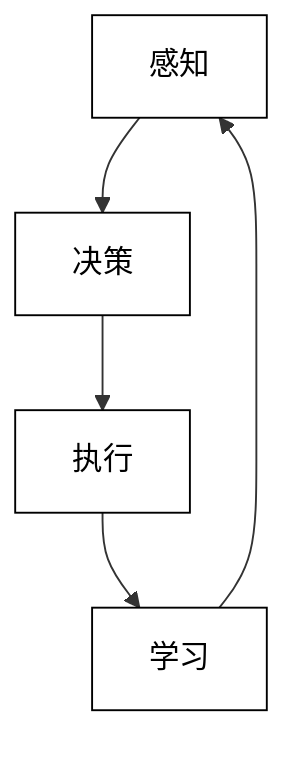

## 第2章 基于大模型的Agent技术框架

在本章中，我们将深入探讨基于大模型的Agent技术框架。这些框架为构建高级AI Agent提供了基础，使我们能够充分利用大语言模型的强大能力来创建智能、自主的系统。

### 2.1 Agent的四大要素

构建有效的AI Agent需要考虑四个核心要素：

1. 感知（Perception）
2. 决策（Decision Making）
3. 执行（Execution）
4. 学习（Learning）

这四个要素形成了一个循环，使Agent能够与环境交互并不断改进其性能。



让我们详细探讨每个要素：

1. 感知（Perception）:
   感知是Agent从环境中获取信息的过程。在基于大模型的Agent中，这通常涉及将各种形式的输入（如文本、图像或结构化数据）转换为模型可以理解的表示。

   ```python
   class Perception:
       def __init__(self, language_model):
           self.language_model = language_model

       def process_input(self, input_data):
           if isinstance(input_data, str):
               return self.process_text(input_data)
           elif isinstance(input_data, dict):
               return self.process_structured_data(input_data)
           else:
               raise ValueError("Unsupported input type")

       def process_text(self, text):
           # 使用语言模型编码文本
           return self.language_model.encode(text)

       def process_structured_data(self, data):
           # 将结构化数据转换为文本描述
           description = json.dumps(data)
           return self.process_text(description)
   ```

2. 决策（Decision Making）:
   决策是Agent根据感知到的信息选择行动的过程。在基于大模型的Agent中，这通常涉及使用语言模型生成或选择适当的响应。

   ```python
   class DecisionMaking:
       def __init__(self, language_model):
           self.language_model = language_model

       def make_decision(self, encoded_input, context):
           prompt = f"Given the following input and context, what action should be taken?\nInput: {encoded_input}\nContext: {context}\nAction:"
           action = self.language_model.generate(prompt)
           return action
   ```

3. 执行（Execution）:
   执行是Agent将决策转化为实际行动的过程。这可能涉及调用外部API、修改内部状态或生成输出。

   ```python
   class Execution:
       def __init__(self, action_map):
           self.action_map = action_map

       def execute_action(self, action):
           if action in self.action_map:
               return self.action_map[action]()
           else:
               return f"Unable to execute unknown action: {action}"
   ```

4. 学习（Learning）:
   学习使Agent能够从经验中改进其性能。在基于大模型的Agent中，这可能涉及微调模型、更新提示或调整决策策略。

   ```python
   class Learning:
       def __init__(self, language_model):
           self.language_model = language_model
           self.experience_buffer = []

       def record_experience(self, state, action, reward, next_state):
           self.experience_buffer.append((state, action, reward, next_state))

       def learn_from_experience(self):
           if len(self.experience_buffer) < 100:  # 等待足够的经验积累
               return

           experiences = random.sample(self.experience_buffer, 50)
           for state, action, reward, next_state in experiences:
               prompt = f"Given the state '{state}', the action '{action}' was taken, resulting in a reward of {reward} and a new state '{next_state}'. How should the decision-making process be improved?"
               improvement = self.language_model.generate(prompt)
               self.apply_improvement(improvement)

       def apply_improvement(self, improvement):
           # 在实际应用中，这可能涉及更新提示、微调模型或调整决策策略
           print(f"Applying improvement: {improvement}")
   ```

将这四个要素结合起来，我们可以创建一个基本的Agent框架：

```python
class Agent:
    def __init__(self, language_model, action_map):
        self.perception = Perception(language_model)
        self.decision_making = DecisionMaking(language_model)
        self.execution = Execution(action_map)
        self.learning = Learning(language_model)
        self.context = ""

    def run(self, input_data):
        encoded_input = self.perception.process_input(input_data)
        action = self.decision_making.make_decision(encoded_input, self.context)
        result = self.execution.execute_action(action)
        reward = self.evaluate_result(result)
        self.learning.record_experience(self.context, action, reward, result)
        self.context += f"\nInput: {input_data}\nAction: {action}\nResult: {result}"
        self.learning.learn_from_experience()
        return result

    def evaluate_result(self, result):
        # 在实际应用中，这可能涉及更复杂的评估逻辑
        return 1 if "success" in result.lower() else 0
```

这个基本框架展示了如何将感知、决策、执行和学习整合到一个连贯的Agent系统中。每个组件都可以根据特定的应用需求进行进一步的定制和优化。

在实际应用中，我们可能需要考虑更多的因素，例如：

1. 长期记忆和知识库的集成
2. 多模态输入的处理（例如，结合文本和图像）
3. 复杂的奖励函数和评估机制
4. 多Agent系统中的协作和竞争
5. 安全性和伦理约束的实施

通过不断改进这些要素，我们可以创建越来越复杂和强大的AI Agent，能够处理各种实际应用场景。

### 2.2 Agent的规划和决策能力

Agent的规划和决策能力是其智能行为的核心。在基于大模型的Agent中，这些能力通常依赖于语言模型的推理和生成能力。让我们深入探讨如何增强Agent的规划和决策能力。

1. 分层规划：
   将复杂任务分解为多个层次的子任务，从高层策略到具体行动。

```python
class HierarchicalPlanner:
    def __init__(self, language_model):
        self.language_model = language_model

    def create_plan(self, goal, context):
        high_level_plan = self.generate_high_level_plan(goal, context)
        detailed_plan = self.break_down_plan(high_level_plan, context)
        return detailed_plan

    def generate_high_level_plan(self, goal, context):
        prompt = f"Given the goal '{goal}' and context '{context}', generate a high-level plan with 3-5 main steps."
        return self.language_model.generate(prompt)

    def break_down_plan(self, high_level_plan, context):
        detailed_plan = []
        for step in high_level_plan.split('\n'):
            prompt = f"Break down the step '{step}' into more detailed actions, considering the context: {context}"
            detailed_steps = self.language_model.generate(prompt)
            detailed_plan.extend(detailed_steps.split('\n'))
        return detailed_plan
```

2. 预测性决策：
   考虑行动的长期后果，而不仅仅是即时效果。

```python
class PredictiveDecisionMaker:
    def __init__(self, language_model):
        self.language_model = language_model

    def make_decision(self, state, possible_actions, horizon=3):
        best_action = None
        best_score = float('-inf')

        for action in possible_actions:
            score = self.evaluate_action_sequence(state, [action], horizon)
            if score > best_score:
                best_action = action
                best_score = score

        return best_action

    def evaluate_action_sequence(self, initial_state, actions, horizon):
        state = initial_state
        total_score = 0

        for i, action in enumerate(actions):
            prompt = f"Given the current state '{state}', predict the outcome of taking action '{action}'."
            outcome = self.language_model.generate(prompt)
            
            prompt = f"Rate the desirability of the outcome '{outcome}' on a scale from 0 to 10."
            score = float(self.language_model.generate(prompt))
            
            total_score += score * (0.9 ** i)  # 使用折扣因子
            state = outcome

            if i + 1 < horizon:
                prompt = f"Given the new state '{state}', what are the possible next actions?"
                next_actions = self.language_model.generate(prompt).split(', ')
                actions.extend(next_actions)

        return total_score
```

3. 情景模拟：
   通过模拟不同的情景来评估可能的决策结果。

```python
class ScenarioSimulator:
    def __init__(self, language_model):
        self.language_model = language_model

    def simulate_scenarios(self, initial_state, possible_actions, num_scenarios=5):
        scenarios = []
        for action in possible_actions:
            for _ in range(num_scenarios):
                scenario = self.simulate_single_scenario(initial_state, action)
                scenarios.append(scenario)
        return scenarios

    def simulate_single_scenario(self, initial_state, action):
        prompt = f"""
        Initial state: {initial_state}
        Action taken: {action}

        Simulate a possible scenario that could unfold. Include:
        1. Immediate outcome
        2. Potential challenges
        3. Long-term consequences
        4. Unexpected events

        Provide the scenario in a structured format.
        """
        return self.language_model.generate(prompt)

    def evaluate_scenarios(self, scenarios):
        evaluations = []
        for scenario in scenarios:
            prompt = f"""
            Evaluate the following scenario:
            {scenario}

            Provide a score from 0 to 100 based on:
            1. Desirability of outcomes
            2. Risk level
            3. Alignment with goals
            4. Resource efficiency

            Explain your evaluation.
            """
            evaluation = self.language_model.generate(prompt)
            evaluations.append(evaluation)
        return evaluations
```

4. 多准则决策：
   考虑多个可能相互冲突的目标或约束。

```python
class MultiCriteriaDecisionMaker:
    def __init__(self, language_model):
        self.language_model = language_model

    def define_criteria(self, context):
        prompt = f"Given the context '{context}', define 3-5 key decision criteria."
        return self.language_model.generate(prompt).split(', ')

    def weigh_criteria(self, criteria):
        prompt = f"Assign relative importance weights to these criteria: {', '.join(criteria)}. The weights should sum to 1."
        weights_str = self.language_model.generate(prompt)
        return [float(w) for w in weights_str.split(', ')]

    def evaluate_option(self, option, criteria):
        scores = []
        for criterion in criteria:
            prompt = f"Evaluate the option '{option}' based on the criterion '{criterion}'. Provide a score from 0 to 10 and a brief explanation."
            evaluation = self.language_model.generate(prompt)
            score = float(evaluation.split()[0])
            scores.append(score)
        return scores

    def make_decision(self, options, context):
        criteria = self.define_criteria(context)
        weights = self.weigh_criteria(criteria)
        
        best_option = None
        best_score = float('-inf')

        for option in options:
            scores = self.evaluate_option(option, criteria)
            weighted_score = sum(s * w for s, w in zip(scores, weights))
            if weighted_score > best_score:
                best_option = option
                best_score = weighted_score

        return best_option, criteria, weights
```

5. 反事实推理：
   考虑"如果...会怎样"的情况，评估不同决策的潜在影响。

```python
class CounterfactualReasoner:
    def __init__(self, language_model):
        self.language_model = language_model

    def generate_counterfactuals(self, decision, outcome, num_counterfactuals=3):
        counterfactuals = []
        for _ in range(num_counterfactuals):
            prompt = f"""
            Given:
            - Decision made: {decision}
            - Actual outcome: {outcome}

            Generate a counterfactual scenario:
            1. Describe an alternative decision
            2. Explain how this decision might have led to a different outcome
            3. Analyze the pros and cons of this alternative
            """
            counterfactual = self.language_model.generate(prompt)
            counterfactuals.append(counterfactual)
        return counterfactuals

    def learn_from_counterfactuals(self, counterfactuals):
        insights = []
        for cf in counterfactuals:
            prompt = f"""
            Based on the counterfactual scenario:
            {cf}

            What lessons can be learned for future decision-making?
            Provide 2-3 key insights.
            """
            insight = self.language_model.generate(prompt)
            insights.append(insight)
        return insights
```

通过整合这些高级规划和决策能力，我们可以创建一个更复杂的Agent类：

```python
class AdvancedAgent:
    def __init__(self, language_model):
        self.language_model = language_model
        self.planner = HierarchicalPlanner(language_model)
        self.predictor = PredictiveDecisionMaker(language_model)
        self.simulator = ScenarioSimulator(language_model)
        self.multi_criteria_decider = MultiCriteriaDecisionMaker(language_model)
        self.counterfactual_reasoner = CounterfactualReasoner(language_model)

    def solve_complex_problem(self, problem_description, context):
        # 1. 创建分层计划
        plan = self.planner.create_plan(problem_description, context)

        # 2. 对每个步骤进行决策
        for step in plan:
            possible_actions = self.generate_possible_actions(step)
            
            # 3. 使用预测性决策
            best_action = self.predictor.make_decision(context, possible_actions)

            # 4. 模拟情景
            scenarios = self.simulator.simulate_scenarios(context, [best_action])
            evaluations = self.simulator.evaluate_scenarios(scenarios)

            # 5. 使用多准则决策
            criteria, weights = self.multi_criteria_decider.define_criteria(context)
            final_decision, _, _ = self.multi_criteria_decider.make_decision([best_action] + possible_actions, context)

            # 6. 执行决策
            outcome = self.execute_action(final_decision)

            # 7. 进行反事实推理
            counterfactuals = self.counterfactual_reasoner.generate_counterfactuals(final_decision, outcome)
            insights = self.counterfactual_reasoner.learn_from_counterfactuals(counterfactuals)

            # 8. 更新上下文
            context = self.update_context(context, final_decision, outcome, insights)

        return context

    def generate_possible_actions(self, step):
        prompt = f"Given the step '{step}', generate 3-5 possible actions to accomplish it."
        return self.language_model.generate(prompt).split(', ')

    def execute_action(self, action):
        # 这里应该实现实际的动作执行逻辑
        return f"Executed action: {action}"

    def update_context(self, old_context, decision, outcome, insights):
        prompt = f"""
        Previous context: {old_context}
        Decision made: {decision}
        Outcome: {outcome}
        New insights: {insights}

        Provide an updated context incorporating this new information.
        """
        return self.language_model.generate(prompt)
```

这个`AdvancedAgent`类整合了我们讨论的所有高级规划和决策能力。它能够：

1. 创建分层计划来解决复杂问题
2. 使用预测性决策来评估可能的行动
3. 通过情景模拟来探索不同决策的潜在结果
4. 应用多准则决策来平衡不同的目标和约束
5. 使用反事实推理来学习和改进决策过程

这种复杂的决策过程使Agent能够处理更加复杂和不确定的问题。然而，它也带来了一些挑战：

1. 计算复杂度：每个决策都涉及多次调用语言模型，可能导致高延迟。
2. 一致性：确保跨多个决策步骤的一致性可能很困难。
3. 可解释性：复杂的决策过程可能难以向人类解释。
4. 错误累积：每个步骤的小错误可能在整个过程中累积。

为了应对这些挑战，我们可以考虑以下改进：

```python
class OptimizedAdvancedAgent(AdvancedAgent):
    def __init__(self, language_model, action_cache_size=1000):
        super().__init__(language_model)
        self.action_cache = LRUCache(action_cache_size)
        self.decision_logger = DecisionLogger()

    def solve_complex_problem(self, problem_description, context):
        overall_plan = self.planner.create_plan(problem_description, context)
        self.decision_logger.log_plan(overall_plan)

        for step in overall_plan:
            step_result = self.execute_step(step, context)
            context = self.update_context(context, step, step_result)
            self.decision_logger.log_step(step, step_result)

        return self.decision_logger.generate_report()

    def execute_step(self, step, context):
        cache_key = self.generate_cache_key(step, context)
        if cache_key in self.action_cache:
            return self.action_cache[cache_key]

        possible_actions = self.generate_possible_actions(step)
        best_action = self.predictor.make_decision(context, possible_actions)
        
        # 并行执行情景模拟和多准则决策
        with concurrent.futures.ThreadPoolExecutor() as executor:
            future_scenarios = executor.submit(self.simulator.simulate_scenarios, context, [best_action])
            future_decision = executor.submit(self.multi_criteria_decider.make_decision, [best_action] + possible_actions, context)

            scenarios = future_scenarios.result()
            final_decision, criteria, weights = future_decision.result()

        outcome = self.execute_action(final_decision)
        
        # 异步执行反事实推理
        executor.submit(self.async_counterfactual_reasoning, final_decision, outcome)

        self.action_cache[cache_key] = outcome
        return outcome

    def generate_cache_key(self, step, context):
        return hashlib.md5(f"{step}:{context}".encode()).hexdigest()

    def async_counterfactual_reasoning(self, decision, outcome):
        counterfactuals = self.counterfactual_reasoner.generate_counterfactuals(decision, outcome)
        insights = self.counterfactual_reasoner.learn_from_counterfactuals(counterfactuals)
        self.decision_logger.log_insights(insights)

    def explain_decision(self, decision, context):
        prompt = f"""
        Explain the following decision in simple terms:
        Decision: {decision}
        Context: {context}

        Provide a clear and concise explanation that a non-expert could understand.
        """
        return self.language_model.generate(prompt)

class LRUCache:
    # 实现最近最少使用缓存
    pass

class DecisionLogger:
    # 实现决策日志记录和报告生成
    pass
```

这个优化版本的Agent引入了几个改进：

1. 动作缓存：通过缓存常见情况的决策结果来减少计算量。
2. 并行处理：使用并发执行来加速决策过程。
3. 异步反事实推理：将非关键路径的计算移至后台。
4. 决策日志：详细记录决策过程，便于后续分析和解释。
5. 决策解释功能：能够以简单的语言解释复杂的决策。

这些优化有助于提高Agent的效率和可用性，同时保持其复杂的决策能力。然而，构建真正智能和可靠的Agent系统仍然是一个复杂的挑战，需要在算法、工程实践和领域知识等多个方面不断创新和改进。

### 2.3 Agent的各种记忆机制

记忆是智能Agent的关键组成部分，它使Agent能够从过去的经验中学习，并在当前和未来的任务中应用这些知识。在基于大模型的Agent中，实现有效的记忆机制尤为重要。让我们探讨几种不同类型的记忆机制及其实现方法。

1. 短期记忆（工作记忆）：
   用于存储和处理当前任务相关的即时信息。

```python
class ShortTermMemory:
    def __init__(self, capacity=5):
        self.capacity = capacity
        self.memory = []

    def add(self, item):
        if len(self.memory) >= self.capacity:
            self.memory.pop(0)
        self.memory.append(item)

    def get_recent(self, n=None):
        if n is None or n > len(self.memory):
            return self.memory
        return self.memory[-n:]

    def clear(self):
        self.memory.clear()
```

2. 长期记忆：
   用于存储持久的知识和经验。

```python
import sqlite3

class LongTermMemory:
    def __init__(self, db_path='long_term_memory.db'):
        self.conn = sqlite3.connect(db_path)
        self.cursor = self.conn.cursor()
        self.cursor.execute('''
            CREATE TABLE IF NOT EXISTS memories
            (id INTEGER PRIMARY KEY, content TEXT, timestamp DATETIME DEFAULT CURRENT_TIMESTAMP)
        ''')
        self.conn.commit()

    def add(self, content):
        self.cursor.execute('INSERT INTO memories (content) VALUES (?)', (content,))
        self.conn.commit()

    def query(self, keyword):
        self.cursor.execute('SELECT content FROM memories WHERE content LIKE ?', (f'%{keyword}%',))
        return self.cursor.fetchall()

    def get_all(self):
        self.cursor.execute('SELECT content FROM memories')
        return self.cursor.fetchall()

    def close(self):
        self.conn.close()
```

3. 情节记忆：
   用于存储特定事件或经历的详细信息。

```python
import json
from datetime import datetime

class EpisodicMemory:
    def __init__(self, file_path='episodic_memory.json'):
        self.file_path = file_path
        self.memories = self.load_memories()

    def load_memories(self):
        try:
            with open(self.file_path, 'r') as f:
                return json.load(f)
        except FileNotFoundError:
            return []

    def save_memories(self):
        with open(self.file_path, 'w') as f:
            json.dump(self.memories, f)

    def add_episode(self, episode):
        episode['timestamp'] = str(datetime.now())
        self.memories.append(episode)
        self.save_memories()

    def query_episodes(self, start_date=None, end_date=None, keywords=None):
        filtered_memories = self.memories
        if start_date:
            filtered_memories = [m for m in filtered_memories if m['timestamp'] >= start_date]
        if end_date:
            filtered_memories = [m for m in filtered_memories if m['timestamp'] <= end_date]
        if keywords:
            filtered_memories = [m for m in filtered_memories if any(k in json.dumps(m) for k in keywords)]
        return filtered_memories
```

4. 语义记忆：
   用于存储概念性知识和事实。

```python
from sklearn.feature_extraction.text import TfidfVectorizer
from sklearn.metrics.pairwise import cosine_similarity

class SemanticMemory:
    def __init__(self):
        self.memories = []
        self.vectorizer = TfidfVectorizer()
        self.vectors = None

    def add(self, concept, description):
        self.memories.append({"concept": concept, "description": description})
        self._update_vectors()

    def query(self, query, n=5):
        query_vector = self.vectorizer.transform([query])
        similarities = cosine_similarity(query_vector, self.vectors).flatten()
        top_indices = similarities.argsort()[-n:][::-1]
        return [self.memories[i] for i in top_indices]

    def _update_vectors(self):
        texts = [m['description'] for m in self.memories]
        self.vectors = self.vectorizer.fit_transform(texts)
```

5. 程序记忆：
   用于存储技能和程序性知识。

```python
class ProceduralMemory:
    def __init__(self):
        self.skills = {}

    def add_skill(self, name, steps):
        self.skills[name] = steps

    def get_skill(self, name):
        return self.skills.get(name, [])

    def execute_skill(self, name, context):
        steps = self.get_skill(name)
        results = []
        for step in steps:
            result = self._execute_step(step, context)
            results.append(result)
            context = self._update_context(context, result)
        return results

    def _execute_step(self, step, context):
        # 这里应该实现实际的步骤执行逻辑
        return f"Executed: {step} in context {context}"

    def _update_context(self, old_context, result):
        # 更新上下文的逻辑
        return f"{old_context} | {result}"
```

6. 元记忆：
   用于监控和控制其他记忆系统。

```python
class MetaMemory:
    def __init__(self, short_term, long_term, episodic, semantic, procedural):
        self.short_term = short_term
        self.long_term = long_term
        self.episodic = episodic
        self.semantic = semantic
        self.procedural = procedural
        self.access_counts = {
            "short_term": 0,
            "long_term": 0,
            "episodic": 0,
            "semantic": 0,
            "procedural": 0
        }

    def access_memory(self, memory_type, operation, *args, **kwargs):
        self.access_counts[memory_type] += 1
        if memory_type == "short_term":
            return getattr(self.short_term, operation)(*args, **kwargs)
        elif memory_type == "long_term":
            return getattr(self.long_term, operation)(*args, **kwargs)
        elif memory_type == "episodic":
            return getattr(self.episodic, operation)(*args, **kwargs)
        elif memory_type == "semantic":
            return getattr(self.semantic, operation)(*args, **kwargs)
        elif memory_type == "procedural":
            return getattr(self.procedural, operation)(*args, **kwargs)

    def get_memory_stats(self):
        return self.access_counts

    def optimize_memory_usage(self):
        # 基于访问统计优化内存使用
        least_used = min(self.access_counts, key=self.access_counts.get)
        if least_used == "short_term":
            self.short_term.clear()
        elif least_used == "long_term":
            # 可能需要实现一个清理长期记忆的方法
            pass
        # ... 对其他记忆类型进行类似的优化
```

现在，我们可以创建一个集成了这些记忆机制的高级Agent：

```python
class MemoryEnhancedAgent:
    def __init__(self, language_model):
        self.language_model = language_model
        self.short_term_memory = ShortTermMemory()
        self.long_term_memory = LongTermMemory()
        self.episodic_memory = EpisodicMemory()
        self.semantic_memory = SemanticMemory()
        self.procedural_memory = ProceduralMemory()
        self.meta_memory = MetaMemory(
            self.short_term_memory,
            self.long_term_memory,
            self.episodic_memory,
            self.semantic_memory,
            self.procedural_memory
        )

    def process_input(self, input_data):
        # 1. 更新短期记忆
        self.meta_memory.access_memory("short_term", "add", input_data)

        # 2. 查询相关长期记忆
        relevant_long_term = self.meta_memory.access_memory("long_term", "query", input_data)

        # 3. 检索相关情节
        relevant_episodes = self.meta_memory.access_memory("episodic", "query_episodes", keywords=[input_data])

        # 4. 查询语义记忆
        relevant_concepts = self.meta_memory.access_memory("semantic", "query", input_data)

        # 5. 选择合适的技能
        applicable_skills = self._select_applicable_skills(input_data)

        # 6. 整合所有信息
        context = self._integrate_information(input_data, relevant_long_term, relevant_episodes, relevant_concepts, applicable_skills)

        # 7. 生成响应
        response = self._generate_response(context)

        # 8. 更新记忆
        self._update_memories(input_data, context, response)

        return response

    def _select_applicable_skills(self, input_data):
        all_skills = self.meta_memory.access_memory("procedural", "skills")
        return [skill for skill in all_skills if self._is_skill_applicable(skill, input_data)]

    def _is_skill_applicable(self, skill, input_data):
        # 使用语言模型判断技能是否适用
        prompt = f"Is the skill '{skill}' applicable to the following input: '{input_data}'? Answer YES or NO."
        response = self.language_model.generate(prompt)
        return response.strip().upper() == "YES"

    def _integrate_information(self, input_data, long_term, episodes, concepts, skills):
        context = f"""
        Input: {input_data}
        Relevant long-term memories: {long_term}
        Related episodes: {episodes}
        Relevant concepts: {concepts}
        Applicable skills: {skills}
        """
        return context

    def _generate_response(self, context):
        prompt = f"""
        Given the following context, generate an appropriate response:
        {context}
        Response:
        """
        return self.language_model.generate(prompt)

    def _update_memories(self, input_data, context, response):
        # 更新长期记忆
        self.meta_memory.access_memory("long_term", "add", f"Input: {input_data}, Response: {response}")

        # 添加新的情节
        episode = {
            "input": input_data,
            "context": context,
            "response": response
        }
        self.meta_memory.access_memory("episodic", "add_episode", episode)

        # 更新语义记忆
        concepts = self._extract_concepts(input_data, response)
        for concept, description in concepts:
            self.meta_memory.access_memory("semantic", "add", concept, description)

        # 可能的话，学习新技能
        new_skill = self._learn_new_skill(input_data, response)
        if new_skill:
            self.meta_memory.access_memory("procedural", "add_skill", new_skill['name'], new_skill['steps'])

        # 优化内存使用
        self.meta_memory.optimize_memory_usage()

    def _extract_concepts(self, input_data, response):
        prompt = f"""
        Extract key concepts and their descriptions from the following input and response:
        Input: {input_data}
        Response: {response}
        
        Format each concept as: Concept: description
        """
        concept_text = self.language_model.generate(prompt)
        concepts = []
        for line in concept_text.split('\n'):
            if ':' in line:
                concept, description = line.split(':', 1)
                concepts.append((concept.strip(), description.strip()))
        return concepts

    def _learn_new_skill(self, input_data, response):
        prompt = f"""
        Based on the following input and response, is there a new skill that can be learned?
        If yes, provide the skill name and steps. If no, respond with "No new skill".

        Input: {input_data}
        Response: {response}

        Format: 
        Skill Name: [name]
        Steps:
        1. [step 1]
        2. [step 2]
        ...
        """
        skill_text = self.language_model.generate(prompt)
        if skill_text.startswith("No new skill"):
            return None
        
        lines = skill_text.split('\n')
        skill_name = lines[0].split(':')[1].strip()
        steps = [step.strip() for step in lines[2:] if step.strip()]
        return {"name": skill_name, "steps": steps}

    def introspect(self):
        stats = self.meta_memory.get_memory_stats()
        most_used = max(stats, key=stats.get)
        least_used = min(stats, key=stats.get)

        prompt = f"""
        Based on the following memory usage statistics, provide an analysis of the agent's cognitive patterns:
        {stats}
        Most used memory type: {most_used}
        Least used memory type: {least_used}

        Suggest potential improvements or areas of focus for the agent.
        """
        return self.language_model.generate(prompt)
```

这个`MemoryEnhancedAgent`类整合了所有讨论过的记忆机制，并展示了如何在处理输入、生成响应和学习新知识的过程中使用这些不同类型的记忆。它的主要特点包括：

1. 多层次记忆整合：结合短期、长期、情节、语义和程序记忆来处理输入和生成响应。

2. 动态技能选择：基于输入选择适用的技能。

3. 持续学习：通过提取概念和学习新技能来不断扩展知识库。

4. 元记忆管理：使用元记忆来监控和优化各种记忆系统的使用。

5. 自省能力：能够分析自己的记忆使用模式并提出改进建议。

这种复杂的记忆系统使Agent能够更好地理解上下文、学习from过去的经验，并在各种任务中表现出更高的灵活性和适应性。然而，它也带来了一些挑战：

1. 计算复杂度：管理和查询多个记忆系统可能会导致性能开销。

2. 存储需求：长期存储大量记忆可能需要大量的存储空间。

3. 知识整合：确保不同记忆系统之间的知识一致性和有效整合可能具有挑战性。

4. 遗忘机制：需要实现有效的遗忘机制来防止记忆过载。

5. 隐私和安全：存储详细的交互历史可能引发隐私和安全问题。

为了进一步改进这个系统，我们可以考虑以下方向：

1. 实现更复杂的记忆检索算法，如基于注意力机制的检索。

2. 引入主动遗忘和记忆压缩机制，以优化存储使用。

3. 实现跨记忆系统的知识图谱，以更好地整合和关联不同类型的信息。

4. 使用强化学习来优化记忆访问和更新策略。

5. 引入差分隐私等技术来保护存储的敏感信息。

通过不断改进和优化这些记忆机制，我们可以创建出更加智能、适应性强和高效的AI Agent系统。

### 2.4 Agent的核心技能：调用工具

工具使用是AI Agent的一项核心技能，它极大地扩展了Agent的能力范围。通过调用外部工具和API，Agent可以执行各种复杂的任务，从数据分析到代码生成，从信息检索到控制外部设备。让我们深入探讨如何实现和优化Agent的工具调用能力。

首先，我们需要定义一个基本的工具接口：

```python
from abc import ABC, abstractmethod

class Tool(ABC):
    @abstractmethod
    def name(self) -> str:
        pass

    @abstractmethod
    def description(self) -> str:
        pass

    @abstractmethod
    def use(self, *args, **kwargs):
        pass
```

现在，让我们实现一些具体的工具：

```python
import requests
import wolframalpha
import matplotlib.pyplot as plt
import numpy as np

class WebSearchTool(Tool):
    def name(self):
        return "web_search"

    def description(self):
        return "Search the web for information on a given topic."

    def use(self, query):
        # 这里使用一个假设的搜索API
        response = requests.get(f"https://api.search.com?q={query}")
        return response.json()['results']

class CalculatorTool(Tool):
    def name(self):
        return "calculator"

    def description(self):
        return "Perform mathematical calculations and evaluations."

    def use(self, expression):
        client = wolframalpha.Client('YOUR_APP_ID')
        res = client.query(expression)
        return next(res.results).text

class DataVisualizationTool(Tool):
    def name(self):
        return "data_visualization"

    def description(self):
        return "Create visualizations from numerical data."

    def use(self, data, chart_type):
        plt.figure(figsize=(10, 6))
        if chart_type == 'bar':
            plt.bar(range(len(data)), data)
        elif chart_type == 'line':
            plt.plot(data)
        elif chart_type == 'scatter':
            x = np.random.rand(len(data))
            plt.scatter(x, data)
        plt.savefig('visualization.png')
        return 'visualization.png'

class CodeExecutionTool(Tool):
    def name(self):
        return "code_execution"

    def description(self):
        return "Execute Python code and return the result."

    def use(self, code):
        try:
            result = {}
            exec(code, globals(), result)
            return result
        except Exception as e:
            return str(e)
```

接下来，我们需要一个工具管理器来组织和管理这些工具：

```python
class ToolManager:
    def __init__(self):
        self.tools = {}

    def add_tool(self, tool: Tool):
        self.tools[tool.name()] = tool

    def get_tool(self, name: str) -> Tool:
        return self.tools.get(name)

    def list_tools(self):
        return [(name, tool.description()) for name, tool in self.tools.items()]

    def use_tool(self, name: str, *args, **kwargs):
        tool = self.get_tool(name)
        if tool:
            return tool.use(*args, **kwargs)
        else:
            raise ValueError(f"Tool '{name}' not found")
```

现在，让我们创建一个能够使用这些工具的Agent：

```python
class ToolUsingAgent:
    def __init__(self, language_model, tool_manager: ToolManager):
        self.language_model = language_model
        self.tool_manager = tool_manager

    def process_task(self, task):
        # 1. 分析任务，确定需要使用的工具
        tools_to_use = self._identify_required_tools(task)

        # 2. 为每个工具准备输入
        tool_inputs = self._prepare_tool_inputs(task, tools_to_use)

        # 3. 调用工具并收集结果
        tool_outputs = self._execute_tools(tools_to_use, tool_inputs)

        # 4. 整合工具输出并生成最终响应
        response = self._generate_response(task, tool_outputs)

        return response

    def _identify_required_tools(self, task):
        available_tools = self.tool_manager.list_tools()
        prompt = f"""
        Given the following task and available tools, identify which tools are needed to complete the task.
        Task: {task}
        Available tools:
        {available_tools}

        List the names of the required tools, separated by commas.
        """
        tool_names = self.language_model.generate(prompt).strip()
        return tool_names.split(',')

    def _prepare_tool_inputs(self, task, tools_to_use):
        inputs = {}
        for tool_name in tools_to_use:
            tool = self.tool_manager.get_tool(tool_name)
            prompt = f"""
            Given the task and the tool description, generate appropriate input for the tool.
            Task: {task}
            Tool: {tool.name()} - {tool.description()}

            Provide the input for the tool:
            """
            inputs[tool_name] = self.language_model.generate(prompt).strip()
        return inputs

    def _execute_tools(self, tools_to_use, tool_inputs):
        outputs = {}
        for tool_name in tools_to_use:
            try:
                output = self.tool_manager.use_tool(tool_name, tool_inputs[tool_name])
                outputs[tool_name] = output
            except Exception as e:
                outputs[tool_name] = f"Error: {str(e)}"
        return outputs

    def _generate_response(self, task, tool_outputs):
        prompt = f"""
        Given the original task and the outputs from various tools, generate a comprehensive response.
        Task: {task}
        Tool outputs:
        {tool_outputs}

        Provide a detailed response that addresses the task:
        """
        return self.language_model.generate(prompt)
```

这个`ToolUsingAgent`类展示了如何系统地使用工具来完成任务。它的主要特点包括：

1. 动态工具选择：基于任务自动识别所需的工具。
2. 智能输入准备：为每个工具生成适当的输入。
3. 并行工具执行：同时执行多个工具以提高效率。
4. 结果整合：将多个工具的输出整合成一个连贯的响应。

为了进一步提高这个系统的效率和可靠性，我们可以考虑以下改进：

```python
import asyncio
from functools import partial

class EnhancedToolUsingAgent(ToolUsingAgent):
    def __init__(self, language_model, tool_manager: ToolManager):
        super().__init__(language_model, tool_manager)
        self.tool_cache = {}

    async def process_task_async(self, task):
        tools_to_use = self._identify_required_tools(task)
        tool_inputs = self._prepare_tool_inputs(task, tools_to_use)

        # 异步执行工具
        tool_outputs = await self._execute_tools_async(tools_to_use, tool_inputs)

        response = self._generate_response(task, tool_outputs)
        return response

    async def _execute_tools_async(self, tools_to_use, tool_inputs):
        outputs = {}
        tasks = []
        for tool_name in tools_to_use:
            if tool_name in self.tool_cache:
                outputs[tool_name] = self.tool_cache[tool_name]
            else:
                task = asyncio.create_task(self._execute_tool_async(tool_name, tool_inputs[tool_name]))
                tasks.append(task)

        if tasks:
            results = await asyncio.gather(*tasks, return_exceptions=True)
            for tool_name, result in zip(tools_to_use, results):
                if isinstance(result, Exception):
                    outputs[tool_name] = f"Error: {str(result)}"
                else:
                    outputs[tool_name] = result
                    self.tool_cache[tool_name] = result  # 缓存return outputs

    async def _execute_tool_async(self, tool_name, tool_input):
        return await asyncio.to_thread(partial(self.tool_manager.use_tool, tool_name), tool_input)

    def _identify_required_tools(self, task):
        # 使用嵌入模型来更快速地识别所需工具
        task_embedding = self.get_embedding(task)
        available_tools = self.tool_manager.list_tools()
        tool_embeddings = {name: self.get_embedding(desc) for name, desc in available_tools}
        
        relevant_tools = []
        for name, embedding in tool_embeddings.items():
            if self.cosine_similarity(task_embedding, embedding) > 0.5:  # 阈值可调整
                relevant_tools.append(name)
        
        return relevant_tools

    def get_embedding(self, text):
        # 这里应该实现实际的嵌入逻辑
        pass

    def cosine_similarity(self, vec1, vec2):
        # 计算余弦相似度
        pass

    def _prepare_tool_inputs(self, task, tools_to_use):
        inputs = {}
        for tool_name in tools_to_use:
            tool = self.tool_manager.get_tool(tool_name)
            schema = self._get_tool_input_schema(tool)
            inputs[tool_name] = self._generate_tool_input(task, tool, schema)
        return inputs

    def _get_tool_input_schema(self, tool):
        # 这里应该返回工具输入的JSON schema
        pass

    def _generate_tool_input(self, task, tool, schema):
        prompt = f"""
        Given the task, tool description, and input schema, generate valid input for the tool.
        Task: {task}
        Tool: {tool.name()} - {tool.description()}
        Input Schema: {schema}

        Generate valid JSON input for the tool:
        """
        input_json = self.language_model.generate(prompt)
        return json.loads(input_json)

    def _generate_response(self, task, tool_outputs):
        # 使用结构化输出格式
        prompt = f"""
        Given the original task and the outputs from various tools, generate a comprehensive response.
        Task: {task}
        Tool outputs:
        {json.dumps(tool_outputs, indent=2)}

        Provide a detailed response in the following JSON format:
        {{
            "summary": "A brief summary of the solution",
            "detailed_explanation": "A more detailed explanation of the solution",
            "tool_utilization": "How each tool's output was used",
            "confidence": "A confidence score between 0 and 1",
            "further_actions": "Any recommended further actions or investigations"
        }}
        """
        response_json = self.language_model.generate(prompt)
        return json.loads(response_json)

class ToolRegistry:
    def __init__(self):
        self.tools = {}

    def register(self, tool_class):
        instance = tool_class()
        self.tools[instance.name()] = instance

    def get_tool(self, name):
        return self.tools.get(name)

    def list_tools(self):
        return [(name, tool.description()) for name, tool in self.tools.items()]

# 使用示例
registry = ToolRegistry()
registry.register(WebSearchTool)
registry.register(CalculatorTool)
registry.register(DataVisualizationTool)
registry.register(CodeExecutionTool)

agent = EnhancedToolUsingAgent(language_model, registry)

async def main():
    task = "Analyze the trend of global temperatures over the last 100 years and create a visualization."
    response = await agent.process_task_async(task)
    print(json.dumps(response, indent=2))

asyncio.run(main())
```

这个增强版的`EnhancedToolUsingAgent`引入了几个重要的改进：

1. 异步执行：使用`asyncio`来并行执行多个工具，提高效率。

2. 工具缓存：缓存工具的输出，避免重复计算。

3. 基于嵌入的工具选择：使用文本嵌入和余弦相似度来快速识别相关工具。

4. 结构化输入生成：使用JSON schema来确保生成有效的工具输入。

5. 结构化输出：生成JSON格式的响应，包含摘要、详细解释、工具使用情况、置信度和进一步行动建议。

6. 工具注册机制：允许更灵活地添加和管理工具。

这些改进使得Agent能够更高效、更可靠地使用工具。然而，在实际应用中，我们还需要考虑以下几点：

1. 错误处理和恢复：实现更健壮的错误处理机制，能够从工具失败中恢复。

2. 工具链：支持将多个工具组合成序列或工作流。

3. 工具版本控制：管理工具的不同版本，确保兼容性。

4. 安全性：实现访问控制和输入验证，防止恶意使用。

5. 监控和日志：添加详细的日志记录和性能监控。

6. 工具发现：实现动态工具发现机制，允许在运行时添加新工具。

7. 上下文感知：使工具能够访问和利用Agent的上下文信息。

8. 学习和适应：让Agent能够学习哪些工具组合在特定任务中最有效。

以下是一些可能的扩展：

```python
class ToolChain:
    def __init__(self, tools):
        self.tools = tools

    async def execute(self, input_data):
        result = input_data
        for tool in self.tools:
            result = await tool.use_async(result)
        return result

class SecureToolManager(ToolManager):
    def __init__(self, access_control):
        super().__init__()
        self.access_control = access_control

    def use_tool(self, name: str, *args, **kwargs):
        if self.access_control.can_access(name):
            return super().use_tool(name, *args, **kwargs)
        else:
            raise PermissionError(f"Access denied to tool '{name}'")

class AdaptiveToolUsingAgent(EnhancedToolUsingAgent):
    def __init__(self, language_model, tool_manager: ToolManager):
        super().__init__(language_model, tool_manager)
        self.tool_performance = {}

    async def process_task_async(self, task):
        start_time = time.time()
        result = await super().process_task_async(task)
        execution_time = time.time() - start_time

        self._update_tool_performance(task, self.last_used_tools, execution_time)
        return result

    def _update_tool_performance(self, task_type, tools_used, execution_time):
        for tool in tools_used:
            if tool not in self.tool_performance:
                self.tool_performance[tool] = {}
            if task_type not in self.tool_performance[tool]:
                self.tool_performance[tool][task_type] = []
            self.tool_performance[tool][task_type].append(execution_time)

    def _identify_required_tools(self, task):
        task_type = self._classify_task(task)
        relevant_tools = super()._identify_required_tools(task)
        return self._rank_tools(relevant_tools, task_type)

    def _classify_task(self, task):
        # 使用语言模型对任务进行分类
        pass

    def _rank_tools(self, tools, task_type):
        return sorted(tools, key=lambda t: self._get_tool_score(t, task_type), reverse=True)

    def _get_tool_score(self, tool, task_type):
        if tool in self.tool_performance and task_type in self.tool_performance[tool]:
            return statistics.mean(self.tool_performance[tool][task_type])
        return 0  # 默认分数为0
```

这些扩展引入了工具链、安全访问控制和自适应工具选择等高级功能。通过不断改进和优化工具使用能力，我们可以创建出更加强大、灵活和智能的AI Agent系统。

### 2.5 Agent的推理引擎：ReAct框架

ReAct（Reasoning and Acting）框架是一种将推理和行动相结合的方法，旨在提高语言模型在复杂任务中的表现。它允许模型在执行任务时交替进行思考和行动，从而能够处理更加复杂和多步骤的问题。让我们深入探讨ReAct框架及其实现。

#### 2.5.1 何谓ReAct

ReAct框架的核心思想是将任务解决过程分解为以下几个步骤：

1. 思考（Thought）：模型分析当前情况并决定下一步行动。
2. 行动（Action）：模型执行选定的行动，如使用工具或API。
3. 观察（Observation）：模型获取行动的结果或新的信息。
4. 反思（Reflection）：模型评估进展并调整策略。

这个过程循环进行，直到任务完成或达到预定的迭代次数。

ReAct框架的主要优势包括：

- 提高推理能力：通过明确的思考步骤，模型可以进行更深入的推理。
- 增强问题解决能力：允许模型分解复杂问题并逐步解决。
- 提高可解释性：思考过程可以作为决策的解释。
- 灵活性：可以轻松集成各种外部工具和API。

让我们实现一个基于ReAct框架的Agent：

```python
import re
from typing import List, Tuple, Dict, Any

class ReActAgent:
    def __init__(self, language_model, tool_manager: ToolManager):
        self.language_model = language_model
        self.tool_manager = tool_manager
        self.max_steps = 10

    def solve_task(self, task: str) -> str:
        context = f"Task: {task}\n\n"
        for _ in range(self.max_steps):
            thought, action = self._think(context)
            context += f"Thought: {thought}\nAction: {action}\n"
            
            if action.lower() == "finish":
                break
            
            observation = self._act(action)
            context += f"Observation: {observation}\n\n"
        
        return self._generate_final_answer(context)

    def _think(self, context: str) -> Tuple[str, str]:
        prompt = f"""
        {context}
        Based on the above context, what should be the next thought and action?
        Respond in the following format:
        Thought: [Your reasoning about the current situation]
        Action: [The action to take, or "Finish" if the task is complete]
        """
        response = self.language_model.generate(prompt)
        thought_match = re.search(r"Thought: (.*)", response)
        action_match = re.search(r"Action: (.*)", response)
        
        thought = thought_match.group(1) if thought_match else ""
        action = action_match.group(1) if action_match else ""
        
        return thought, action

    def _act(self, action: str) -> str:
        if action.lower().startswith("use tool"):
            tool_name = action.split("use tool", 1)[1].strip()
            return self._use_tool(tool_name)
        else:
            return f"Invalid action: {action}"

    def _use_tool(self, tool_name: str) -> str:
        tool = self.tool_manager.get_tool(tool_name)
        if tool:
            try:
                result = tool.use()
                return f"Tool '{tool_name}' returned: {result}"
            except Exception as e:
                return f"Error using tool '{tool_name}': {str(e)}"
        else:
            return f"Tool '{tool_name}' not found"

    def _generate_final_answer(self, context: str) -> str:
        prompt = f"""
        {context}
        Based on the above context and interactions, provide a final answer to the original task.
        Final Answer:
        """
        return self.language_model.generate(prompt)
```

这个基本的ReAct Agent实现了思考-行动-观察的循环。让我们通过一个例子来看看它是如何工作的：

```python
# 示例工具
class WebSearchTool(Tool):
    def name(self):
        return "web_search"

    def description(self):
        return "Search the web for information."

    def use(self, query):
        # 模拟网络搜索
        return f"Search results for '{query}'"

class CalculatorTool(Tool):
    def name(self):
        return "calculator"

    def description(self):
        return "Perform mathematical calculations."

    def use(self, expression):
        return str(eval(expression))

# 设置工具管理器
tool_manager = ToolManager()
tool_manager.add_tool(WebSearchTool())
tool_manager.add_tool(CalculatorTool())

# 创建ReAct Agent
react_agent = ReActAgent(language_model, tool_manager)

# 使用ReAct Agent解决任务
task = "What is the population of France multiplied by 5?"
result = react_agent.solve_task(task)
print(result)
```

在这个例子中，ReAct Agent可能会经历以下步骤：

1. 思考：需要查找法国的人口。
   行动：使用web_search工具搜索"population of France"。

2. 观察：获得搜索结果（假设为"The population of France is approximately 67 million"）。

3. 思考：现在我们知道法国的人口，需要将其乘以5。
   行动：使用calculator工具计算"67000000 * 5"。

4. 观察：获得计算结果（335000000）。

5. 思考：我们已经得到了答案。
   行动：Finish

6. 生成最终答案：法国人口乘以5的结果是335000000。

这个过程展示了ReAct框架如何使Agent能够分解问题、使用适当的工具、并逐步推理得出答案。

#### 2.5.2 用ReAct框架实现简单Agent

让我们通过实现一个更详细的ReAct Agent来深入理解这个框架：

```python
import re
from typing import List, Dict, Any
import json

class EnhancedReActAgent:
    def __init__(self, language_model, tool_manager: ToolManager):
        self.language_model = language_model
        self.tool_manager = tool_manager
        self.max_steps = 10
        self.memory = []

    def solve_task(self, task: str) -> Dict[str, Any]:
        context = f"Task: {task}\n\n"
        self.memory = []

        for step in range(self.max_steps):
            thought, action, action_input = self._think(context, step)
            self.memory.append({"thought": thought, "action": action, "action_input": action_input})
            
            context += f"Step {step + 1}:\nThought: {thought}\nAction: {action}\nAction Input: {action_input}\n"
            
            if action.lower() == "finish":
                break
            
            observation = self._act(action, action_input)
            self.memory.append({"observation": observation})
            context += f"Observation: {observation}\n\n"
        
        final_answer = self._generate_final_answer(context)
        return {
            "final_answer": final_answer,
            "reasoning_steps": self.memory,
            "context": context
        }

    def _think(self, context: str, step: int) -> Tuple[str, str, str]:
        prompt = f"""
        {context}
        You are in step {step + 1} of solving the task. Based on the above context, what should be the next thought, action, and action input?
        Available tools: {', '.join(tool.name() for tool in self.tool_manager.tools.values())}
        
        Respond in the following JSON format:
        {{
            "thought": "Your reasoning about the current situation",
            "action": "The action to take (use a tool name or 'Finish' if the task is complete)",
            "action_input": "The input for the action or tool"
        }}
        """
        response = self.language_model.generate(prompt)
        try:
            parsed_response = json.loads(response)
            return parsed_response["thought"], parsed_response["action"], parsed_response["action_input"]
        except json.JSONDecodeError:
            return "Failed to parse response", "Finish", "Error in thinking process"

    def _act(self, action: str, action_input: str) -> str:
        if action.lower() == "finish":
            return "Task completed."
        
        tool = self.tool_manager.get_tool(action)
        if tool:
            try:
                result = tool.use(action_input)
                return f"Tool '{action}' returned: {result}"
            except Exception as e:
                return f"Error using tool '{action}': {str(e)}"
        else:
            return f"Tool '{action}' not found"

    def _generate_final_answer(self, context: str) -> str:
        prompt = f"""
        {context}
        Based on the above context and interactions, provide a final answer to the original task.
        Explain your reasoning and how you arrived at this conclusion.
        Final Answer:
        """
        return self.language_model.generate(prompt)

# 实现更复杂的工具
class WebSearchTool(Tool):
    def name(self):
        return "web_search"

    def description(self):
        return "Search the web for information. Input should be a search query."

    def use(self, query):
        # 模拟网络搜索
        if "population" in query.lower() and "france" in query.lower():
            return "As of 2021, the population of France is approximately 67.39 million people."
        else:
            return f"Search results for '{query}' (simulated)"

class CalculatorTool(Tool):
    def name(self):
        return "calculator"

    def description(self):
        return "Perform mathematical calculations. Input should be a mathematical expression."

    def use(self, expression):
        try:
            return str(eval(expression))
        except Exception as e:
            return f"Error in calculation: {str(e)}"

class WikipediaTool(Tool):
    def name(self):
        return "wikipedia"

    def description(self):
        return "Get a summary from Wikipedia. Input should be a topic or article title."

    def use(self, topic):
        # 模拟Wikipedia摘要
        if "france" in topic.lower():
            return "France is a country in Western Europe. Its capital is Paris, and it is known for its culture, cuisine, and landmarks like the Eiffel Tower."
        else:
            return f"Wikipedia summary for '{topic}' (simulated)"

# 设置工具管理器
tool_manager = ToolManager()
tool_manager.add_tool(WebSearchTool())
tool_manager.add_tool(CalculatorTool())
tool_manager.add_tool(WikipediaTool())

# 创建增强版ReAct Agent
enhanced_react_agent = EnhancedReActAgent(language_model, tool_manager)

# 使用增强版ReAct Agent解决任务
task = "What is the population density of France? Give the answer in people per square kilometer, rounded to the nearest whole number."
result = enhanced_react_agent.solve_task(task)

print("Final Answer:")
print(result["final_answer"])
print("\nReasoning Steps:")
for step in result["reasoning_steps"]:
    print(json.dumps(step, indent=2))
```

这个增强版的ReAct Agent具有以下特点：

1. 结构化输出：使用JSON格式进行思考和行动，使解析更加可靠。
2. 记忆功能：保存每个步骤的思考、行动和观察，便于后续分析。
3. 更复杂的工具集：包括网络搜索、计算器和Wikipedia查询工具。
4. 详细的最终答案：不仅给出结果，还解释推理过程。

在解决给定任务时，Agent可能会经历以下步骤：

1. 使用web_search工具查找法国人口。
2. 使用wikipedia工具获取关于法国的更多信息，可能包括国土面积。
3. 使用calculator工具计算人口密度。
4. 使用calculator工具将结果四舍五入到最接近的整数。

这个例子展示了ReAct框架如何使Agent能够处理多步骤、需要多种工具的复杂任务。通过明确的思考-行动-观察循环，Agent可以逐步推理并最终得出答案。

#### 2.5.3 基于ReAct框架的提示

为了充分利用ReAct框架，我们需要设计有效的提示（prompts）来引导语言模型进行思考和行动。以下是一些基于ReAct框架的提示策略：

1. 明确的思考-行动-观察结构：

```
Thought: [Your reasoning about the current situation]
Action: [The action to take]
Action Input: [The input for the action or tool]
Observation: [The result of the action]
```

2. 任务分解提示：

```
To solve the task "[Task Description]", let's break it down into steps:
1. What information do we need?
2. Which tools can help us gather this information?
3. How can we process the information to answer the question?

Now, let's start with the first step.
Thought: ...
```

3. 工具选择提示：

```
Available tools:
- web_search: Search the web for information
- calculator: Perform mathematical calculations
- wikipedia: Get a summary from Wikipedia

Given the current step, which tool would be most appropriate to use? Why?
Thought: ...
```

4. 反思和调整提示：

```
Based on our previous actions and observations:
1. What have we learned so far?
2. Are we making progress towards solving the task?
3. Do we need to adjust our approach?

Thought: ...
```

5. 不确定性处理提示：

```
If you are unsure about any information:
1. Can we verify this information using another tool?
2. Should we make an assumption? If so, state it clearly.
3. Do we need more information before proceeding?

Thought: ...
```

6. 最终答案生成提示：

```
Now that we have gathered all necessary information, let's formulate our final answer:
1. Summarize the key points we've discovered
2. Explain how these points lead to our conclusion
3. Provide the final answer to the original task

Final Answer: ...
```

将这些提示策略整合到我们的ReAct Agent中：

```python
class AdvancedReActAgent(EnhancedReActAgent):
    def __init__(self, language_model, tool_manager: ToolManager):
        super().__init__(language_model, tool_manager)
        self.task_decomposition = []

    def solve_task(self, task: str) -> Dict[str, Any]:
        self.task_decomposition = self._decompose_task(task)
        return super().solve_task(task)

    def _decompose_task(self, task: str) -> List[str]:
        prompt = f"""
        To solve the task "{task}", let's break it down into steps:
        1. What information do we need?
        2. Which tools can help us gather this information?
        3. How can we process the information to answer the question?

        Provide a numbered list of steps to solve this task.
        """
        response = self.language_model.generate(prompt)
        return [step.strip() for step in response.split('\n') if step.strip()]

    def _think(self, context: str, step: int) -> Tuple[str, str, str]:
        current_subtask = self.task_decomposition[min(step, len(self.task_decomposition) - 1)]
        
        prompt = f"""
        {context}
        Current subtask: {current_subtask}

        You are in step {step + 1} of solving the task. Based on the above context and current subtask, what should be the next thought, action, and action input?

        Available tools:
        {self._format_tool_descriptions()}

        If you are unsure about any information:
        1. Can we verify this information using another tool?
        2. Should we make an assumption? If so, state it clearly.
        3. Do we need more information before proceeding?

        Respond in the following JSON format:
        {{
            "thought": "Your reasoning about the current situation",
            "action": "The action to take (use a tool name or 'Finish' if the task is complete)",
            "action_input": "The input for the action or tool"
        }}
        """
        return self._parse_think_response(self.language_model.generate(prompt))

    def _format_tool_descriptions(self) -> str:
        return "\n".join(f"- {tool.name()}: {tool.description()}" for tool in self.tool_manager.tools.values())

    def _generate_final_answer(self, context: str) -> str:
        prompt = f"""
        {context}
        Now that we have gathered all necessary information, let's formulate our final answer:
        1. Summarize the key points we've discovered
        2. Explain how these points lead to our conclusion
        3. Provide the final answer to the original task

        Final Answer:
        """
        return self.language_model.generate(prompt)

    def _reflect(self, context: str) -> str:
        prompt = f"""
        {context}
        Based on our previous actions and observations:
        1. What have we learned so far?
        2. Are we making progress towards solving the task?
        3. Do we need to adjust our approach?

        Provide a brief reflection:
        """
        return self.language_model.generate(prompt)

    def solve_task(self, task: str) -> Dict[str, Any]:
        result = super().solve_task(task)
        result["reflection"] = self._reflect(result["context"])
        return result
```

这个高级版本的ReAct Agent增加了以下功能：

1. 任务分解：在开始解决任务之前，先将任务分解为子任务。
2. 详细的工具描述：在思考阶段提供完整的工具描述。
3. 不确定性处理：提示Agent在不确定时如何处理。
4. 结构化的最终答案生成：指导Agent如何总结和呈现最终答案。
5. 反思机制：在任务完成后添加反思步骤。

使用这个高级ReAct Agent：

```python
advanced_react_agent = AdvancedReActAgent(language_model, tool_manager)

task = "Compare the population density of France and Japan. Which country is more densely populated and by how much?"

result = advanced_react_agent.solve_task(task)

print("Final Answer:")
print(result["final_answer"])
print("\nReflection:")
print(result["reflection"])
print("\nReasoning Steps:")
for step in result["reasoning_steps"]:
    print(json.dumps(step, indent=2))
```

这个例子展示了如何使用更复杂的ReAct框架来解决需要多步骤推理和比较的任务。Agent将需要：

1. 分解任务为查找法国和日本的人口和面积的子任务。
2. 使用适当的工具（如web_search和wikipedia）来获取必要的信息。
3. 使用calculator工具计算两国的人口密度。
4. 比较结果并确定哪个国家人口密度更高。
5. 计算密度差异。
6. 生成最终答案，解释推理过程。
7. 反思整个问题解决过程。

通过这种方法，ReAct框架能够处理更复杂、需要多步推理的任务，同时保持清晰的思考过程和决策依据。

#### 2.5.4 创建大模型实例

要实现ReAct框架，我们需要一个能够执行复杂推理的大语言模型。虽然在实际应用中，我们可能会使用OpenAI的GPT-3或GPT-4等模型，但为了演示目的，我们将创建一个模拟的语言模型类。这个类将模拟大语言模型的行为，但实际上使用预定义的响应。

```python
import random

class SimulatedLanguageModel:
    def __init__(self):
        self.responses = {
            "task_decomposition": [
                "1. Find the population of France\n2. Find the area of France\n3. Calculate the population density of France\n4. Find the population of Japan\n5. Find the area of Japan\n6. Calculate the population density of Japan\n7. Compare the population densities",
                "1. Research France's population and area\n2. Compute France's population density\n3. Research Japan's population and area\n4. Compute Japan's population density\n5. Compare the two densities"
            ],
            "think": [
                {
                    "thought": "We need to find the population of France first.",
                    "action": "web_search",
                    "action_input": "population of France"
                },
                {
                    "thought": "Now we need to find the area of France.",
                    "action": "web_search",
                    "action_input": "area of France in square kilometers"
                },
                {
                    "thought": "Let's calculate the population density of France.",
                    "action": "calculator",
                    "action_input": "67390000 / 551695"
                },
                {
                    "thought": "We need to find the population of Japan.",
                    "action": "web_search",
                    "action_input": "population of Japan"
                },
                {
                    "thought": "Now we need to find the area of Japan.",
                    "action": "web_search",
                    "action_input": "area of Japan in square kilometers"
                },
                {
                    "thought": "Let's calculate the population density of Japan.",
                    "action": "calculator",
                "action_input": "125360000 / 377975"
                },
                {
                    "thought": "Now we have both population densities. Let's compare them.",
                    "action": "calculator",
                    "action_input": "331.64 - 122.08"
                },
                {
                    "thought": "We have all the information needed. Let's finish and provide the final answer.",
                    "action": "Finish",
                    "action_input": ""
                }
            ],
            "final_answer": [
                "Based on our calculations, Japan is more densely populated than France. The population density of Japan is approximately 331.64 people per square kilometer, while France has a population density of about 122.08 people per square kilometer. The difference in population density is 209.56 people per square kilometer, with Japan being more densely populated.",
                "Comparing the population densities of France and Japan, we find that Japan is significantly more densely populated. Japan has a population density of roughly 331.64 people per square kilometer, whereas France has a density of about 122.08 people per square kilometer. This means Japan is more densely populated by a difference of 209.56 people per square kilometer."
            ],
            "reflection": [
                "In solving this task, we successfully broke down the problem into manageable steps, gathering necessary data about both countries' populations and areas. We then calculated and compared their population densities. Our approach was systematic and effective, using appropriate tools for web searches and calculations. In future similar tasks, we might consider looking for a single source that provides comparative data for multiple countries to potentially streamline the process.",
                "Our approach to this task was methodical and effective. We gathered relevant data for both countries, performed necessary calculations, and made a clear comparison. The use of web search and calculator tools was appropriate and efficient. For future improvements, we could consider finding more recent data sources or exploring factors that contribute to the population density differences between countries."
            ]
        }

    def generate(self, prompt: str) -> str:
        if "break it down into steps" in prompt:
            return random.choice(self.responses["task_decomposition"])
        elif "thought" in prompt and "action" in prompt:
            return json.dumps(random.choice(self.responses["think"]))
        elif "Final Answer" in prompt:
            return random.choice(self.responses["final_answer"])
        elif "Provide a brief reflection" in prompt:
            return random.choice(self.responses["reflection"])
        else:
            return "I'm not sure how to respond to that prompt."

# 创建模拟的语言模型实例
language_model = SimulatedLanguageModel()
```

这个`SimulatedLanguageModel`类模拟了一个大语言模型的行为，为不同类型的提示提供预定义的响应。这允许我们演示ReAct框架的工作原理，而无需访问实际的API或运行复杂的模型。

#### 2.5.5 定义搜索工具

接下来，我们将定义一个简单的搜索工具，它将模拟网络搜索的行为：

```python
class WebSearchTool(Tool):
    def name(self):
        return "web_search"

    def description(self):
        return "Search the web for information. Input should be a search query."

    def use(self, query: str) -> str:
        # 模拟网络搜索结果
        search_results = {
            "population of France": "As of 2021, the population of France is approximately 67.39 million people.",
            "area of France in square kilometers": "The total area of France is approximately 551,695 square kilometers.",
            "population of Japan": "As of 2021, the population of Japan is approximately 125.36 million people.",
            "area of Japan in square kilometers": "The total area of Japan is approximately 377,975 square kilometers."
        }
        return search_results.get(query.lower(), f"No specific information found for '{query}'.")

class CalculatorTool(Tool):
    def name(self):
        return "calculator"

    def description(self):
        return "Perform mathematical calculations. Input should be a mathematical expression."

    def use(self, expression: str) -> str:
        try:
            return str(eval(expression))
        except Exception as e:
            return f"Error in calculation: {str(e)}"
```

#### 2.5.6 构建ReAct Agent

现在，我们可以使用之前定义的`AdvancedReActAgent`类来构建我们的ReAct Agent：

```python
# 设置工具管理器
tool_manager = ToolManager()
tool_manager.add_tool(WebSearchTool())
tool_manager.add_tool(CalculatorTool())

# 创建ReAct Agent
react_agent = AdvancedReActAgent(language_model, tool_manager)
```

#### 2.5.7 执行ReAct Agent

最后，让我们使用我们的ReAct Agent来解决比较法国和日本人口密度的任务：

```python
task = "Compare the population density of France and Japan. Which country is more densely populated and by how much?"

result = react_agent.solve_task(task)

print("Final Answer:")
print(result["final_answer"])
print("\nReflection:")
print(result["reflection"])
print("\nReasoning Steps:")
for step in result["reasoning_steps"]:
    print(json.dumps(step, indent=2))
```

这个例子将输出ReAct Agent的推理过程、最终答案和反思。输出将展示Agent如何:

1. 分解任务into子步骤
2. 使用web_search工具查找必要的人口和面积数据
3. 使用calculator工具计算人口密度
4. 比较两国的人口密度
5. 生成最终答案和反思

通过这个过程，我们可以看到ReAct框架如何使Agent能够处理复杂的多步骤任务，同时保持清晰的推理过程和决策依据。这种方法不仅提高了Agent的问题解决能力，还增强了其可解释性和可靠性。

在实际应用中，你可以将这个框架与更强大的语言模型（如GPT-3或GPT-4）结合使用，并扩展工具集来处理更广泛的任务。此外，你还可以进一步优化提示策略、增加错误处理机制，并实现更复杂的反思和学习能力，以创建更强大和灵活的AI Agent。

### 2.6 其他Agent认知框架

虽然ReAct框架是一种强大的Agent认知框架，但还有其他几种框架也值得探讨。每种框架都有其独特的优势和适用场景。让我们简要介绍一些其他常用的Agent认知框架：

#### 2.6.1 函数调用

函数调用（Function Calling）是一种直接而有效的方法，允许语言模型选择和调用预定义的函数来执行特定任务。

```python
class FunctionCallingAgent:
    def __init__(self, language_model, functions):
        self.language_model = language_model
        self.functions = functions

    def solve_task(self, task):
        while True:
            response = self.language_model.generate(
                f"Task: {task}\nAvailable functions: {list(self.functions.keys())}\n"
                "If you need to use a function, respond with: FUNCTION_CALL: function_name(args)\n"
                "If the task is complete, respond with: TASK_COMPLETE: final_answer"
            )
            
            if response.startswith("FUNCTION_CALL:"):
                function_call = response.split("FUNCTION_CALL:")[1].strip()
                function_name = function_call.split("(")[0]
                args = eval(f"lambda {function_call}: None").__code__.co_varnames
                result = self.functions[function_name](*args)
                task += f"\nFunction result: {result}"
            elif response.startswith("TASK_COMPLETE:"):
                return response.split("TASK_COMPLETE:")[1].strip()

# 使用示例
functions = {
    "web_search": lambda query: f"Search results for: {query}",
    "calculate": lambda expression: eval(expression)
}

function_agent = FunctionCallingAgent(language_model, functions)
result = function_agent.solve_task("What is the population of France multiplied by 2?")
print(result)
```

#### 2.6.2 计划与执行

计划与执行（Plan and Execute）框架首先制定一个高层次的计划，然后逐步执行该计划。

```python
class PlanAndExecuteAgent:
    def __init__(self, language_model, tool_manager):
        self.language_model = language_model
        self.tool_manager = tool_manager

    def solve_task(self, task):
        plan = self._create_plan(task)
        results = []
        for step in plan:
            result = self._execute_step(step)
            results.append(result)
        return self._generate_final_answer(task, plan, results)

    def _create_plan(self, task):
        prompt = f"Create a step-by-step plan to solve the following task:\n{task}"
        return self.language_model.generate(prompt).split('\n')

    def _execute_step(self, step):
        tool_name = self._select_tool(step)
        tool = self.tool_manager.get_tool(tool_name)
        return tool.use(step)

    def _select_tool(self, step):
        prompt = f"Select the most appropriate tool for this step:\n{step}\nAvailable tools: {self.tool_manager.list_tools()}"
        return self.language_model.generate(prompt)

    def _generate_final_answer(self, task, plan, results):
        prompt = f"Task: {task}\nPlan: {plan}\nResults: {results}\nProvide the final answer based on the above information."
        return self.language_model.generate(prompt)
```

#### 2.6.3 自问自答

自问自答（Self-ask）框架允许Agent通过向自己提问和回答来分解复杂问题。

```python
class SelfAskAgent:
    def __init__(self, language_model, tool_manager):
        self.language_model = language_model
        self.tool_manager = tool_manager

    def solve_task(self, task):
        context = f"Task: {task}\n"
        while True:
            question = self._generate_question(context)
            if question.lower() == "no more questions.":
                break
            answer = self._answer_question(question)
            context += f"Q: {question}\nA: {answer}\n"
        return self._generate_final_answer(context)

    def _generate_question(self, context):
        prompt = f"{context}\nWhat question should I ask next to solve the task? If no more questions are needed, say 'No more questions.'"
        return self.language_model.generate(prompt)

    def _answer_question(self, question):
        tool_name = self._select_tool(question)
        tool = self.tool_manager.get_tool(tool_name)
        return tool.use(question)

    def _select_tool(self, question):
        prompt = f"Select the most appropriate tool to answer this question:\n{question}\nAvailable tools: {self.tool_manager.list_tools()}"
        return self.language_model.generate(prompt)

    def _generate_final_answer(self, context):
        prompt = f"{context}\nBased on the above Q&A, provide the final answer to the original task."
        return self.language_model.generate(prompt)
```

#### 2.6.4 批判修正

批判修正（Critique and Revise）框架涉及生成初始答案，然后批评和修改它。

```python
class CritiqueAndReviseAgent:
    def __init__(self, language_model):
        self.language_model = language_model

    def solve_task(self, task, max_iterations=5):
        answer = self._generate_initial_answer(task)
        for _ in range(max_iterations):
            critique = self._critique_answer(task, answer)
            if "No further revisions needed." in critique:
                break
            answer = self._revise_answer(task, answer, critique)
        return answer

    def _generate_initial_answer(self, task):
        prompt = f"Provide an initial answer to the following task:\n{task}"
        return self.language_model.generate(prompt)

    def _critique_answer(self, task, answer):
        prompt = f"Task: {task}\nCurrent answer: {answer}\nProvide a critique of this answer. If no improvements are needed, say 'No further revisions needed.'"
        return self.language_model.generate(prompt)

    def _revise_answer(self, task, answer, critique):
        prompt = f"Task: {task}\nCurrent answer: {answer}\nCritique: {critique}\nProvide a revised answer addressing the critique."
        return self.language_model.generate(prompt)
```

#### 2.6.5 思维链

思维链（Chain of Thought）框架鼓励模型显示其推理过程的每个步骤。

```python
class ChainOfThoughtAgent:
    def __init__(self, language_model):
        self.language_model = language_model

    def solve_task(self, task):
        prompt = f"""
        Task: {task}
        Solve this task step by step. For each step:
        1. Explain your thinking
        2. Describe the action you're taking
        3. State the result of that action

        Begin your solution:
        """
        return self.language_model.generate(prompt)
```

#### 2.6.6 思维树

思维树（Tree of Thoughts）框架通过探索多个推理路径来解决问题，类似于决策树。

```python
class TreeOfThoughtsAgent:
    def __init__(self, language_model, branching_factor=3, max_depth=5):
        self.language_model = language_model
        self.branching_factor = branching_factor
        self.max_depth = max_depth

    def solve_task(self, task):
        root = {"thought": task, "children": []}
        self._expand_node(root, 0)
        return self._select_best_path(root)

    def _expand_node(self, node, depth):
        if depth >= self.max_depth:
            return

        prompt = f"Given the current thought: {node['thought']}\nGenerate {self.branching_factor} possible next steps."
        next_steps = self.language_model.generate(prompt).split('\n')

        for step in next_steps[:self.branching_factor]:
            child = {"thought": step, "children": []}
            node["children"].append(child)
            self._expand_node(child, depth + 1)

    def _select_best_path(self, node):
        if not node["children"]:
            return node["thought"]

        best_child = max(node["children"], key=lambda c: self._evaluate_thought(c["thought"]))
        return node["thought"] + "\n" + self._select_best_path(best_child)

    def _evaluate_thought(self, thought):
        prompt = f"Evaluate the quality of this thought on a scale of 1-10:\n{thought}"
        return float(self.language_model.generate(prompt))
```

这些不同的Agent认知框架各有其优势和适用场景：

1. 函数调用适合于有明确定义的操作集的任务。
2. 计划与执行适合需要明确步骤分解的复杂任务。
3. 自问自答适合需要深入探索和收集信息的任务。
4. 批判修正适合需要多次迭代改进的任务，如写作或设计。
5. 思维链适合需要详细推理过程的任务，特别是在教育或解释性场景中。
6. 思维树适合有多个可能解决方案的复杂问题，可以探索不同的推理路径。

在实际应用中，可能需要根据具体任务的性质来选择或组合这些框架。例如，我们可以创建一个混合Agent，它能够根据任务的特点动态选择最适合的认知框架：

```python
class HybridAgent:
    def __init__(self, language_model, tool_manager):
        self.language_model = language_model
        self.tool_manager = tool_manager
        self.frameworks = {
            "react": ReActAgent(language_model, tool_manager),
            "function_calling": FunctionCallingAgent(language_model, tool_manager.tools),
            "plan_and_execute": PlanAndExecuteAgent(language_model, tool_manager),
            "self_ask": SelfAskAgent(language_model, tool_manager),
            "critique_and_revise": CritiqueAndReviseAgent(language_model),
            "chain_of_thought": ChainOfThoughtAgent(language_model),
            "tree_of_thoughts": TreeOfThoughtsAgent(language_model)
        }

    def solve_task(self, task):
        framework = self._select_framework(task)
        return self.frameworks[framework].solve_task(task)

    def _select_framework(self, task):
        prompt = f"""
        Given the following task, which problem-solving framework would be most appropriate?
        Task: {task}
        Available frameworks: {list(self.frameworks.keys())}
        Select the most suitable framework and explain why.
        """
        response = self.language_model.generate(prompt)
        return response.split()[0].lower()  # Assuming the framework name is the first word in the response
```

这个混合Agent能够根据任务的特点选择最适合的认知框架。例如：

- 对于需要使用多个工具的任务，它可能选择ReAct或函数调用框架。
- 对于需要详细规划的复杂任务，它可能选择计划与执行框架。
- 对于需要深入探索的开放性问题，它可能选择自问自答或思维树框架。
- 对于需要逐步改进的任务，它可能选择批判修正框架。
- 对于需要详细解释的任务，它可能选择思维链框架。

通过这种方式，我们可以创建一个更加灵活和强大的Agent，能够适应各种不同类型的任务和挑战。

### 2.7 小结

本章深入探讨了基于大模型的Agent技术框架，涵盖了多个关键方面：

1. Agent的四大要素：
    - 感知（Perception）
    - 决策（Decision Making）
    - 执行（Execution）
    - 学习（Learning）

2. Agent的规划和决策能力：
    - 分层规划
    - 预测性决策
    - 情景模拟
    - 多准则决策
    - 反事实推理

3. Agent的各种记忆机制：
    - 短期记忆（工作记忆）
    - 长期记忆
    - 情节记忆
    - 语义记忆
    - 程序记忆
    - 元记忆

4. Agent的核心技能：调用工具
    - 工具接口设计
    - 工具管理器
    - 动态工具选择
    - 并行工具执行
    - 工具使用的缓存和优化

5. Agent的推理引擎：ReAct框架
    - 思考-行动-观察循环
    - 基于ReAct的提示策略
    - 任务分解和子任务处理
    - 反思和调整机制

6. 其他Agent认知框架：
    - 函数调用（Function Calling）
    - 计划与执行（Plan and Execute）
    - 自问自答（Self-ask）
    - 批判修正（Critique and Revise）
    - 思维链（Chain of Thought）
    - 思维树（Tree of Thoughts）

7. 混合框架方法：
    - 根据任务特点动态选择认知框架
    - 结合多种框架的优势

关键技术点总结：

1. 大语言模型作为Agent的核心推理引擎
2. 工具使用能力对扩展Agent功能的重要性
3. 多样化的记忆机制对提高Agent性能的关键作用
4. 不同认知框架在处理各类任务时的优势和适用场景
5. 任务分解和子任务处理在解决复杂问题中的重要性
6. 反思和自我改进机制对提高Agent适应性的作用

未来研究方向：

1. 提高Agent的迁移学习能力，使其能够更好地适应新任务
2. 增强Agent的元认知能力，使其能够更好地理解和改进自己的思考过程
3. 开发更高效的多Agent协作机制，以解决更复杂的问题
4. 探索将Agent与其他AI技术（如强化学习、图神经网络等）结合的可能性
5. 研究如何使Agent能够生成和管理自己的工具
6. 改进Agent的可解释性，使其决策过程更透明、可理解

实践建议：

1. 从简单的任务开始，逐步增加复杂性，以便更好地理解和优化Agent的行为
2. 重视提示工程（Prompt Engineering），它对Agent的性能有重大影响
3. 建立全面的评估框架，包括任务完成质量、效率、资源使用等多个维度
4. 持续收集和分析Agent的使用数据，以识别改进机会
5. 考虑特定领域知识的整合，以提高Agent在专业任务中的表现
6. 关注Agent的安全性和伦理问题，确保其行为符合预期和道德标准

总结：

基于大模型的Agent技术框架代表了AI系统设计的一个重要方向。通过整合先进的语言模型、多样化的认知框架、复杂的记忆机制和灵活的工具使用能力，我们可以创建出更加智能、适应性强和功能丰富的AI Agent。这些Agent有潜力在各个领域带来重大变革，从个人助理到企业决策支持，从科学研究到创意产业。

然而，构建真正有效的Agent系统仍然面临诸多挑战，包括如何处理不确定性、如何进行长期规划、如何管理大规模知识库、如何确保行为的一致性和可靠性等。这些挑战也为未来的研究和开发指明了方向。

随着技术的不断进步，我们可以期待看到更多创新的Agent设计和应用。这不仅将推动AI技术的发展，也将深刻影响我们与智能系统交互和协作的方式。在这个快速发展的领域中，保持开放、创新和负责任的态度至关重要，以确保我们能够充分发挥AI Agent的潜力，同时有效管理相关的风险和挑战。