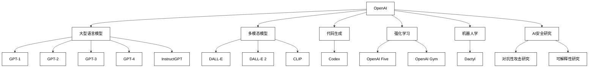
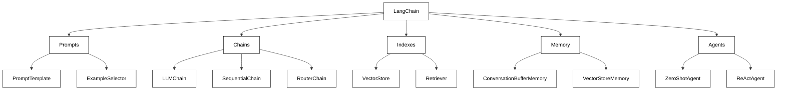
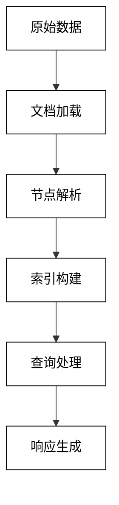

## 第3章 OpenAI API、LangChain和LlamaIndex

在本章中，我们将深入探讨三个关键的工具和框架：OpenAI API、LangChain和LlamaIndex。这些工具为开发强大的AI应用和Agent提供了基础，使我们能够更容易地利用大型语言模型的能力。

### 3.1 何谓OpenAI API

OpenAI API是一个强大的工具，它允许开发者将OpenAI的先进语言模型集成到自己的应用程序中。通过这个API，我们可以访问如GPT-3和GPT-4等大型语言模型的能力，用于各种自然语言处理任务。

#### 3.1.1 说说OpenAI这家公司

OpenAI是一家位于旧金山的人工智能研究实验室，成立于2015年。它的使命是确保人工通用智能（AGI）能够造福全人类。以下是关于OpenAI的一些关键点：

1. 创始背景：
    - 由Elon Musk、Sam Altman等科技界知名人士共同创立。
    - 初始承诺投资10亿美元，旨在推动AI的开放研究。

2. 研究重点：
    - 大型语言模型（如GPT系列）
    - 强化学习
    - 机器人学
    - AI安全和伦理

3. 主要成就：
    - GPT（Generative Pre-trained Transformer）系列模型
    - DALL-E图像生成模型
    - Codex代码生成模型

4. 商业模式转变：
    - 从纯粹的非盈利组织转变为"有上限利润"的公司
    - 通过API服务将研究成果商业化

5. 影响力：
    - 在NLP领域处于领先地位
    - 推动了AI民主化，使更多开发者能够使用先进AI技术

6. 争议与挑战：
    - 关于AI安全和伦理的讨论
    - 模型偏见和错误信息传播的问题
    - 对就业市场可能造成的影响

OpenAI的发展历程可以用以下时间线来概括：

```mermaid
timeline
    2015 : OpenAI成立
    2018 : 发布GPT-1
    2019 : 发布GPT-2
    2020 : 发布GPT-3
         : 推出OpenAI API
    2021 : 发布DALL-E
         : 与微软建立独家授权协议
    2022 : 发布ChatGPT
         : DALL-E 2公开测试
    2023 : 发布GPT-4
         : ChatGPT移动应用推出

%% 自定义样式
classDef default fill:#ffffff,stroke:#000000,color:#000000;
```

OpenAI的技术发展主要集中在以下几个方向：

1. 大型语言模型：
    - GPT系列：从GPT-1到GPT-4，模型规模和能力不断提升。
    - InstructGPT：改进模型对指令的理解和执行能力。

2. 多模态模型：
    - DALL-E和DALL-E 2：将文本描述转化为图像。
    - CLIP：学习文本和图像之间的关联。

3. 代码生成：
    - Codex：基于自然语言生成代码，是GitHub Copilot的基础。

4. 强化学习：
    - OpenAI Five：在Dota 2游戏中击败人类职业选手。
    - OpenAI Gym：用于开发和比较强化学习算法的工具包。

5. 机器人学：
    - Dactyl：学习在模拟环境中操纵物理对象。

6. AI安全研究：
    - 研究AI系统的对抗性攻击和防御。
    - 探索AI系统的可解释性和透明度。

OpenAI的技术进步可以用以下图表来表示：



#### 3.1.2 OpenAI API和Agent开发

OpenAI API为Agent开发提供了强大的基础。通过API，我们可以让Agent具备高级的自然语言处理能力，包括但不限于：

1. 自然语言理解和生成
2. 任务分解和规划
3. 信息提取和总结
4. 代码生成和分析
5. 多语言翻译
6. 情感分析
7. 文本分类

以下是OpenAI API在Agent开发中的一些关键应用：

1. 对话管理：
   使用API来理解用户输入，生成适当的响应，并维护对话上下文。

   ```python
   import openai

   openai.api_key = "your-api-key"

   def chat_with_agent(user_input, conversation_history):
       prompt = f"{conversation_history}\nHuman: {user_input}\nAI:"
       response = openai.Completion.create(
           engine="text-davinci-002",
           prompt=prompt,
           max_tokens=150
       )
       return response.choices[0].text.strip()

   conversation_history = ""
   while True:
       user_input = input("You: ")
       if user_input.lower() == "exit":
           break
       ai_response = chat_with_agent(user_input, conversation_history)
       print("AI:", ai_response)
       conversation_history += f"Human: {user_input}\nAI: {ai_response}\n"
   ```

2. 任务规划：
   使用API来分解复杂任务并生成执行计划。

   ```python
   def generate_task_plan(task_description):
       prompt = f"Create a step-by-step plan to accomplish the following task:\n{task_description}\n\nPlan:"
       response = openai.Completion.create(
           engine="text-davinci-002",
           prompt=prompt,
           max_tokens=200
       )
       return response.choices[0].text.strip().split("\n")

   task = "Organize a virtual team-building event for a remote team of 20 people"
   plan = generate_task_plan(task)
   for step in plan:
       print(step)
   ```

3. 信息提取：
   使用API从非结构化文本中提取结构化信息。

   ```python
   def extract_information(text):
       prompt = f"""
       Extract the following information from the text below:
       - Name
       - Age
       - Occupation
       - Location

       Text: {text}

       Information:
       """
       response = openai.Completion.create(
           engine="text-davinci-002",
           prompt=prompt,
           max_tokens=100
       )
       return response.choices[0].text.strip()

   text = "John Doe is a 35-year-old software engineer living in San Francisco, California."
   info = extract_information(text)
   print(info)
   ```

4. 代码生成：
   使用API生成代码片段或完整函数。

   ```python
   def generate_code(task_description, programming_language):
       prompt = f"""
       Generate {programming_language} code for the following task:
       {task_description}

       {programming_language} code:
       ```{programming_language}
       """
       response = openai.Completion.create(
           engine="text-davinci-002",
           prompt=prompt,
           max_tokens=200,
           stop=["```"]
       )
       return response.choices[0].text.strip()

   task = "Create a function that calculates the factorial of a number"
   language = "python"
   code = generate_code(task, language)
   print(code)
   ```

5. 决策支持：
   使用API来分析情况并提供决策建议。

   ```python
   def get_decision_advice(situation, options):
       prompt = f"""
       Situation: {situation}

       Options:
       {'\n'.join(f'- {option}' for option in options)}

       Analyze the situation and provide advice on the best course of action. Explain your reasoning.

       Advice:
       """
       response = openai.Completion.create(
           engine="text-davinci-002",
           prompt=prompt,
           max_tokens=200
       )
       return response.choices[0].text.strip()

   situation = "A startup is deciding whether to focus on product development or marketing"
   options = ["Invest more in R&D", "Increase marketing budget", "Balance both equally"]
   advice = get_decision_advice(situation, options)
   print(advice)
   ```

这些例子展示了OpenAI API如何为Agent开发提供核心能力。通过组合这些功能，我们可以创建具有强大语言理解和生成能力的智能Agent，能够处理各种复杂任务。

然而，在使用OpenAI API开发Agent时，也需要注意以下几点：

1. 上下文管理：大型语言模型没有长期记忆，需要在提示中包含必要的上下文。
2. 错误处理：模型可能产生不一致或错误的输出，需要实现适当的错误检查和处理机制。
3. 成本控制：API使用是按使用量计费的，需要优化提示和请求频率以控制成本。
4. 安全性：确保不会通过API泄露敏感信息，并实施适当的访问控制。
5. 伦理考虑：确保Agent的行为符合伦理标准，不产生有害或偏见的内容。

通过结合OpenAI API的强大能力和这些实践，我们可以开发出智能、高效且可靠的AI Agent。#### 3.1.3 OpenAI API的聊天程序示例

为了更好地理解OpenAI API在实际应用中的使用，让我们创建一个更复杂的聊天程序示例。这个程序将展示如何使用API实现一个具有多种功能的聊天机器人。

```python
import openai
import json
import requests
from typing import List, Dict, Any

openai.api_key = "your-api-key"

class ChatBot:
    def __init__(self):
        self.conversation_history: List[Dict[str, str]] = []
        self.functions = {
            "get_weather": self.get_weather,
            "calculate": self.calculate,
            "search_web": self.search_web
        }

    def chat(self, user_input: str) -> str:
        self.conversation_history.append({"role": "user", "content": user_input})
        
        response = openai.ChatCompletion.create(
            model="gpt-3.5-turbo",
            messages=self.conversation_history,
            functions=[
                {
                    "name": "get_weather",
                    "description": "Get the current weather for a location",
                    "parameters": {
                        "type": "object",
                        "properties": {
                            "location": {"type": "string", "description": "The city and state, e.g. San Francisco, CA"},
                        },
                        "required": ["location"],
                    },
                },
                {
                    "name": "calculate",
                    "description": "Perform a calculation",
                    "parameters": {
                        "type": "object",
                        "properties": {
                            "expression": {"type": "string", "description": "The mathematical expression to evaluate"},
                        },
                        "required": ["expression"],
                    },
                },
                {
                    "name": "search_web",
                    "description": "Search the web for information",
                    "parameters": {
                        "type": "object",
                        "properties": {
                            "query": {"type": "string", "description": "The search query"},
                        },
                        "required": ["query"],
                    },
                },
            ],
            function_call="auto",
        )

        assistant_message = response["choices"][0]["message"]

        if assistant_message.get("function_call"):
            function_name = assistant_message["function_call"]["name"]
            function_args = json.loads(assistant_message["function_call"]["arguments"])
            function_response = self.functions[function_name](**function_args)

            self.conversation_history.append({
                "role": "function",
                "name": function_name,
                "content": function_response,
            })

            second_response = openai.ChatCompletion.create(
                model="gpt-3.5-turbo",
                messages=self.conversation_history,
            )
            assistant_message = second_response["choices"][0]["message"]

        self.conversation_history.append(assistant_message)
        return assistant_message["content"]

    def get_weather(self, location: str) -> str:
        # 这里应该使用实际的天气API，这里用模拟数据代替
        return f"The weather in {location} is currently sunny with a temperature of 72°F (22°C)."

    def calculate(self, expression: str) -> str:
        try:
            result = eval(expression)
            return f"The result of {expression} is {result}."
        except Exception as e:
            return f"Error in calculation: {str(e)}"

    def search_web(self, query: str) -> str:
        # 这里应该使用实际的搜索API，这里用模拟数据代替
        return f"Top result for '{query}': This is a simulated search result."

# 使用示例
bot = ChatBot()

while True:
    user_input = input("You: ")
    if user_input.lower() == "exit":
        break
    response = bot.chat(user_input)
    print("AI:", response)
```

这个聊天机器人示例展示了几个重要的特性：

1. 对话历史管理：使用`conversation_history`列表来保存整个对话的上下文。

2. 函数调用：定义了`get_weather`、`calculate`和`search_web`三个函数，并在API调用中声明了这些函数。

3. 多轮对话：当API决定调用函数时，程序会执行函数并将结果添加到对话历史中，然后进行第二轮API调用以生成最终响应。

4. 错误处理：在`calculate`函数中，使用了try-except块来处理可能的计算错误。

5. 模拟外部API：虽然这个例子使用了模拟数据，但它展示了如何集成外部API（如天气服务或搜索引擎）。

这个示例可以进一步扩展，例如：

- 添加更多专门的函数，如日程管理、提醒设置等。
- 实现用户认证和个性化响应。
- 集成真实的外部API和数据源。
- 添加自然语言处理功能，如情感分析或意图识别。
- 实现对话状态管理，允许多步骤任务的完成。

#### 3.1.4 OpenAI API的图片生成示例

除了文本处理，OpenAI API还提供了强大的图像生成能力。以下是使用DALL-E模型生成图像的示例：

```python
import openai
import requests
import matplotlib.pyplot as plt
import io
from PIL import Image

openai.api_key = "your-api-key"

def generate_image(prompt: str, n: int = 1, size: str = "1024x1024") -> List[str]:
    response = openai.Image.create(
        prompt=prompt,
        n=n,
        size=size
    )
    return [item['url'] for item in response['data']]

def display_image(image_url: str):
    response = requests.get(image_url)
    img = Image.open(io.BytesIO(response.content))
    plt.imshow(img)
    plt.axis('off')
    plt.show()

# 使用示例
prompt = "A futuristic city with flying cars and holographic billboards"
image_urls = generate_image(prompt, n=1)

for url in image_urls:
    print(f"Generated image URL: {url}")
    display_image(url)
```

这个示例展示了如何使用OpenAI的DALL-E模型生成图像。主要步骤包括：

1. 调用`openai.Image.create`函数，提供描述性的文本提示。
2. 从API响应中提取图像URL。
3. 下载并显示生成的图像。

这种图像生成能力可以在多种场景中应用，例如：

- 创意设计：为产品概念、广告活动或艺术项目生成视觉素材。
- 教育：生成教学插图或视觉化概念。
- 游戏开发：创建游戏资产或概念艺术。
- 虚拟现实：生成VR/AR环境的纹理或元素。

然而，使用这种技术时也需要注意一些问题：

1. 内容控制：确保生成的图像内容适当且无害。
2. 版权问题：需要明确使用条款和生成内容的所有权。
3. 图像质量：生成的图像可能需要进一步的编辑或修善。
4. 成本控制：图像生成也是按使用量计费的。

#### 3.1.5 OpenAI API实践

在实际项目中使用OpenAI API时，有一些最佳实践和考虑事项：

1. 提示工程（Prompt Engineering）：
    - 精心设计提示以获得最佳结果。
    - 使用示例（few-shot learning）来引导模型的输出。
    - 考虑使用模板化的提示以确保一致性。

   ```python
   def generate_product_description(product_name, features):
       prompt = f"""
       Product: {product_name}
       Features:
       {' '.join(f'- {feature}' for feature in features)}

       Write a compelling product description in 50-100 words:
       """
       response = openai.Completion.create(
           engine="text-davinci-002",
           prompt=prompt,
           max_tokens=150
       )
       return response.choices[0].text.strip()
   ```

2. 错误处理和重试机制：
    - 实现错误检查和异常处理。
    - 在遇到API错误时使用指数退避重试。

   ```python
   import time
   import random

   def api_call_with_retry(func, max_retries=3, base_delay=1):
       retries = 0
       while retries < max_retries:
           try:
               return func()
           except openai.error.RateLimitError:
               delay = (base_delay * 2 ** retries) + random.uniform(0, 0.1)
               time.sleep(delay)
               retries += 1
       raise Exception("Max retries exceeded")
   ```

3. 模型选择和参数调优：
    - 根据任务复杂性和所需响应速度选择合适的模型。
    - 调整参数如temperature和max_tokens以平衡创造性和一致性。

   ```python
   def generate_creative_text(prompt, temperature=0.7, max_tokens=100):
       response = openai.Completion.create(
           engine="text-davinci-002",
           prompt=prompt,
           temperature=temperature,
           max_tokens=max_tokens
       )
       return response.choices[0].text.strip()
   ```

4. 缓存和结果重用：
    - 对于频繁或重复的查询，实现结果缓存。
    - 考虑使用数据库或分布式缓存系统存储结果。

   ```python
   import redis

   redis_client = redis.Redis(host='localhost', port=6379, db=0)

   def get_cached_or_generate(prompt, ttl=3600):
       cached_result = redis_client.get(prompt)
       if cached_result:
           return cached_result.decode('utf-8')
       
       result = generate_creative_text(prompt)
       redis_client.setex(prompt, ttl, result)
       return result
   ```

5. 内容过滤和安全措施：
    - 实现内容过滤以防止生成不适当或有害的内容。
    - 使用OpenAI的内容过滤API或实现自定义过滤逻辑。

   ```python
   def is_safe_content(text):
       response = openai.Completion.create(
           engine="content-filter-alpha",
           prompt="<|endoftext|>" + text + "\n--\nLabel:",
           temperature=0,
           max_tokens=1,
           top_p=0,
           logprobs=10
       )
       output_label = response["choices"][0]["text"]
       return output_label == "0"
   ```

6. 并发和异步处理：
    - 对于需要处理大量请求的应用，考虑使用异步API调用。
    - 实现请求批处理以减少API调用次数。

   ```python
   import asyncio
   import aiohttp

   async def async_generate_text(prompt):
       async with aiohttp.ClientSession() as session:
           async with session.post(
               "https://api.openai.com/v1/engines/davinci-codex/completions",
               headers={"Authorization": f"Bearer {openai.api_key}"},
               json={"prompt": prompt, "max_tokens": 100}
           ) as resp:
               data = await resp.json()
               return data["choices"][0]["text"]

   async def process_prompts(prompts):
       tasks = [async_generate_text(prompt) for prompt in prompts]
       return await asyncio.gather(*tasks)
   ```

7. 监控和日志记录：
    - 实现详细的日志记录以跟踪API使用和性能。
    - 设置监控和警报以检测异常使用情况或错误。

   ```python
   import logging
   import time

   logging.basicConfig(level=logging.INFO)
   logger = logging.getLogger(__name__)

   def log_api_call(func):
       def wrapper(*args, **kwargs):
           start_time = time.time()
           result = func(*args, **kwargs)
           duration = time.time() - start_time
           logger.info(f"API call to {func.__name__} took {duration:.2f} seconds")
           return result
       return wrapper

   @log_api_call
   def generate_text(prompt):
       return openai.Completion.create(
           engine="text-davinci-002",
           prompt=prompt,
           max_tokens=100
       )
   ```

这些实践可以帮助你更有效地使用OpenAI API，同时确保应用程序的可靠性、安全性和性能。随着项目的发展，你可能需要不断调整和优化这些策略。

### 3.2 何谓LangChain

LangChain是一个强大的框架，专门为开发基于大语言模型的应用程序而设计。它提供了一套工具和抽象，使得创建复杂的AI应用变得更加简单和高效。#### 3.2.1 说说LangChain

LangChain的核心理念是将语言模型与其他计算或知识源结合，以创建更强大的应用程序。它提供了多个主要组件：

1. 提示管理（Prompts）：
    - 动态构建和优化提示
    - 提示模板和变量替换

2. 链（Chains）：
    - 将多个组件组合成一个连贯的应用
    - 顺序处理和条件执行

3. 索引（Indexes）：
    - 高效存储和检索文本数据
    - 与外部数据源集成

4. 记忆（Memory）：
    - 管理对话历史和上下文
    - 实现长期和短期记忆机制

5. 代理（Agents）：
    - 创建能够使用工具和做出决策的自主代理
    - 实现目标导向的行为

LangChain的优势包括：

1. 模块化设计：易于组合和定制组件
2. 灵活性：支持多种语言模型和数据源
3. 抽象层：简化了与语言模型的交互
4. 社区支持：活跃的开发者社区和丰富的文档

以下是LangChain的架构概览：



#### 3.2.2 LangChain中的六大模块

LangChain框架包含六个主要模块，每个模块都专注于特定的功能：

1. 模型 I/O（Models）：
    - 与各种语言模型进行交互
    - 支持OpenAI、Hugging Face等多个提供商的模型

   ```python
   from langchain.llms import OpenAI

   llm = OpenAI(temperature=0.9)
   text = "What would be a good company name for a company that makes colorful socks?"
   print(llm(text))
   ```

2. 提示（Prompts）：
    - 管理和优化发送给语言模型的提示
    - 提供模板和示例选择器

   ```python
   from langchain import PromptTemplate

   template = "What is a good name for a company that makes {product}?"
   prompt = PromptTemplate(
       input_variables=["product"],
       template=template,
   )

   print(prompt.format(product="eco-friendly water bottles"))
   ```

3. 索引（Indexes）：
    - 构建和管理文档索引
    - 支持各种文档加载器和文本分割器

   ```python
   from langchain.document_loaders import TextLoader
   from langchain.indexes import VectorstoreIndexCreator

   loader = TextLoader('data.txt')
   index = VectorstoreIndexCreator().from_loaders([loader])

   query = "What is the main topic of the document?"
   print(index.query(query))
   ```

4. 链（Chains）：
    - 将多个组件组合成一个应用
    - 支持顺序执行和条件分支

   ```python
   from langchain.chains import LLMChain
   from langchain.llms import OpenAI
   from langchain.prompts import PromptTemplate

   llm = OpenAI(temperature=0.9)
   prompt = PromptTemplate(
       input_variables=["product"],
       template="What is a good name for a company that makes {product}?",
   )

   chain = LLMChain(llm=llm, prompt=prompt)
   print(chain.run("colorful socks"))
   ```

5. 代理（Agents）：
    - 创建能够使用工具和做出决策的自主代理
    - 支持多种代理类型和工具集成

   ```python
   from langchain.agents import load_tools
   from langchain.agents import initialize_agent
   from langchain.agents import AgentType
   from langchain.llms import OpenAI

   llm = OpenAI(temperature=0)
   tools = load_tools(["serpapi", "llm-math"], llm=llm)
   agent = initialize_agent(tools, llm, agent=AgentType.ZERO_SHOT_REACT_DESCRIPTION, verbose=True)

   agent.run("Who is Leo DiCaprio's girlfriend? What is her current age raised to the 0.43 power?")
   ```

6. 记忆（Memory）：
    - 管理对话历史和上下文信息
    - 提供多种记忆类型，如对话缓冲和摘要

   ```python
   from langchain import OpenAI, ConversationChain
   from langchain.memory import ConversationBufferMemory

   llm = OpenAI(temperature=0)
   conversation = ConversationChain(
       llm=llm, 
       verbose=True, 
       memory=ConversationBufferMemory()
   )

   conversation.predict(input="Hi there!")
   conversation.predict(input="I'm doing well! Just having a conversation with an AI.")
   conversation.predict(input="Tell me about our conversation so far.")
   ```

#### 3.2.3 LangChain和Agent开发

LangChain特别适合开发复杂的AI Agent。它提供了多种工具和抽象，使得创建智能、自主的Agent变得更加简单。以下是使用LangChain开发Agent的一些关键方面：

1. 工具集成：
   LangChain允许轻松集成各种工具，如搜索引擎、计算器、API等。

   ```python
   from langchain.agents import load_tools
   from langchain.agents import initialize_agent
   from langchain.llms import OpenAI

   llm = OpenAI(temperature=0)
   tools = load_tools(["serpapi", "llm-math"], llm=llm)
   agent = initialize_agent(tools, llm, agent="zero-shot-react-description", verbose=True)
   ```

2. 自定义工具：
   你可以创建自定义工具并将其添加到Agent中。

   ```python
   from langchain.tools import Tool
   from langchain.utilities import GoogleSearchAPIWrapper

   search = GoogleSearchAPIWrapper()
   tools = [
       Tool(
           name="Google Search",
           func=search.run,
           description="Useful for when you need to answer questions about current events. You should ask targeted questions"
       ),
   ]
   agent = initialize_agent(tools, llm, agent="zero-shot-react-description", verbose=True)
   ```

3. 记忆管理：
   LangChain提供了多种记忆类型，使Agent能够维护对话历史和上下文。

   ```python
   from langchain.memory import ConversationBufferMemory

   memory = ConversationBufferMemory(memory_key="chat_history")
   agent = initialize_agent(tools, llm, agent="conversational-react-description", memory=memory, verbose=True)
   ```

4. 链式操作：
   你可以使用链来创建复杂的处理流程，例如结合文档检索和问答。

   ```python
   from langchain.chains import RetrievalQA
   from langchain.document_loaders import TextLoader
   from langchain.indexes import VectorstoreIndexCreator

   loader = TextLoader('data.txt')
   index = VectorstoreIndexCreator().from_loaders([loader])
   qa = RetrievalQA.from_chain_type(llm=llm, chain_type="stuff", retriever=index.vectorstore.as_retriever())
   ```

5. 提示模板：
   使用提示模板可以更灵活地控制Agent的行为。

   ```python
   from langchain.prompts import PromptTemplate

   template = """
   You are an AI assistant for answering questions about the given text.
   
   {context}
   
   Human: {human_input}
   AI: """

   prompt = PromptTemplate(
       input_variables=["context", "human_input"],
       template=template
   )
   ```

6. 多Agent系统：
   LangChain支持创建多个相互作用的Agent。

   ```python
   from langchain.agents import Tool
   from langchain.agents import AgentType
   from langchain.memory import ConversationBufferMemory
   from langchain.chat_models import ChatOpenAI
   from langchain.utilities import SerpAPIWrapper
   from langchain.agents import initialize_agent

   search = SerpAPIWrapper()
   tools = [
       Tool(
           name = "Current Search",
           func=search.run,
           description="useful for when you need to answer questions about current events or the current state of the world"
       ),
   ]

   memory = ConversationBufferMemory(memory_key="chat_history", return_messages=True)

   llm=ChatOpenAI(temperature=0)
   agent_chain = initialize_agent(tools, llm, agent=AgentType.CHAT_CONVERSATIONAL_REACT_DESCRIPTION, verbose=True, memory=memory)

   agent_chain.run(input="Hi, I'm Bob")
   agent_chain.run(input="What's the weather like in SF?")
   agent_chain.run(input="Thanks for the info! By the way, what's my name?")
   ```

这些例子展示了LangChain如何简化Agent开发过程，使得创建功能强大、上下文感知的AI系统变得更加容易。通过组合这些组件，开发者可以构建出能够理解、推理和执行复杂任务的智能Agent。

#### 3.2.4 LangSmith的使用方法

LangSmith是LangChain生态系统中的一个重要工具，它提供了一套用于调试、测试和监控LangChain应用的功能。以下是LangSmith的主要用途和使用方法：

1. 设置LangSmith：

首先，你需要设置LangSmith的环境变量：

```bash
export LANGCHAIN_TRACING_V2=true
export LANGCHAIN_ENDPOINT="https://api.smith.langchain.com"
export LANGCHAIN_API_KEY="your-api-key"
```

2. 跟踪运行：

在你的LangChain应用中启用跟踪：

```python
from langchain.callbacks import tracing_v2_enabled

with tracing_v2_enabled() as cb:
    # 你的LangChain代码
    agent.run("What is the weather in New York?")
```

3. 查看跟踪结果：

访问LangSmith的Web界面（https://smith.langchain.com/）来查看你的运行记录。

4. 分析性能：

LangSmith提供了详细的性能指标，包括延迟、令牌使用量等。

5. 调试错误：

当你的应用出现错误时，LangSmith可以帮助你快速定位问题所在。

6. 评估输出质量：

使用LangSmith的评估功能来评估你的模型输出：

```python
from langchain.smith import RunEvalConfig, run_on_dataset

eval_config = RunEvalConfig(
    evaluators=[
        "qa",
        "context_qa",
        RunEvalConfig.Criteria("relevance"),
        RunEvalConfig.Criteria("coherence"),
    ]
)

results = run_on_dataset(
    client=client,
    dataset_name="question-answering-dataset",
    llm_or_chain_factory=qa_chain,
    evaluation=eval_config,
)
```

7. 版本控制和实验：

LangSmith允许你保存和比较不同版本的提示和链。

8. 协作和共享：

你可以与团队成员共享你的运行记录和实验结果。

通过使用LangSmith，你可以更好地理解和优化你的LangChain应用，提高开发效率和应用质量。

### 3.3 何谓LlamaIndex

LlamaIndex（前身为GPT Index）是一个强大的数据框架，专为大型语言模型（LLM）应用程序设计。它提供了一套工具，使得将外部数据高效地整合到LLM中变得简单。

#### 3.3.1 说说LlamaIndex

LlamaIndex的主要功能包括：

1. 数据连接：支持多种数据源和文件格式。
2. 数据结构化：将非结构化数据转换为适合LLM使用的结构。
3. 数据索引：创建高效的索引以快速检索相关信息。
4. 查询接口：提供灵活的查询方法来访问索引数据。

LlamaIndex的核心概念：

1. 文档（Documents）：表示原始数据。
2. 节点（Nodes）：文档的最小单位，通常是文本块。
3. 索引（Indices）：组织和存储节点的数据结构。
4. 查询引擎（Query Engines）：处理用户查询并返回相关信息。

LlamaIndex的工作流程：



#### 3.3.2 LlamaIndex和基于RAG的AI开发

RAG（Retrieval-Augmented Generation）是一种结合信息检索和文本生成的方法，LlamaIndex特别适合用于实现RAG系统。以下是使用LlamaIndex开发基于RAG的AI应用的关键步骤：

1. 数据准备和加载：

```python
from llama_index import SimpleDirectoryReader

documents = SimpleDirectoryReader('data').load_data()
```

2. 索引构建：

```python
from llama_index import GPTVectorStoreIndex

index = GPTVectorStoreIndex.from_documents(documents)
```

3. 查询引擎创建：

```python
query_engine = index.as_query_engine()
```

4. 查询处理：

```python
response = query_engine.query("What are the main topics discussed in the documents?")
print(response)
```

5. 高级索引策略：

LlamaIndex提供了多种索引策略，适用于不同的使用场景：

```python
from llama_index import GPTListIndex, GPTTreeIndex, GPTKeywordTableIndex

list_index = GPTListIndex.from_documents(documents)
tree_index = GPTTreeIndex.from_documents(documents)
keyword_table_index = GPTKeywordTableIndex.from_documents(documents)
```

6. 自定义检索策略：

你可以自定义检索策略来优化查询结果：

```python
from llama_index.indices.query.schema import QueryConfig

query_config = QueryConfig(
    index_struct_type="keyword_table",
    query_mode="default",
    query_kwargs={"similarity_top_k": 3}
)
query_engine = index.as_query_engine(query_config=query_config)
```

7. 结合LLM进行响应生成：

LlamaIndex可以与各种LLM无缝集成，例如OpenAI的GPT模型：

```python
from llama_index import LLMPredictor, ServiceContext
from langchain import OpenAI

llm_predictor = LLMPredictor(llm=OpenAI(temperature=0, model_name="text-davinci-002"))
service_context = ServiceContext.from_defaults(llm_predictor=llm_predictor)

index = GPTVectorStoreIndex.from_documents(
    documents, service_context=service_context
)
```

8. 增量更新：

LlamaIndex支持增量更新索引，这对于处理不断变化的数据集很有用：

```python
# 保存索引
index.storage_context.persist()

# 加载已存在的索引
from llama_index import StorageContext, load_index_from_storage

storage_context = StorageContext.from_defaults(persist_dir="./storage")
index = load_index_from_storage(storage_context)

# 添加新文档
index.insert(new_document)
```

9. 结构化数据查询：

LlamaIndex还支持对结构化数据进行查询：

```python
from llama_index import GPTPandasIndex
import pandas as pd

df = pd.read_csv("data.csv")
index = GPTPandasIndex(df)

response = index.query("What is the average salary?")
print(response)
```

10. 多模态数据处理：

LlamaIndex可以处理文本、图像等多种类型的数据：

```python
from llama_index import SimpleDirectoryReader, GPTVectorStoreIndex
from llama_index.readers import PDFReader, ImageReader

pdf_reader = PDFReader()
image_reader = ImageReader()
documents = SimpleDirectoryReader("data", file_extractor={
    ".pdf": pdf_reader,
    ".jpg": image_reader,
    ".png": image_reader
}).load_data()

index = GPTVectorStoreIndex.from_documents(documents)
```

使用LlamaIndex开发基于RAG的AI应用有以下优势：

1. 高效的数据集成：轻松将大量外部数据整合到LLM应用中。
2. 灵活的索引策略：根据数据特性和查询需求选择最适合的索引方法。
3. 优化的检索性能：通过向量存储和相似度搜索提高检索效率。
4. 无缝的LLM集成：与主流LLM平台（如OpenAI、Hugging Face）集成良好。
5. 可扩展性：支持增量更新和大规模数据处理。

#### 3.3.3 简单的LlamaIndex开发示例

让我们通过一个简单的例子来展示如何使用LlamaIndex构建一个问答系统：

```python
import os
from llama_index import GPTVectorStoreIndex, SimpleDirectoryReader, LLMPredictor, ServiceContext
from langchain import OpenAI

# 设置OpenAI API密钥
os.environ['OPENAI_API_KEY'] = 'your-api-key-here'

# 加载文档
documents = SimpleDirectoryReader('data').load_data()

# 创建LLM预测器
llm_predictor = LLMPredictor(llm=OpenAI(temperature=0, model_name="text-davinci-002"))

# 创建服务上下文
service_context = ServiceContext.from_defaults(llm_predictor=llm_predictor)

# 构建索引
index = GPTVectorStoreIndex.from_documents(documents, service_context=service_context)

# 创建查询引擎
query_engine = index.as_query_engine()

# 进行查询
response = query_engine.query("What are the key features of LlamaIndex?")
print(response)

# 保存索引以便future使用
index.storage_context.persist()

# 示例：如何加载已保存的索引
from llama_index import StorageContext, load_index_from_storage

storage_context = StorageContext.from_defaults(persist_dir="./storage")
loaded_index = load_index_from_storage(storage_context)
```

这个例子展示了LlamaIndex的基本使用流程：

1. 加载文档
2. 配置LLM和服务上下文
3. 构建索引
4. 创建查询引擎
5. 执行查询
6. 保存和加载索引

通过这种方式，你可以快速构建一个能够回答特定领域问题的AI助手。这个系统可以根据索引的文档内容，生成相关性强的回答，大大提高了LLM在特定领域的应用效果。

### 3.4 小结

本章深入探讨了OpenAI API、LangChain和LlamaIndex这三个强大的工具和框架，它们在现代AI应用开发中扮演着关键角色：

1. OpenAI API：
    - 提供了访问先进语言模型（如GPT-3和GPT-4）的能力
    - 支持各种NLP任务，包括文本生成、问答、分类等
    - 通过函数调用功能实现了更灵活的工具使用

2. LangChain：
    - 提供了一个完整的框架，用于构建基于语言模型的应用
    - 包含了提示管理、链式操作、记忆管理等关键功能
    - 特别适合开发复杂的AI Agent

3. LlamaIndex：
    - 专注于高效地将外部数据整合到语言模型应用中
    - 提供了多种索引策略和查询方法
    - 非常适合构建基于RAG的系统

这三个工具的组合使用可以极大地提高AI应用的开发效率和性能：

- OpenAI API提供了强大的语言模型能力
- LangChain提供了灵活的应用架构和工具集成
- LlamaIndex解决了大规模外部数据的整合问题

通过结合这些工具，开发者可以构建出功能强大、知识丰富且高度定制化的AI应用，例如：

- 智能客服系统
- 个性化学习助手
- 专业领域的问答系统
- 智能文档分析工具
- 自动化报告生成器

关键要点总结：

1. 灵活性：这些工具提供了高度的灵活性，可以适应各种应用场景
2. 可扩展性：支持从简单原型到大规模生产系统的扩展
3. 性能优化：通过各种策略（如缓存、异步处理）提高系统性能
4. 持续学习：这些工具都在快速发展，需要持续关注新功能和最佳实践

未来展望：

1. 模型能力的进一步提升：更大、更精确的语言模型
2. 多模态集成：更好地处理文本、图像、音频等多种数据类型
3. 个性化和定制化：更容易针对特定领域或用户群体进行优化
4. 隐私和安全：更强大的数据保护和安全机制
5. 效率提升：更高效的索引和检索算法，降低计算成本

实践建议：

1. 从小项目开始，逐步掌握这些工具的特性
2. 关注社区发展，及时了解新功能和最佳实践
3. 注重提示工程，它对于充分发挥语言模型的能力至关重要
4. 重视数据质量，它直接影响了基于RAG系统的性能
5. 考虑伦理和隐私问题，确保AI应用的负责任使用

通过掌握OpenAI API、LangChain和LlamaIndex，开发者可以站在巨人的肩膀上，创造出前所未有的智能应用。这不仅将提升用户体验，也将为各个行业带来创新和效率的提升。随着这些工具和相关技术的不断发展，我们正在见证AI应用开发的新时代的到来。