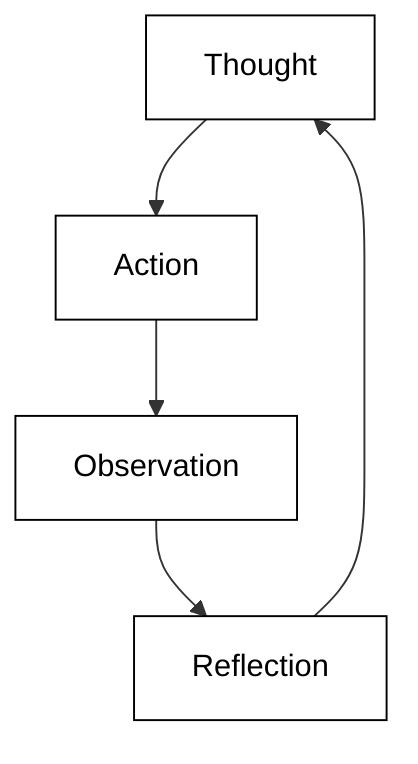
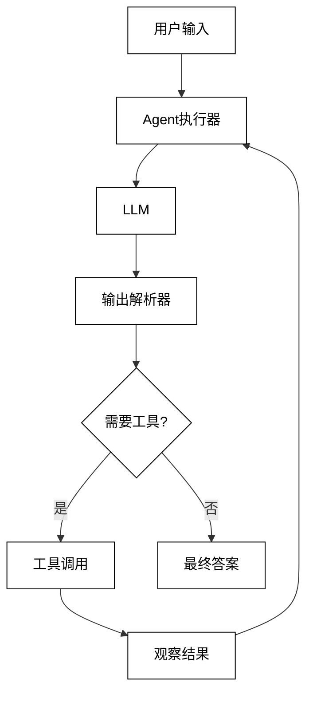

## 第6章 Agent 3：推理与行动的协同——通过LangChain中的ReAct框架实现自动定价

在本章中，我们将深入探讨LangChain中的ReAct（Reasoning and Acting）框架，并通过一个实际的例子来展示如何使用这个框架实现一个自动定价的Agent。ReAct框架结合了推理和行动，使AI能够更有效地解决复杂问题。

### 6.1 复习ReAct框架

ReAct框架是一种结合了推理（Reasoning）和行动（Acting）的方法，旨在提高语言模型在复杂任务中的表现。它的核心思想是让模型在执行任务时交替进行思考和行动，从而能够处理更加复杂和多步骤的问题。ReAct框架的主要步骤包括：

1. 思考（Thought）：模型分析当前情况并决定下一步行动。
2. 行动（Action）：模型执行选定的行动，如使用工具或API。
3. 观察（Observation）：模型获取行动的结果或新的信息。
4. 反思（Reflection）：模型评估进展并调整策略。

ReAct框架的优势包括：

1. 提高推理能力：通过明确的思考步骤，模型可以进行更深入的推理。
2. 增强问题解决能力：允许模型分解复杂问题并逐步解决。
3. 提高可解释性：思考过程可以作为决策的解释。
4. 灵活性：可以轻松集成各种外部工具和API。

下面是一个简化的ReAct框架示意图：



在LangChain中，ReAct框架被实现为一种特殊类型的Agent，它能够根据任务需求动态选择和使用工具。


### 6.2 LangChain中ReAct Agent 的实现

LangChain提供了一个强大而灵活的ReAct Agent实现。它的核心组件包括：

1. LLM（Large Language Model）：作为Agent的大脑，负责推理和决策。
2. 工具（Tools）：Agent可以使用的各种功能，如搜索引擎、计算器等。
3. 提示模板（Prompt Template）：指导LLM如何思考和行动的结构化提示。
4. 输出解析器（Output Parser）：解析LLM的输出，提取思考、行动和最终答案。
5. Agent执行器（Agent Executor）：协调整个过程，管理工具调用和观察结果。

LangChain中ReAct Agent的工作流程如下：




### 6.3 LangChain中的工具和工具包

在LangChain中，工具（Tools）是Agent可以使用的功能单元。每个工具通常包含一个名称、描述和执行函数。LangChain提供了多种内置工具，也允许用户定义自己的工具。

以下是一些常用的内置工具：

1. 搜索工具：如`SerpAPI`用于网络搜索。
2. 计算工具：如`LLMMathChain`用于数学计算。
3. 数据库工具：如`SQLDatabaseChain`用于数据库查询。
4. 文件操作工具：如`ReadFileTool`和`WriteFileTool`。

我们也可以轻松创建自定义工具。例如，一个简单的天气查询工具可以这样定义：

```python
from langchain.tools import Tool

def get_weather(location):
    # 这里应该是实际的天气API调用
    return f"The weather in {location} is sunny."

weather_tool = Tool(
    name="WeatherInfo",
    func=get_weather,
    description="Useful for getting weather information for a specific location."
)
```

工具包（Toolkit）是一组相关工具的集合。LangChain提供了多种预定义的工具包，如`SQLDatabaseToolkit`用于数据库操作，`VectorStoreToolkit`用于向量存储操作等。

### 6.4 通过create_react_agent创建鲜花定价Agent

现在，让我们通过一个实际例子来展示如何使用LangChain的ReAct框架创建一个自动定价Agent。我们将创建一个能够为鲜花店设定价格的Agent，它将考虑多个因素，如市场数据、竞争对手价格和成本信息。

首先，我们需要设置环境并导入必要的模块：

```python
import os
from langchain.agents import Tool, AgentExecutor, LLMSingleActionAgent, AgentOutputParser
from langchain.prompts import StringPromptTemplate
from langchain import OpenAI, SerpAPIWrapper, LLMChain
from langchain.schema import AgentAction, AgentFinish
from langchain.tools import BaseTool
from typing import List, Union
import re

# 设置OpenAI API密钥
os.environ["OPENAI_API_KEY"] = "your-api-key-here"
```

接下来，我们定义一些自定义工具：

```python
class MarketDataTool(BaseTool):
    name = "MarketData"
    description = "Use this tool to get market data for flowers."

    def _run(self, flower_type: str) -> str:
        # 这里应该是实际的市场数据API调用
        market_data = {
            "roses": {"demand": "high", "supply": "medium", "average_price": 25},
            "tulips": {"demand": "medium", "supply": "high", "average_price": 15},
            "sunflowers": {"demand": "low", "supply": "high", "average_price": 10}
        }
        return str(market_data.get(flower_type.lower(), "No data available for this flower type."))

class CompetitorPriceTool(BaseTool):
    name = "CompetitorPrice"
    description = "Use this tool to get competitor prices for flowers."

    def _run(self, flower_type: str) -> str:
        # 这里应该是实际的竞争对手价格API调用
        competitor_prices = {
            "roses": [20, 22, 26, 28],
            "tulips": [12, 14, 16, 18],
            "sunflowers": [8, 10, 12, 14]
        }
        return str(competitor_prices.get(flower_type.lower(), "No data available for this flower type."))

class CostInfoTool(BaseTool):
    name = "CostInfo"
    description = "Use this tool to get cost information for flowers."

    def _run(self, flower_type: str) -> str:
        # 这里应该是实际的成本信息API调用
        cost_info = {
            "roses": {"production_cost": 15, "transport_cost": 2},
            "tulips": {"production_cost": 8, "transport_cost": 1},
            "sunflowers": {"production_cost": 5, "transport_cost": 1}
        }
        return str(cost_info.get(flower_type.lower(), "No data available for this flower type."))

tools = [MarketDataTool(), CompetitorPriceTool(), CostInfoTool()]
```

然后，我们定义提示模板和输出解析器：

```python
class FlowerPricingPromptTemplate(StringPromptTemplate):
    template = """You are an AI assistant tasked with setting prices for a flower shop. 
    Use the following tools to gather information and determine the optimal price:

    {tools}

    Use the following format:

    Question: the input question you must answer
    Thought: you should always think about what to do
    Action: the action to take, should be one of [{tool_names}]
    Action Input: the input to the action
    Observation: the result of the action
    ... (this Thought/Action/Action Input/Observation can repeat N times)
    Thought: I now know the final answer
    Final Answer: the final answer to the original input question

    Question: {input}
    {agent_scratchpad}"""

    def format(self, **kwargs) -> str:
        # Get the intermediate steps (AgentAction, Observation tuples)
        # Format them in a particular way
        intermediate_steps = kwargs.pop("intermediate_steps")
        thoughts = ""
        for action, observation in intermediate_steps:
            thoughts += action.log
            thoughts += f"\nObservation: {observation}\nThought: "
        # Set the agent_scratchpad variable to that value
        kwargs["agent_scratchpad"] = thoughts
        # Create a tools variable from the list of tools provided
        kwargs["tools"] = "\n".join([f"{tool.name}: {tool.description}" for tool in kwargs["tools"]])
        # Create a list of tool names for the tools provided
        kwargs["tool_names"] = ", ".join([tool.name for tool in kwargs["tools"]])
        return self.template.format(**kwargs)

class FlowerPricingOutputParser(AgentOutputParser):
    def parse(self, llm_output: str) -> Union[AgentAction, AgentFinish]:
        # Check if agent should finish
        if "Final Answer:" in llm_output:
            return AgentFinish(
                return_values={"output": llm_output.split("Final Answer:")[-1].strip()},
                log=llm_output,
            )
        
        # Parse out the action and action input
        regex = r"Action: (\w+)[\n]*Action Input:[\s]*(.*)"
        match = re.search(regex, llm_output, re.DOTALL)
        if not match:
            raise ValueError(f"Could not parse LLM output: `{llm_output}`")
        action = match.group(1).strip()
        action_input = match.group(2)
        # Return the action and action input
        return AgentAction(tool=action, tool_input=action_input.strip(" ").strip('"'), log=llm_output)
```

现在，我们可以创建ReAct Agent：

```python
llm = OpenAI(temperature=0)
prompt = FlowerPricingPromptTemplate(
    template=FlowerPricingPromptTemplate.template,
    tools=tools,
    input_variables=["input", "intermediate_steps"]
)
output_parser = FlowerPricingOutputParser()

llm_chain = LLMChain(llm=llm, prompt=prompt)

agent = LLMSingleActionAgent(
    llm_chain=llm_chain, 
    output_parser=output_parser,
    stop=["\nObservation:"], 
    allowed_tools=[tool.name for tool in tools]
)

agent_executor = AgentExecutor.from_agent_and_tools(agent=agent, tools=tools, verbose=True)
```

最后，我们可以使用这个Agent来设定鲜花价格：

```python
question = "What should be the optimal price for a dozen roses?"
result = agent_executor.run(question)
print(result)
```

这个例子展示了如何使用LangChain的ReAct框架创建一个复杂的自动定价Agent。该Agent能够：

1. 理解定价任务的复杂性
2. 使用多个工具收集相关信息
3. 分析市场数据、竞争对手价格和成本信息
4. 进行推理并得出最终的定价建议

通过这种方法，我们可以创建能够处理复杂业务决策的智能Agent，大大提高定价策略的效率和准确性。

### 6.5 深挖AgentExecutor的运行机制

为了更好地理解ReAct Agent的工作原理，让我们深入探讨AgentExecutor的运行机制。AgentExecutor是协调整个Agent操作的核心组件，它管理了从用户输入到最终输出的整个过程。

#### 6.5.1 在AgentExecutor中设置断点

为了观察AgentExecutor的内部工作，我们可以在关键点设置断点。以下是一个修改过的AgentExecutor类，加入了一些打印语句来帮助我们理解执行流程：

```python
from langchain.agents.agent import AgentExecutor
from langchain.schema import AgentAction, AgentFinish

class DebugAgentExecutor(AgentExecutor):
    def _take_next_step(
        self,
        name_to_tool_map: Dict[str, BaseTool],
        color_mapping: Dict[str, str],
        inputs: Dict[str, str],
        intermediate_steps: List[Tuple[AgentAction, str]],
    ) -> Union[AgentFinish, List[Tuple[AgentAction, str]]]:
        """Take a single step in the thought-action-observation loop."""
        try:
            print("\n--- Starting a new step ---")
            
            # Call the agent
            output = self.agent.plan(intermediate_steps, **inputs)
            print(f"Agent's output: {output}")

            if isinstance(output, AgentFinish):
                print("Agent decided to finish.")
                return output
            
            actions: List[AgentAction]
            if isinstance(output, AgentAction):
                actions = [output]
            else:
                actions = output
            
            print(f"Actions to take: {actions}")

            result = []
            for agent_action in actions:
                print(f"\nExecuting action: {agent_action.tool}")
                if agent_action.tool in name_to_tool_map:
                    tool = name_to_tool_map[agent_action.tool]
                    observation = tool.run(agent_action.tool_input)
                    print(f"Observation: {observation}")
                    result.append((agent_action, observation))
                else:
                    result.append((agent_action, f"Tool {agent_action.tool} not found."))
            return result
        except Exception as e:
            print(f"An error occurred: {e}")
            raise

# 使用这个调试版本替换原来的AgentExecutor
agent_executor = DebugAgentExecutor.from_agent_and_tools(agent=agent, tools=tools, verbose=True)
```

现在，当我们运行Agent时，我们将看到更详细的执行过程：

```python
question = "What should be the optimal price for a dozen roses?"
result = agent_executor.run(question)
print("\nFinal Result:", result)
```

#### 6.5.2 第一轮思考：模型决定搜索

在第一轮思考中，模型会分析问题并决定需要哪些信息来回答问题。对于定价roses的任务，它可能会首先决定获取市场数据。

输出可能如下：

```
--- Starting a new step ---
Agent's output: AgentAction(tool='MarketData', tool_input='roses', log='Thought: To determine the optimal price for a dozen roses, I need to gather market data first. This will give me information about the current demand, supply, and average price in the market.\n\nAction: MarketData\nAction Input: roses')

Actions to take: [AgentAction(tool='MarketData', tool_input='roses', log='Thought: To determine the optimal price for a dozen roses, I need to gather market data first. This will give me information about the current demand, supply, and average price in the market.\n\nAction: MarketData\nAction Input: roses')]

Executing action: MarketData
Observation: {'demand': 'high', 'supply': 'medium', 'average_price': 25}
```

#### 6.5.3 第一轮行动：工具执行搜索

AgentExecutor会执行MarketData工具，获取roses的市场数据。

#### 6.5.4 第二轮思考：模型决定计算

基于获得的市场数据，模型可能会决定下一步获取竞争对手的价格信息。

输出可能如下：

```
--- Starting a new step ---
Agent's output: AgentAction(tool='CompetitorPrice', tool_input='roses', log='Thought: Now that I have the market data for roses, I need to compare it with competitor prices to ensure our pricing is competitive.\n\nAction: CompetitorPrice\nAction Input: roses')

Actions to take: [AgentAction(tool='CompetitorPrice', tool_input='roses', log='Thought: Now that I have the market data for roses, I need to compare it with competitor prices to ensure our pricing is competitive.\n\nAction: CompetitorPrice\nAction Input: roses')]

Executing action: CompetitorPrice
Observation: [20, 22, 26, 28]
```

#### 6.5.5 第二轮行动：工具执行计算

AgentExecutor会执行CompetitorPrice工具，获取roses的竞争对手价格信息。

#### 6.5.6 第三轮思考：模型完成任务

在获得市场数据和竞争对手价格后，模型可能会决定获取成本信息来完成定价决策。

输出可能如下：

```
--- Starting a new step ---
Agent's output: AgentAction(tool='CostInfo', tool_input='roses', log='Thought: To determine the optimal price, I also need to consider our costs. Let\'s get the cost information for roses.\n\nAction: CostInfo\nAction Input: roses')

Actions to take: [AgentAction(tool='CostInfo', tool_input='roses', log='Thought: To determine the optimal price, I also need to consider our costs. Let\'s get the cost information for roses.\n\nAction: CostInfo\nAction Input: roses')]

Executing action: CostInfo
Observation: {'production_cost': 15, 'transport_cost': 2}

--- Starting a new step ---
Agent's output: AgentFinish(return_values={'output': 'Based on the gathered information, I recommend setting the price for a dozen roses at $27. Here\'s my reasoning:\n\n1. Market Data: The demand for roses is high, while supply is medium. The average market price is $25 per dozen.\n\n2. Competitor Prices: Our competitors are pricing roses between $20 and $28 per dozen.\n\n3. Our Costs: The production cost is $15 and the transport cost is $2, totaling $17 per dozen.\n\n4. Pricing Strategy: \n   - Our total cost ($17) sets the minimum price to ensure profitability.\n   - The high demand allows for a price on the higher end of the market range.\n   - Pricing slightly above the market average ($25) positions our roses as a premium product.\n   - $27 is within the range of competitor prices, making it competitive while maximizing profit.\n   - This price provides a $10 profit margin per dozen, which is a healthy 37% profit.\n\nA price of $27 per dozen roses balances profitability with market competitiveness, taking advantage of the high demand while staying within the range of competitor prices.'}, log='Thought: Now that I have all the necessary information, I can determine the optimal price for a dozen roses.\n\nFinal Answer: Based on the gathered information, I recommend setting the price for a dozen roses at $27. Here\'s my reasoning:\n\n1. Market Data: The demand for roses is high, while supply is medium. The average market price is $25 per dozen.\n\n2. Competitor Prices: Our competitors are pricing roses between $20 and $28 per dozen.\n\n3. Our Costs: The production cost is $15 and the transport cost is $2, totaling $17 per dozen.\n\n4. Pricing Strategy: \n   - Our total cost ($17) sets the minimum price to ensure profitability.\n   - The high demand allows for a price on the higher end of the market range.\n   - Pricing slightly above the market average ($25) positions our roses as a premium product.\n   - $27 is within the range of competitor prices, making it competitive while maximizing profit.\n   - This price provides a $10 profit margin per dozen, which is a healthy 37% profit.\n\nA price of $27 per dozen roses balances profitability with market competitiveness, taking advantage of the high demand while staying within the range of competitor prices.')

Final Result: Based on the gathered information, I recommend setting the price for a dozen roses at $27. Here's my reasoning:

1. Market Data: The demand for roses is high, while supply is medium. The average market price is $25 per dozen.

2. Competitor Prices: Our competitors are pricing roses between $20 and $28 per dozen.

3. Our Costs: The production cost is $15 and the transport cost is $2, totaling $17 per dozen.

4. Pricing Strategy: 
   - Our total cost ($17) sets the minimum price to ensure profitability.
   - The high demand allows for a price on the higher end of the market range.
   - Pricing slightly above the market average ($25) positions our roses as a premium product.
   - $27 is within the range of competitor prices, making it competitive while maximizing profit.
   - This price provides a $10 profit margin per dozen, which is a healthy 37% profit.

A price of $27 per dozen roses balances profitability with market competitiveness, taking advantage of the high demand while staying within the range of competitor prices.
```

### 6.6 小结

本章我们深入探讨了LangChain中的ReAct框架，并通过一个自动定价Agent的实例展示了其强大的功能。主要内容包括：

1. ReAct框架的原理和优势
    - 结合推理和行动的方法
    - 提高复杂问题解决能力
    - 增强可解释性

2. LangChain中ReAct Agent的实现
    - 核心组件：LLM、工具、提示模板、输出解析器、Agent执行器
    - 工作流程：思考-行动-观察循环

3. 工具和工具包的使用
    - 内置工具和自定义工具
    - 工具包的概念和应用

4. 鲜花定价Agent的实现
    - 自定义工具的创建：市场数据、竞争对手价格、成本信息
    - 提示模板和输出解析器的设计
    - ReAct Agent的创建和执行

5. AgentExecutor的运行机制
    - 执行步骤的详细分析
    - 思考-行动-观察循环的实际应用

关键技术点：

1. 提示工程：设计有效的提示模板对Agent性能至关重要
2. 工具设计：创建合适的工具集可以显著增强Agent的能力
3. 输出解析：正确解析LLM输出对于Agent的正常运行至关重要
4. 错误处理：实现稳健的错误处理机制可以提高Agent的可靠性
5. 可解释性：ReAct框架提供了清晰的思考过程，增强了AI决策的可解释性

实践建议：

1. 从简单任务开始，逐步增加复杂性
2. 仔细设计和测试每个工具，确保其功能明确且可靠
3. 优化提示模板，使其能够引导模型进行有效的推理
4. 实现详细的日志记录，以便于调试和优化
5. 考虑添加安全检查，防止Agent执行不安全或不适当的操作

未来展望：

1. 多Agent协作：探索多个ReAct Agent协同工作的可能性
2. 自适应学习：实现Agent根据反馈自动调整其策略的能力
3. 领域特化：为特定行业或任务定制ReAct Agent
4. 与其他AI技术的集成：如强化学习、知识图谱等
5. 伦理和安全考虑：研究如何确保ReAct Agent的决策符合伦理标准和安全要求

通过本章的学习，我们不仅掌握了如何使用LangChain实现ReAct Agent，还深入理解了其内部工作机制。这为我们创建更复杂、更智能的AI应用打下了坚实的基础。ReAct框架的灵活性和强大功能使其成为解决各种复杂问题的理想选择，从自动定价到决策支持，再到复杂的任务规划，都可以找到其适用的场景。
