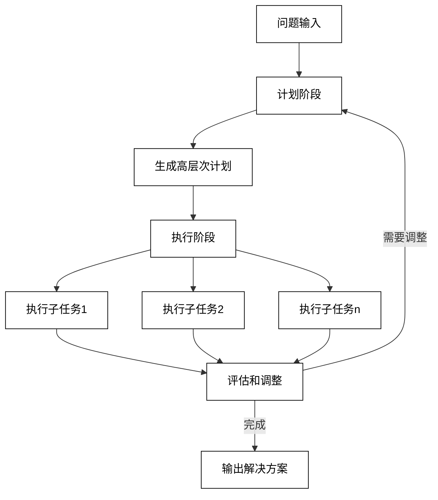

## 第7章 Agent 4：计划和执行的解耦——通过LangChain中的Plan-and-Execute实现智能调度库存

在本章中，我们将探讨LangChain中的Plan-and-Execute（计划和执行）策略，并通过一个智能库存调度的实例来展示其应用。Plan-and-Execute策略将复杂任务的计划和执行过程分离，使得AI系统能够更有效地处理多步骤、长期目标的任务。

### 7.1 Plan-and-Solve策略的提出

Plan-and-Solve策略是一种解决复杂问题的方法，它将问题解决过程分为两个主要阶段：计划（Plan）和执行（Execute）。这种方法的核心思想是：

1. 计划阶段：AI系统制定一个高层次的计划，将复杂问题分解为一系列可管理的子任务。
2. 执行阶段：系统按照计划逐步执行每个子任务，必要时调整计划。

这种策略的优势包括：

1. 更好的问题分解：通过先制定计划，系统可以更全面地考虑问题的各个方面。
2. 提高效率：预先的计划可以避免执行过程中的冗余或无效操作。
3. 增强可解释性：计划提供了清晰的问题解决路径，使AI的决策过程更透明。
4. 灵活性：执行过程中可以根据新信息调整计划。
5. 处理长期目标：适合处理需要多个步骤和长期规划的复杂任务。

Plan-and-Solve策略的工作流程可以用以下图表表示：



在LangChain中，Plan-and-Execute策略被实现为一种特殊类型的Agent，它包含两个主要组件：

1. Planner：负责生成任务的高层次计划。
2. Executor：负责执行计划中的每个步骤。

让我们通过一个简单的例子来说明Plan-and-Execute策略的工作原理：

```python
from langchain.llms import OpenAI
from langchain.chat_models import ChatOpenAI
from langchain.agents import load_tools
from langchain.agents import initialize_agent
from langchain.agents import AgentType
from langchain.agents.tools import Tool
from langchain.chains import LLMChain
from langchain.prompts import PromptTemplate

# 初始化语言模型
llm = OpenAI(temperature=0)
chat_model = ChatOpenAI(temperature=0)

# 定义Planner
planner_prompt = PromptTemplate(
    input_variables=["objective"],
    template="Please create a step-by-step plan to achieve the following objective: {objective}"
)
planner_chain = LLMChain(llm=llm, prompt=planner_prompt)

# 定义Executor
executor_prompt = PromptTemplate(
    input_variables=["plan", "step"],
    template="Given the plan: {plan}\n\nPlease execute the following step: {step}"
)
executor_chain = LLMChain(llm=chat_model, prompt=executor_prompt)

# 定义Plan-and-Execute Agent
def plan_and_execute(objective):
    # 生成计划
    plan = planner_chain.run(objective)
    print(f"Generated Plan:\n{plan}\n")

    # 执行计划
    steps = plan.split('\n')
    for i, step in enumerate(steps, 1):
        print(f"Executing Step {i}: {step}")
        result = executor_chain.run(plan=plan, step=step)
        print(f"Result: {result}\n")

    return "Task completed"

# 使用Plan-and-Execute Agent
objective = "Organize a virtual team-building event for a remote team of 20 people"
result = plan_and_execute(objective)
print(result)
```

在这个例子中：

1. Planner（`planner_chain`）负责生成一个步骤列表来实现给定的目标。
2. Executor（`executor_chain`）负责执行计划中的每个步骤。
3. `plan_and_execute`函数协调整个过程，首先调用Planner生成计划，然后逐步调用Executor执行每个步骤。

这种方法的优势在于：

1. 清晰的任务分解：Planner生成的计划提供了清晰的任务分解。
2. 灵活的执行：每个步骤都是独立执行的，可以根据需要进行调整。
3. 更好的上下文管理：整个计划作为上下文传递给每个执行步骤。
4. 提高复杂任务的处理能力：适合处理需要多个步骤和决策的复杂任务。

### 7.2 LangChain中的Plan-and-Execute Agent

LangChain提供了一个内置的Plan-and-Execute Agent实现，它进一步优化了上述的基本概念。这个实现包括以下主要组件：

1. PlanningChain：负责生成初始计划。
2. ExecutionChain：负责执行计划中的每个步骤。
3. PlanAndExecuteAgentExecutor：协调整个过程的执行器。

以下是使用LangChain的Plan-and-Execute Agent的基本结构：

```python
from langchain.chat_models import ChatOpenAI
from langchain.experimental.plan_and_execute import PlanAndExecute, load_agent_executor, load_chat_planner
from langchain.llms import OpenAI
from langchain.agents.tools import Tool

# 初始化语言模型
llm = OpenAI(temperature=0)
chat_model = ChatOpenAI(temperature=0)

# 定义工具
tools = [
    Tool(
        name = "Search",
        func = lambda x: "search result for: " + x,
        description = "useful for when you need to answer questions about current events"
    ),
    Tool(
        name = "Calculator",
        func = lambda x: eval(x),
        description = "useful for when you need to perform mathematical calculations"
    )
]

# 加载Planner和Executor
planner = load_chat_planner(chat_model)
executor = load_agent_executor(chat_model, tools, verbose=True)

# 创建Plan-and-Execute Agent
agent = PlanAndExecute(planner=planner, executor=executor, verbose=True)

# 使用Agent
result = agent.run("Who is the current US president and what is their age raised to the 0.23 power?")
print(result)
```

在这个示例中：

1. 我们定义了两个简单的工具：一个搜索工具和一个计算器工具。
2. `load_chat_planner`函数加载了一个基于聊天模型的Planner。
3. `load_agent_executor`函数加载了一个能够使用定义工具的Executor。
4. `PlanAndExecute`类将Planner和Executor组合成一个完整的Agent。

这个Agent的工作流程如下：

1. Planner生成一个高层次的计划，包括使用搜索工具查找总统信息和使用计算器计算年龄的幂。
2. Executor逐步执行这个计划，首先进行搜索，然后进行计算。
3. 最后，Agent整合所有信息，提供一个完整的答案。

### 7.3 通过Plan-and-Execute Agent实现物流管理

现在，让我们应用Plan-and-Execute Agent来解决一个更复杂的实际问题：智能库存调度。我们将创建一个Agent来管理一个跨多个仓库的物流系统，优化库存水平和配送路线。

#### 7.3.1 为Agent定义一系列进行自动库存调度的工具

首先，我们需要定义一些工具来模拟物流管理系统的各个方面：

```python
from langchain.agents.tools import Tool
from langchain.tools import BaseTool
from typing import Dict, List
import random

class InventoryTool(BaseTool):
    name = "Inventory"
    description = "Check the current inventory levels for a specific product in all warehouses"

    def _run(self, product: str) -> Dict[str, int]:
        # 模拟库存数据
        warehouses = ["North", "South", "East", "West"]
        return {w: random.randint(0, 100) for w in warehouses}

class DemandForecastTool(BaseTool):
    name = "DemandForecast"
    description = "Get the demand forecast for a specific product for the next week"

    def _run(self, product: str) -> int:
        # 模拟需求预测
        return random.randint(50, 200)

class ShippingCostTool(BaseTool):
    name = "ShippingCost"
    description = "Calculate the shipping cost between two warehouses"

    def _run(self, source: str, destination: str) -> float:
        # 模拟运输成本计算
        return round(random.uniform(100, 1000), 2)

class TransferInventoryTool(BaseTool):
    name = "TransferInventory"
    description = "Transfer inventory of a product from one warehouse to another"

    def _run(self, product: str, source: str, destination: str, amount: int) -> str:
        # 模拟库存转移
        return f"Transferred {amount} units of {product} from {source} to {destination}"

tools = [
    InventoryTool(),
    DemandForecastTool(),
    ShippingCostTool(),
    TransferInventoryTool()
]
```

#### 7.3.2 创建Plan-and-Execute Agent并尝试一个"不可能完成的任务"

现在，我们可以创建我们的Plan-and-Execute Agent并尝试使用它来解决一个复杂的库存管理问题：

```python
from langchain.chat_models import ChatOpenAI
from langchain.experimental.plan_and_execute import PlanAndExecute, load_agent_executor, load_chat_planner

# 初始化语言模型
chat_model = ChatOpenAI(temperature=0)

# 加载Planner和Executor
planner = load_chat_planner(chat_model)
executor = load_agent_executor(chat_model, tools, verbose=True)

# 创建Plan-and-Execute Agent
agent = PlanAndExecute(planner=planner, executor=executor, verbose=True)

# 使用Agent解决复杂的库存管理问题
task = """
Optimize the inventory levels for Product A across all warehouses. 
Ensure that each warehouse has at least 20 units, 
the total inventory meets the forecasted demand for the next week, 
and the total shipping cost is minimized.
"""

result = agent.run(task)
print(result)
```

运行这段代码，你可能会发现Agent无法完全解决这个问题。这是因为：

1. 任务复杂性：这个任务涉及多个约束条件和优化目标。
2. 工具限制：我们的工具集虽然提供了基本功能，但没有直接的优化功能。
3. 上下文管理：Agent可能难以在多个步骤之间保持复杂的状态信息。

#### 7.3.3 完善请求，让Agent完成任务

为了帮助Agent更好地完成任务，我们可以将复杂任务分解为更明确的步骤，并提供更多指导：

```python
task = """
Optimize the inventory levels for Product A across all warehouses. Follow these steps:

1. Check the current inventory levels for Product A in all warehouses.
2. Get the demand forecast for Product A for the next week.
3. Calculate the total current inventory and compare it with the forecasted demand.
4. If the total inventory is less than the forecasted demand, stop and report the shortage.
5. If the total inventory is sufficient, proceed to balance the inventory:
   a. Identify warehouses with less than 20 units.
   b. For each such warehouse, find the nearest warehouse with excess inventory.
   c. Calculate the shipping cost for the transfer.
   d. If the transfer is beneficial, execute it.
6. Repeat step 5 until all warehouses have at least 20 units or no beneficial transfers are possible.
7. Summarize the final inventory levels and total shipping cost.

Remember to use the appropriate tools for each step. 
Explain your reasoning at each step.
"""

result = agent.run(task)
print(result)
```

这个改进的任务描述提供了更清晰的步骤和决策准则，使Agent能够更系统地处理问题。它还鼓励Agent在每个步骤解释其推理过程，这有助于我们理解Agent的决策过程。

通过这种方式，我们可以看到Plan-and-Execute Agent如何处理复杂的多步骤任务，以及如何通过适当的任务分解和指导来提高其性能。

### 7.4 从单Agent到多Agent

虽然Plan-and-Execute策略大大提高了单个Agent处理复杂任务的能力，但对于更大规模、更复杂的问题，我们可能需要考虑使用多个Agent协同工作。多Agent系统可以带来以下优势：

1. 任务并行化：不同Agent可以同时处理不同的子任务。
2. 专业化：每个Agent可以专注于特定类型的任务或决策。
3. 鲁棒性：如果一个Agent失败，其他Agent可以接管或提供替代方案。
4. 可扩展性：可以根据需要添加新的Agent来处理新的任务类型或领域。

在LangChain中，我们可以通过组合多个Plan-and-Execute Agent来创建一个多Agent系统。例如：

```python
class InventoryManager:
    def __init__(self):
        self.planner = load_chat_planner(ChatOpenAI(temperature=0))
        self.executor = load_agent_executor(ChatOpenAI(temperature=0), tools, verbose=True)
        self.agent = PlanAndExecute(planner=self.planner, executor=self.executor, verbose=True)

    def optimize_inventory(self, product):
        task = f"Optimize inventory for {product} across all warehouses."
        return self.agent.run(task)

class ShippingManager:
    def __init__(self):
        self.planner = load_chat_planner(ChatOpenAI(temperature=0))
        self.executor = load_agent_executor(ChatOpenAI(temperature=0), tools, verbose=True)
        self.agent = PlanAndExecute(planner=self.planner, executor=self.executor, verbose=True)

    def optimize_shipping(self, transfers):
        task = f"Optimize shipping routes for the following transfers: {transfers}"
        return self.agent.run(task)

class SupplyChainManager:
    def __init__(self):
        self.inventory_manager = InventoryManager()
        self.shipping_manager = ShippingManager()

    def optimize_supply_chain(self, product):
        inventory_result = self.inventory_manager.optimize_inventory(product)
        shipping_result = self.shipping_manager.optimize_shipping(inventory_result)
        return f"Inventory Optimization: {inventory_result}\nShipping Optimization: {shipping_result}"

# 使用多Agent系统
supply_chain_manager = SupplyChainManager()
result = supply_chain_manager.optimize_supply_chain("Product A")
print(result)
```

在这个例子中，我们创建了三个专门的Agent：

1. InventoryManager：负责优化库存水平。
2. ShippingManager：负责优化运输路线。
3. SupplyChainManager：协调InventoryManager和ShippingManager，实现端到端的供应链优化。

这种多Agent架构允许我们将复杂的供应链管理问题分解为更小、更可管理的部分，每个部分由专门的Agent处理。这不仅提高了系统的整体性能和可扩展性，还增强了其鲁棒性和灵活性。

### 7.5 小结

本章我们深入探讨了LangChain中的Plan-and-Execute策略，并通过一个智能库存调度的实例展示了其应用。主要内容包括：

1. Plan-and-Solve策略的原理和优势
    - 问题分解和高层次规划
    - 提高复杂任务处理能力
    - 增强可解释性和灵活性

2. LangChain中Plan-and-Execute Agent的实现
    - PlanningChain和ExecutionChain的结构
    - PlanAndExecuteAgentExecutor的工作机制

3. 智能库存调度系统的实现
    - 自定义工具的创建：库存查询、需求预测、运输成本计算、库存转移
    - 复杂任务的分解和指导

4. 从单Agent到多Agent系统
    - 多Agent系统的优势
    - 实现专门的Agent：InventoryManager、ShippingManager、SupplyChainManager

关键技术点：

1. 任务分解：将复杂问题分解为可管理的子任务是Plan-and-Execute策略的核心
2. 工具设计：创建合适的工具集对Agent的性能至关重要
3. 提示工程：清晰、详细的任务描述和指导可以显著提高Agent的效果
4. 多Agent协作：通过专门化和并行化来处理更复杂的问题

实践建议：

1. 从简单任务开始，逐步增加复杂性
2. 仔细设计每个工具的功能和接口，确保它们能够有效支持任务执行
3. 提供清晰的任务分解和决策准则，帮助Agent更好地理解和执行任务
4. 在实现多Agent系统时，注意Agent之间的通信和协调机制
5. 持续监控和优化Agent的性能，根据实际结果调整策略

未来展望：

1. 自适应规划：开发能够根据执行结果动态调整计划的Agent
2. 强化学习集成：探索将强化学习技术应用于Plan-and-Execute策略的可能性
3. 跨领域知识迁移：研究如何使Agent能够将一个领域的知识应用到相关领域
4. 人机协作：开发更好的接口，使人类专家能够更容易地干预和指导Agent的决策过程
5. 可解释性增强：进一步提高Agent决策过程的透明度和可解释性

通过本章的学习，我们不仅掌握了如何使用LangChain实现Plan-and-Execute Agent，还深入理解了如何将这种策略应用于复杂的实际问题。Plan-and-Execute策略为处理多步骤、长期规划的任务提供了强大的框架，从库存管理到项目规划，再到复杂的决策支持系统，都可以找到其适用的场景。随着技术的不断进步，我们可以期待看到更多基于这种策略的创新应用，进一步推动AI在复杂问题解决中的应用。
