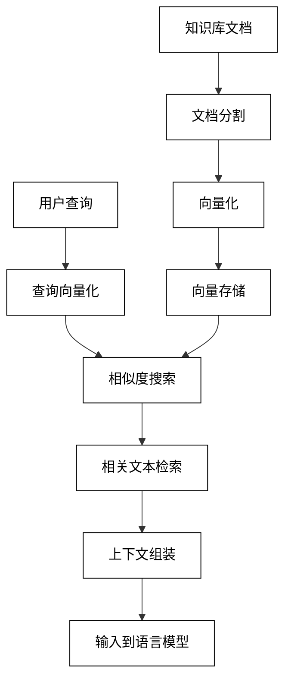

## 第8章 Agent 5：知识的提取与整合——通过LlamaIndex实现检索增强生成

在本章中，我们将深入探讨检索增强生成（Retrieval-Augmented Generation，RAG）技术，并通过LlamaIndex框架来实现一个强大的知识提取和整合系统。RAG技术结合了信息检索和文本生成的优势，使AI系统能够基于大规模知识库生成更准确、更相关的回答。

### 8.1 何谓检索增强生成

检索增强生成（RAG）是一种结合信息检索和文本生成的AI技术。它的核心思想是在生成回答之前，先从大规模知识库中检索相关信息，然后将这些信息作为上下文输入到语言模型中，以生成更准确、更相关的回答。

#### 8.1.1 提示工程、RAG与微调

在使用大语言模型时，我们有几种主要的方法来改善模型的输出质量和特定任务性能：

1. 提示工程（Prompt Engineering）：
    - 优点：灵活，无需修改模型
    - 缺点：可能需要复杂的提示，不适合处理大量特定领域知识

2. 检索增强生成（RAG）：
    - 优点：可以利用大量外部知识，无需重新训练模型
    - 缺点：依赖于检索质量，可能引入额外的延迟

3. 微调（Fine-tuning）：
    - 优点：可以显著提高特定任务的性能
    - 缺点：需要大量标注数据，计算成本高

RAG在这三种方法中找到了一个平衡点，它结合了提示工程的灵活性和微调的特定领域适应性，同时避免了大规模模型重训练的需求。

#### 8.1.2 从技术角度看检索部分的Pipeline

RAG的检索过程通常包含以下步骤：

1. 文档索引：
    - 将知识库文档分割成小块
    - 使用语义编码器（如BERT）将文本块转换为向量
    - 将向量存储在向量数据库中

2. 查询处理：
    - 将用户查询转换为向量表示
    - 在向量数据库中进行相似度搜索
    - 检索最相关的文本块

3. 上下文组装：
    - 将检索到的文本块组合成连贯的上下文
    - 可能包括去重和排序步骤

下面是RAG检索流程的示意图：



#### 8.1.3 从用户角度看RAG流程

从用户的角度来看，RAG系统的工作流程如下：

1. 用户提出问题
2. 系统在知识库中检索相关信息
3. 系统将检索到的信息与用户问题结合
4. 语言模型生成回答
5. 系统将回答呈现给用户

这个过程对用户来说是透明的，他们只需提出问题并获得答案，而不需要了解底层的复杂处理过程。

### 8.2 RAG和Agent

RAG技术可以显著增强Agent的能力，使其能够访问和利用大量外部知识。在Agent系统中集成RAG可以带来以下优势：

1. 知识扩展：Agent可以利用大规模知识库，不再局限于训练数据。
2. 实时更新：可以持续更新知识库，使Agent始终能够访问最新信息。
3. 可解释性提升：检索的文档可以作为Agent回答的依据，增强可解释性。
4. 特定领域适应：通过构建特定领域的知识库，可以快速使Agent适应新领域。

将RAG集成到Agent系统中的基本流程如下：

1. 知识库准备：收集和索引相关文档
2. 查询理解：Agent解析用户输入，提取关键信息
3. 知识检索：使用RAG系统检索相关信息
4. 上下文整合：将检索到的信息与用户查询结合
5. 回答生成：基于整合的上下文生成回答
6. 行动决策：根据生成的信息决定下一步行动

### 8.3 通过LlamaIndex的ReAct RAG Agent实现花语秘境财报检索

现在，让我们使用LlamaIndex框架实现一个能够检索和分析公司财报的RAG Agent。我们将以一个虚构的公司"花语秘境"（Floral Realm）为例，创建一个可以回答有关公司财务状况的智能助手。

#### 8.3.1 获取并加载电商的财报文件

首先，我们需要准备公司的财报文件。为了简化示例，我们将直接创建一个包含财报信息的文本文件：

```python
import os

# 创建一个模拟的财报文件
financial_report = """
花语秘境（Floral Realm）2023年第二季度财务报告

收入概览：
- 总收入：5000万美元
- 线上销售：3500万美元
- 实体店销售：1500万美元

成本和费用：
- 商品成本：2000万美元
- 运营费用：1500万美元
- 营销支出：500万美元

利润：
- 毛利润：3000万美元
- 净利润：1000万美元

关键指标：
- 客户增长率：15%
- 平均订单价值：75美元
- 复购率：60%

未来展望：
我们计划在下一季度推出新的花卉订阅服务，预计将带来额外的200万美元收入。
"""

# 将财报保存为文本文件
with open("floral_realm_financial_report.txt", "w") as f:
    f.write(financial_report)
```

#### 8.3.2 将财报文件的数据转换为向量数据

接下来，我们使用LlamaIndex将财报文件转换为向量数据：

```python
from llama_index import SimpleDirectoryReader, GPTVectorStoreIndex, LLMPredictor, ServiceContext
from langchain.chat_models import ChatOpenAI

# 加载文档
documents = SimpleDirectoryReader('path/to/your/document/directory').load_data()

# 设置LLM
llm_predictor = LLMPredictor(llm=ChatOpenAI(temperature=0, model_name="gpt-3.5-turbo"))

# 创建服务上下文
service_context = ServiceContext.from_defaults(llm_predictor=llm_predictor)

# 创建索引
index = GPTVectorStoreIndex.from_documents(documents, service_context=service_context)
```

#### 8.3.3 构建查询引擎和工具

现在，我们可以创建一个查询引擎和相应的工具：

```python
from llama_index.tools import QueryEngineTool, ToolMetadata

# 创建查询引擎
query_engine = index.as_query_engine()

# 创建查询工具
query_tool = QueryEngineTool(
    query_engine=query_engine,
    metadata=ToolMetadata(
        name="financial_report_qa",
        description="Useful for answering questions about Floral Realm's financial report"
    )
)
```

#### 8.3.4 配置文本生成引擎大模型

我们将使用OpenAI的GPT模型作为我们的文本生成引擎：

```python
from llama_index.llms import OpenAI

llm = OpenAI(model="gpt-3.5-turbo", temperature=0)
```

#### 8.3.5 创建Agent以查询财务信息

最后，我们可以创建一个ReAct Agent来使用我们的查询工具：

```python
from llama_index.agent import ReActAgent

agent = ReActAgent.from_tools([query_tool], llm=llm, verbose=True)

# 使用Agent回答问题
response = agent.chat("What was Floral Realm's total revenue in Q2 2023?")
print(response)

response = agent.chat("What is the company's plan for the next quarter?")
print(response)
```

这个Agent现在可以回答有关花语秘境公司财报的问题，它会首先在财报文档中检索相关信息，然后基于检索到的信息生成回答。

### 8.4 小结

本章我们探讨了检索增强生成（RAG）技术，并通过LlamaIndex框架实现了一个能够检索和分析公司财报的智能Agent。主要内容包括：

1. RAG技术的原理和优势
    - 结合信息检索和文本生成
    - 利用大规模外部知识库
    - 提高回答的准确性和相关性

2. RAG在Agent系统中的应用
    - 知识扩展和实时更新
    - 提升可解释性
    - 快速适应特定领域

3. 使用LlamaIndex实现RAG系统
    - 文档索引和向量化
    - 查询引擎和工具构建
    - ReAct Agent的创建和使用

4. 财务报告查询Agent的实现
    - 模拟财报数据的创建
    - 文档加载和索引构建
    - 查询工具的配置
    - Agent的创建和使用

关键技术点：

1. 文档处理：有效的文档分割和向量化是RAG系统的基础
2. 相似度搜索：高效的向量检索对系统性能至关重要
3. 上下文整合：将检索到的信息有效地与用户查询结合
4. 提示工程：设计合适的提示以充分利用检索到的信息

实践建议：

1. 知识库质量：确保知识库包含高质量、相关的信息
2. 索引优化：根据具体应用场景选择合适的索引策略
3. 查询优化：优化查询处理以提高检索准确性
4. 结果过滤：实现机制以过滤不相关或低质量的检索结果
5. 持续更新：建立机制以定期更新知识库，保持信息的时效性

未来展望：

1. 多模态RAG：扩展RAG以处理图像、音频等多模态数据
2. 个性化RAG：根据用户偏好和历史调整检索和生成策略
3. 实时RAG：开发能够实时接入最新信息源的RAG系统
4. 协作式RAG：探索多个RAG系统协同工作的可能性
5. 隐私保护RAG：研究如何在保护隐私的同时实现有效的信息检索和利用

通过本章的学习，我们不仅掌握了如何使用LlamaIndex实现RAG系统，还深入理解了如何将RAG技术应用于实际问题。RAG技术为AI系统提供了访问和利用大规模知识的能力，极大地扩展了AI应用的范围和深度。从客户服务到专业咨询，从教育辅助到研究支持，RAG技术都有广阔的应用前景。随着技术的不断进步，我们可以期待看到更多基于RAG的创新应用，进一步推动AI在知识密集型任务中的应用。
