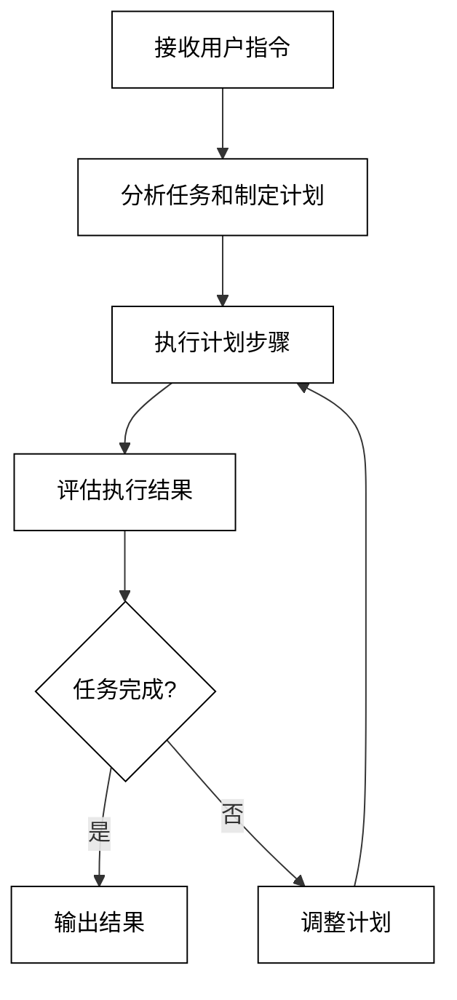
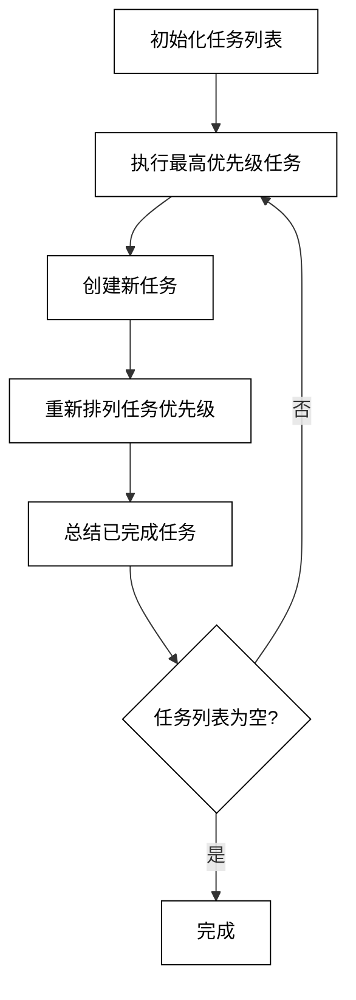
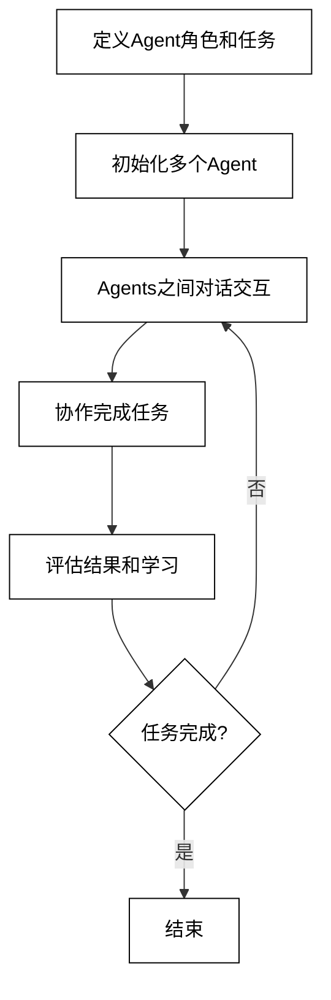

## 第9章 Agent 6：GitHub的网红聚落——AutoGPT、BabyAGI和CAMEL

在本章中，我们将探讨三个在GitHub上广受欢迎的Agent项目：AutoGPT、BabyAGI和CAMEL。这些项目代表了Agent技术的不同方向和应用，展示了AI Agent在自主任务执行、任务规划和多Agent协作方面的潜力。

### 9.1 AutoGPT

AutoGPT是一个开源项目，旨在创建一个能够自主执行复杂任务的AI Agent。它利用GPT-4的强大能力，结合了任务规划、网络搜索、文件操作等功能，使AI能够像人类一样思考和行动。

#### 9.1.1 AutoGPT简介

AutoGPT的主要特点包括：

1. 自主任务执行：能够理解高级指令并自主规划和执行任务步骤。
2. 长期记忆：使用向量数据库存储和检索信息，实现长期记忆。
3. 网络交互：能够进行网络搜索、访问网页和下载文件。
4. 文件操作：可以读写文件，进行数据处理和分析。
5. 命令行交互：提供命令行界面，方便用户与Agent交互。

AutoGPT的工作流程可以概括为以下步骤：

1. 接收用户指令
2. 分析任务并制定计划
3. 执行计划中的步骤
4. 评估执行结果
5. 根据需要调整计划
6. 重复步骤3-5直到任务完成

下面是AutoGPT的简化工作流程图：



#### 9.1.2 AutoGPT实战

让我们通过一个实际例子来展示如何使用AutoGPT。在这个例子中，我们将创建一个简化版的AutoGPT，用于执行基本的市场研究任务。

首先，我们需要安装必要的依赖：

```bash
pip install openai python-dotenv requests beautifulsoup4
```

接下来，创建一个Python文件，例如`simple_autogpt.py`，并添加以下代码：

```python
import openai
import os
import requests
from bs4 import BeautifulSoup
from dotenv import load_dotenv

# 加载环境变量
load_dotenv()
openai.api_key = os.getenv("OPENAI_API_KEY")

class SimpleAutoGPT:
    def __init__(self):
        self.memory = []
        self.task_list = []

    def add_to_memory(self, information):
        self.memory.append(information)

    def get_memory(self):
        return "\n".join(self.memory)

    def execute_command(self, command):
        if command.startswith("SEARCH:"):
            query = command[7:]
            return self.web_search(query)
        elif command.startswith("ANALYZE:"):
            text = command[8:]
            return self.analyze_text(text)
        else:
            return "Unknown command"

    def web_search(self, query):
        url = f"https://www.google.com/search?q={query}"
        response = requests.get(url)
        soup = BeautifulSoup(response.text, 'html.parser')
        search_results = soup.find_all('div', class_='g')
        results = []
        for result in search_results[:3]:
            title = result.find('h3', class_='r')
            if title:
                results.append(title.text)
        return "\n".join(results)

    def analyze_text(self, text):
        prompt = f"Analyze the following text and provide key insights:\n\n{text}"
        response = openai.Completion.create(
            engine="text-davinci-002",
            prompt=prompt,
            max_tokens=150
        )
        return response.choices[0].text.strip()

    def run(self, task):
        self.add_to_memory(f"Task: {task}")
        
        while True:
            prompt = f"Given the task: '{task}' and the current memory:\n{self.get_memory()}\n\nWhat should be the next step? Respond with either a command (SEARCH: ... or ANALYZE: ...) or 'TASK COMPLETE' if the task is finished."
            
            response = openai.Completion.create(
                engine="text-davinci-002",
                prompt=prompt,
                max_tokens=50
            )
            
            next_step = response.choices[0].text.strip()
            print(f"Next step: {next_step}")
            
            if next_step == "TASK COMPLETE":
                break
            
            result = self.execute_command(next_step)
            self.add_to_memory(f"Step: {next_step}\nResult: {result}")

        return self.get_memory()

# 使用示例
agent = SimpleAutoGPT()
result = agent.run("Conduct a brief market research on electric vehicles")
print(result)
```

这个简化版的AutoGPT实现了以下功能：

1. 任务分解：将主任务分解为一系列步骤。
2. 网络搜索：使用Google搜索获取信息。
3. 文本分析：使用GPT-3分析搜索结果。
4. 记忆管理：保存执行过程中的信息。
5. 自主决策：根据当前状态决定下一步行动。

运行这个脚本，你将看到Agent如何逐步执行市场研究任务，包括搜索相关信息、分析搜索结果，并最终完成任务。

### 9.2 BabyAGI

BabyAGI是另一个引人注目的Agent项目，它专注于任务规划和执行的自动化。BabyAGI的设计灵感来自于人类如何管理和完成复杂任务的过程，它能够自主创建、优先排序和执行任务列表。

#### 9.2.1 BabyAGI简介

BabyAGI的核心特点包括：

1. 任务创建：能够基于当前目标生成新的相关任务。
2. 任务优先级排序：根据重要性和紧迫性对任务进行排序。
3. 任务执行：使用语言模型执行各种任务。
4. 结果总结：对已完成任务的结果进行总结。
5. 任务列表管理：动态更新和管理任务列表。

BabyAGI的工作流程可以概括为以下步骤：

1. 初始化任务列表
2. 执行当前最高优先级的任务
3. 创建新任务
4. 重新排列任务优先级
5. 总结已完成的任务
6. 重复步骤2-5直到所有任务完成

下面是BabyAGI的简化工作流程图：



#### 9.2.2 BabyAGI实战

让我们通过一个简化版的BabyAGI来展示其工作原理。我们将创建一个能够自动规划和执行简单研究任务的Agent。

首先，确保已安装必要的依赖：

```bash
pip install openai python-dotenv
```

然后，创建一个Python文件，例如`simple_babyagi.py`，并添加以下代码：

```python
import openai
import os
from dotenv import load_dotenv

# 加载环境变量
load_dotenv()
openai.api_key = os.getenv("OPENAI_API_KEY")

class SimpleBabyAGI:
    def __init__(self, objective):
        self.objective = objective
        self.task_list = []
        self.task_id_counter = 1

    def add_task(self, task_name):
        task = {"id": self.task_id_counter, "name": task_name}
        self.task_list.append(task)
        self.task_id_counter += 1

    def get_ada_embedding(self, text):
        text = text.replace("\n", " ")
        return openai.Embedding.create(input=[text], model="text-embedding-ada-002")["data"][0]["embedding"]

    def task_creation_agent(self, objective, result, task_description, task_list):
        prompt = f"""
        You are an task creation AI that uses the result of an execution agent to create new tasks with the following objective: {objective},
        The last completed task has the following result: {result}.
        This task description: {task_description}.
        These are incomplete tasks: {', '.join([t['name'] for t in task_list])}.
        Based on the result, create new tasks to be completed by the AI system that do not overlap with incomplete tasks.
        Return the tasks as an array."""

        response = openai.Completion.create(
            engine="text-davinci-002",
            prompt=prompt,
            max_tokens=100,
            n=1,
            stop=None,
            temperature=0.5,
        )

        new_tasks = eval(response.choices[0].text)
        return [{"task_name": task_name} for task_name in new_tasks]

    def prioritization_agent(self, this_task_id):
        task_names = [t["name"] for t in self.task_list]
        next_task_id = int(this_task_id) + 1
        prompt = f"""
        You are an task prioritization AI tasked with cleaning the formatting of and reprioritizing the following tasks: {task_names}.
        Consider the ultimate objective of your team: {self.objective}.
        Do not remove any tasks. Return the result as an ordered array of strings with the highest priority tasks first."""

        response = openai.Completion.create(
            engine="text-davinci-002",
            prompt=prompt,
            max_tokens=1000,
            n=1,
            stop=None,
            temperature=0.5,
        )

        new_tasks = eval(response.choices[0].text)
        self.task_list = [{"id": i + next_task_id, "name": task_name} for i, task_name in enumerate(new_tasks)]

    def execution_agent(self, objective, task):
        prompt = f"""
        You are an AI who performs one task based on the following objective: {objective}.
        Your task: {task}
        Response:"""

        response = openai.Completion.create(
            engine="text-davinci-002",
            prompt=prompt,
            max_tokens=2000,
            n=1,
            stop=None,
            temperature=0.7,
        )

        return response.choices[0].text.strip()

    def run(self):
        self.add_task("Make a todo list")
        
        while True:
            if not self.task_list:
                break

            print("\n*****TASK LIST*****")
            for t in self.task_list:
                print(f"{t['id']}: {t['name']}")

            task = self.task_list.pop(0)
            print(f"\n*****NEXT TASK*****\n{task['id']}: {task['name']}")

            result = self.execution_agent(self.objective, task["name"])
            print(f"\n*****TASK RESULT*****\n{result}")

            new_tasks = self.task_creation_agent(self.objective, result, task["name"], self.task_list)
            for new_task in new_tasks:
                self.add_task(new_task["task_name"])

            self.prioritization_agent(task["id"])

            print("\n*****TASK ENDING*****")

# 使用示例
agent = SimpleBabyAGI("Conduct a comprehensive analysis of renewable energy sources")
agent.run()
```

这个简化版的BabyAGI实现了以下功能：

1. 任务创建：基于当前目标和已完成任务的结果创建新任务。
2. 任务优先级排序：根据整体目标对任务进行重新排序。
3. 任务执行：使用GPT-3执行各个任务。
4. 任务列表管理：动态更新和管理任务列表。

运行这个脚本，你将看到Agent如何自主创建、优先排序和执行与可再生能源分析相关的任务。

### 9.3 CAMEL

CAMEL（Communicative Agents for "Mind" Exploration of Large Scale Language Model Society）是一个专注于多Agent协作的项目。它旨在创建一个能够模拟人类社会交互的AI Agent生态系统。

#### 9.3.1 CAMEL简介

CAMEL的核心特点包括：

1. 多Agent交互：支持多个AI Agent之间的对话和协作。
2. 角色扮演：每个Agent可以扮演特定的角色，拥有独特的知识和能力。
3. 任务协作：Agents可以共同完成复杂任务，每个Agent负责自己专长的部分。
4. 行为模拟：模拟人类社会中的各种交互行为。
5. 可扩展性：可以轻松添加新的Agent角色和交互场景。

CAMEL的工作流程可以概括为以下步骤：

1. 定义Agent角色和任务
2. 初始化多个Agent
3. Agents之间进行对话交互
4. 协作完成任务
5. 评估结果和学习

下面是CAMEL的简化工作流程图：



#### 9.3.2 CAMEL论文中的股票交易场景

CAMEL论文中提出了一个有趣的股票交易场景，涉及两个Agent：一个金融分析师和一个投资经理。这个场景展示了如何使用多Agent系统来模拟复杂的决策过程。

场景描述：
- 金融分析师负责分析市场数据和公司财报，提供投资建议。
- 投资经理负责做出最终的投资决策，考虑风险和回报。
- 两个Agent需要就特定股票的投资前景进行讨论和决策。

这个场景的关键步骤包括：

1. 金融分析师收集和分析相关数据
2. 分析师向投资经理提供初步建议
3. 投资经理提出问题和关注点
4. 分析师提供更详细的解释和数据支持
5. 两个Agent讨论潜在风险和机会
6. 投资经理做出最终决策

#### 9.3.3 CAMEL实战

让我们通过一个简化版的CAMEL来模拟这个股票交易场景。我们将创建两个Agent：一个金融分析师和一个投资经理，它们将就是否投资某家科技公司进行讨论。

首先，确保已安装必要的依赖：

```bash
pip install openai python-dotenv
```

然后，创建一个Python文件，例如`simple_camel.py`，并添加以下代码：

```python
import openai
import os
from dotenv import load_dotenv

# 加载环境变量
load_dotenv()
openai.api_key = os.getenv("OPENAI_API_KEY")

class Agent:
    def __init__(self, role, background):
        self.role = role
        self.background = background

    def generate_response(self, message_history):
        prompt = f"You are a {self.role}. {self.background}\n\n"
        for message in message_history:
            prompt += f"{message['role']}: {message['content']}\n"
        prompt += f"{self.role}:"

        response = openai.Completion.create(
            engine="text-davinci-002",
            prompt=prompt,
            max_tokens=150,
            n=1,
            stop=None,
            temperature=0.7,
        )

        return response.choices[0].text.strip()

def simulate_conversation(analyst, manager, company):
    conversation = [
        {"role": "System", "content": f"Discuss whether to invest in {company}."},
        {"role": "Financial Analyst", "content": f"I've analyzed the financial data for {company}. Their revenue has grown by 25% year-over-year, and they have a strong balance sheet with minimal debt. Their new product line is showing promise in the market. What are your thoughts on this potential investment?"}
    ]

    for _ in range(5):  # Simulate 5 turns of conversation
        manager_response = manager.generate_response(conversation)
        conversation.append({"role": "Investment Manager", "content": manager_response})
        print(f"Investment Manager: {manager_response}")

        analyst_response = analyst.generate_response(conversation)
        conversation.append({"role": "Financial Analyst", "content": analyst_response})
        print(f"Financial Analyst: {analyst_response}")

    return conversation

# 创建Agents
financial_analyst = Agent("Financial Analyst", "You specialize in analyzing tech companies and providing investment recommendations based on financial data and market trends.")
investment_manager = Agent("Investment Manager", "You are responsible for making investment decisions, considering both potential returns and risks. You have a balanced approach to investing.")

# 运行模拟
company = "TechCorp"
conversation = simulate_conversation(financial_analyst, investment_manager, company)

# 生成最终决策
final_decision = investment_manager.generate_response(conversation + [{"role": "System", "content": "Based on the discussion, make a final decision on whether to invest in TechCorp and explain your reasoning."}])
print(f"\nFinal Decision: {final_decision}")
```

这个简化版的CAMEL实现了以下功能：

1. Agent角色定义：创建了金融分析师和投资经理两个角色。
2. 对话生成：使用GPT-3为每个Agent生成对话内容。
3. 多轮对话：模拟了多轮对话，允许Agents交换信息和观点。
4. 最终决策：基于整个对话过程，生成最终的投资决策。

运行这个脚本，你将看到两个Agent如何就是否投资TechCorp进行讨论，考虑各种因素，并最终做出决策。

### 9.4 小结

本章我们探讨了三个流行的GitHub Agent项目：AutoGPT、BabyAGI和CAMEL。这些项目展示了AI Agent技术在不同方向上的应用和潜力：

1. AutoGPT：
    - 专注于自主任务执行
    - 结合了任务规划、网络交互和文件操作
    - 适用于复杂、多步骤的任务执行

2. BabyAGI：
    - 侧重于任务规划和管理
    - 实现了任务创建、优先级排序和执行的自动化
    - 适合需要动态规划和调整的长期任务

3. CAMEL：
    - 聚焦于多Agent协作和交互
    - 模拟了人类社会中的角色扮演和协作决策
    - 适用于需要多方面专业知识的复杂决策场景

关键技术点：

1. 任务分解：将复杂任务分解为可管理的子任务
2. 自主决策：基于当前状态和目标做出决策
3. 记忆管理：维护和利用长期记忆
4. 多Agent协作：实现不同专业领域Agent之间的有效沟通
5. 角色定义：为Agent设定明确的角色和背景知识

实践建议：

1. 从简单场景开始，逐步增加复杂性
2. 仔细设计Agent的角色和能力，确保它们能够有效配合
3. 实现robust的错误处理和异常情况管理
4. 考虑伦理和安全问题，确保Agent的行为符合预期
5. 持续监控和优化Agent的性能，根据实际结果调整策略

未来展望：

1. 增强自主性：开发能够设定自己目标的Agent
2. 知识迁移：探索如何让Agent将一个领域的知识应用到新领域
3. 情感和个性：为Agent添加情感模拟和个性特征，使交互更自然
4. 大规模协作：研究如何协调大量Agent同时工作的方法
5. 与物理世界交互：将Agent与机器人技术结合，实现与现实世界的交互

通过学习这些项目，我们不仅了解了当前AI Agent技术的前沿发展，还看到了未来AI系统可能发展的方向。这些技术为创建更智能、更自主的AI系统铺平了道路，有潜力在各个领域带来革命性的变化，从个人助理到企业决策支持，再到科学研究和创新。随着这些技术的不断发展和完善，我们可以期待看到更多令人兴奋的应用和突破。
